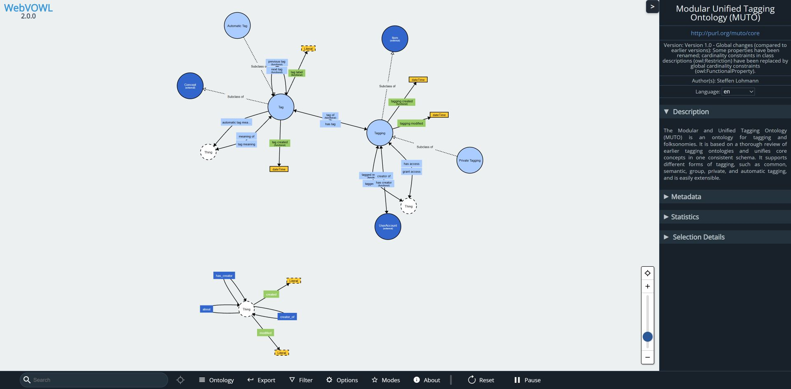

# WebVOWL

**Explore ontologies as interactive graphs.** WebVOWL visualizes classes, properties, and relationships using the Visual Notation for OWL (VOWL). Load an ontology, inspect its structure, and export a figure for a paper, lecture, or discussion.

**[Open WebVOWL](https://haddenindustries.com/webvowl/)** · [Work with an agent](#work-with-an-agent) · [Run locally](#run-locally) · [Get help](#help-and-contributing)

_The bundled MUTO example in the hosted application._

## Try it

1. Open **Ontology** and choose an example, upload a file, or enter an ontology URL.
2. Search for a class or property, select it to inspect its details, and use **Filter** and zoom to explore the graph.
3. Use **Export** to save SVG for a figure or VOWL JSON for reopening the visualization. Turtle and LaTeX exports are also available, marked **alpha**.

> [!TIP]
> If a remote ontology cannot load because its host blocks browser requests (CORS), download the file and upload it through **Ontology**.

## Why JavaScript?

This Hadden Industries continuation moves ontology ingestion and VOWL conversion into the browser, using the JavaScript [owlapi](https://github.com/Hadden-Industries/owlapi) library. The application can therefore run on **purely static hosting**: a university ontologist can publish it on an existing static website without asking IT to provision and maintain a dedicated Java backend. No Java conversion service, Docker, or server-side Node.js process is required to serve the built application. Local files are parsed in the browser; URL loading still depends on the source host's access rules.

## Work with an agent

WebVOWL exposes **14 structured tools** through [WebMCP](https://developer.chrome.com/docs/ai/webmcp), letting a compatible browser agent load, summarize, search, inspect, frame, arrange, and export the same graph you see. Human controls and agent tools share the same application operations, so you can continue exploring the result yourself.

Ask your agent to:

- “Open FOAF, find Person, and explain its declared relationships.”
- “Hide datatypes, focus on the classes we discussed, and prepare an SVG for my lecture.”
- “Inspect this ontology's classes and properties, then show me the relevant part of the graph.”

This can shorten the path from an unfamiliar ontology to a useful explanation or figure by combining exploration and presentation steps in one request. Ontology editing remains human-only.

> [!NOTE]
> WebMCP is experimental and requires a compatible browser and agent client. Open WebVOWL as a top-level page; embedded iframes do not register tools. Ordinary browsing needs no agent. Exports are downloaded from the page; attaching them to a conversation depends on the client.

See [WebMCP usage and limits](docs/webmcp.md) and the [recorded browser qualification](docs/evaluations/2026-09-10-webmcp-completion.md).

## Run locally

Clone this repository, then use its selected **Node.js** ([version](.node-version)), **npm** ([`packageManager`](package.json)), and **Python** ([version](.python-version)). Run `npm run setup:development` to install locked npm dependencies with lifecycle scripts disabled and prepare `.venv` with the [Python development requirements](requirements-dev.txt). Setup preserves an existing usable environment and does not activate agent configuration.

| Command                   | Purpose                                                                                                         |
| ------------------------- | --------------------------------------------------------------------------------------------------------------- |
| `npm run dev`             | Start development and open the local URL.                                                                       |
| `npm test -- --runInBand` | Run the Jest suite; requires the [sibling ontology corpus](#test-corpus). |
| `npm run test:setup`      | Check Python setup utilities using this checkout's `.venv`. |
| `npm run build`           | Check formatting/lint and build static files into `deploy/`.                                                    |
| `npm run preview`         | Preview the production build locally.                                                                           |

### Test corpus

The corpus tests read `../universal-ontology/dist` beside this checkout. CI uses [Universal Ontology at commit `b3984ff`](https://github.com/Hadden-Industries/universal-ontology/tree/b3984ffbfe9b38cca7bd4570aeb3f5bc0fa6f20e) and copies its `src/external`, `src/iso`, `src/iso-iec`, and `src/universal` directories into that repository's `dist/` directory. Prepare the same static corpus for local full-suite checks, preserving its licence and per-ontology notices. An absent corpus is a missing test prerequisite.

### Agent tooling

The independent `util/set_up_mcp_servers.py` and `util/set_up_agent_skills.py` utilities remain available. External skill refresh requires reviewed immutable source revisions and a pinned project-local Skills CLI; the existing lock is not permission to install or refresh tools. Generated local configuration and retained historical evidence remain ignored by Git.

## Help and contributing

[Report a bug or request a feature](https://github.com/Hadden-Industries/webvowl/issues), including reproduction steps, browser details, and a shareable example ontology. Include relevant test/build results with changes. For browser or export changes, also record the scenario, expected result, observed behavior, and any verification limits.

Project history and legacy links

This project continues [VisualDataWeb/WebVOWL](https://github.com/VisualDataWeb/WebVOWL). Its early history was imported from SVN after version 0.4.0; historical Git cleanup can make early commits look unusual. The legacy `visualdataweb.org` domain is no longer associated with the project. [TIB hosts a separate WebVOWL service](https://service.tib.eu/webvowl/).

## License

Copyright © 2014–2026 Vincent Link, Steffen Lohmann, Eduard Marbach, Stefan Negru, Vitalis Wiens, Maksym Shostak.

Licensed under **GNU AGPL version 3 only** (`AGPL-3.0-only`). See [LICENSE](LICENSE).
