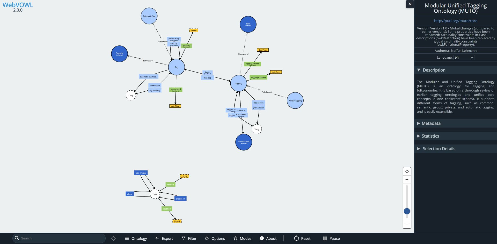

# WebVOWL

**Explore ontologies as interactive graphs.**
WebVOWL visualizes classes, properties, and relationships using the Visual Notation for OWL (VOWL).
Load an ontology, inspect its structure, and export a figure for a paper, lecture, or discussion.

**[Open WebVOWL](https://haddenindustries.com/webvowl/)** · [Work with an agent](#work-with-an-agent) · [Run locally](#run-locally) · [Get help](#help-and-contributing)



*The bundled MUTO example in the hosted application.*

## Try it

1. Open **Ontology** and choose an example, upload a file, or enter an ontology URL.
2. Search for a class or property, select it to inspect its details, and use **Filter** and zoom to explore the graph.
3. Use **Export** to save SVG for a figure or VOWL JSON for reopening the visualization.
   Turtle and LaTeX exports are also available, marked **alpha**.

> [!TIP]
> If a remote ontology cannot load because its host blocks browser requests (CORS), download the file and upload it through **Ontology**.

## Why JavaScript?

This Hadden Industries continuation moves ontology ingestion and VOWL conversion into the browser, using the JavaScript [owlapi](https://github.com/Hadden-Industries/owlapi) library.
The application can therefore run on **purely static hosting**: a university ontologist can publish it on an existing static website without asking IT to provision and maintain a dedicated Java backend.
No Java conversion service, Docker, or server-side Node.js process is required to serve the built application.
Local files are parsed in the browser; URL loading still depends on the source host's access rules.

## Work with an agent

WebVOWL exposes **16 structured tools** through [WebMCP](https://developer.chrome.com/docs/ai/webmcp), letting a compatible browser agent load, summarize, search, reveal temporary neighbourhoods, inspect, frame, arrange, and export the same graph you see.
Human controls and agent tools share the same application operations, so you can continue exploring the result yourself.

Ask your agent to:

- “Open FOAF, find Person, and explain its declared relationships.”
- “Hide datatypes, focus on the classes we discussed, and prepare an SVG for my lecture.”
- “Inspect this ontology's classes and properties, then show me the relevant part of the graph.”

This can shorten the path from an unfamiliar ontology to a useful explanation or figure by combining exploration and presentation steps in one request.
Ontology editing remains human-only.

> [!NOTE]
> WebMCP is experimental and requires a compatible browser and agent client.
> Open WebVOWL as a top-level page; embedded iframes do not register tools.
> Ordinary browsing needs no agent.
> Exports are downloaded from the page; attaching them to a conversation depends on the client.

See [WebMCP usage and limits](docs/webmcp.md) and the [recorded browser qualification](docs/evaluations/2026-09-10-webmcp-completion.md).

## Run locally

Clone this repository, then use its selected **Node.js** ([version](.node-version)), **npm** ([native minimum and exact reference](package.json)), and **Python >=3.15.0** ([minimum and CI reference](.python-version)).
Native npm `devEngines` requires npm `>=12.2.0`; `packageManager` and CI select exact npm 12.2.0 as the reproducible reference.
Registry development dependencies use floating `>=` minimums; the committed lockfile selects the exact qualified graph for `npm ci`.
Both application and VOWL consumers retain the `owlapi` import name and share one source selector: `dependencies.owlapi` in the root [package.json](package.json).
Set that field to `npm:PACKAGE_NAME@EXACT_VERSION` for a published package, or `git+https://github.com/Hadden-Industries/owlapi.git#FULL_40_CHARACTER_COMMIT` for an immutable source commit.
The root `overrides.owlapi` references `$owlapi`; the private VOWL workspace uses `*`, so neither repeats the chosen package name, version or commit.
Regenerate the root lock with `npm install --package-lock-only --ignore-scripts`, then run `npm ci --ignore-scripts` and the consumer checks; generated lock records are not independent settings.
See [OwlAPI dependency selection](docs/owlapi-git-adoption.md) for payload verification and the lessons from Universal Ontology's transition.
Run `npm run setup:development` to install locked npm dependencies with lifecycle scripts disabled and prepare `.venv` from the [hashed Python lock](requirements.lock.txt).
Python installation requires hashes and wheels except for PyYAML, whose latest release requires a source build on Python 3.15, then runs `pip check`.
The [development requirements](requirements-dev.txt) declare minimum versions without upper bounds; routine setup and CI install the exact locked versions.

Run `npm run install:markdown` explicitly to install the exact shared Markdown graph without lifecycle scripts.
The development runtime is Node 24.21.0; the application dependency graph is unchanged.
Markdown checking always covers the full authored corpus, including when CI skips application jobs for documentation-only changes.
Use `npm run format:docs -- -- "docs/example.md"` for literal paths or `--files-json` for a JSON array.
Exceptions and upgrades remain governed by the shared capability and exact trusted-run owner acceptance.
Setup preserves an existing usable environment and does not activate agent configuration.

To regenerate the Python lock with the resolver installed in `.venv`, run:

```sh
node util/runRepositoryPython.mjs -m piptools compile --allow-unsafe --generate-hashes --no-strip-extras --output-file=requirements.lock.txt requirements-dev.txt
```

This preserves existing selections when they still satisfy the requirements.
For a deliberate upgrade, add `--upgrade-package NAME`, review the lock diff, rerun setup, and run the checks below.

| Command                   | Purpose                                                                   |
| ------------------------- | ------------------------------------------------------------------------- |
| `npm run dev`             | Start development and open the local URL.                                 |
| `npm test -- --runInBand` | Run the Jest suite; requires the [sibling ontology corpus](#test-corpus). |
| `npm run test:setup`      | Check Python setup utilities using this checkout's `.venv`.               |
| `npm run build`           | Check formatting/lint and build static files into `deploy/`.              |
| `npm run preview`         | Preview the production build locally.                                     |

### Python and Markdown checks

The standard `npm run format`, `npm run format:check`, and `npm run lint` commands cover application files, maintained JavaScript in `util/` and `tooling/`, Python, and authored Markdown.
`npm run fix:all` applies application and tooling JavaScript lint fixes, safe Python lint fixes, and all formatting.
Node.js helpers use Node globals and do not receive browser-compatibility checks.
Markdown formatting and prose diagnostics are checked by both `lint` and `format:check`.
Run `npm run check:python` for Ruff linting, Python formatting checks, setup tests, and prose-tooling tests.
Run `npm run check:docs` for Prettier Markdown formatting and Snapper's semantic line checks.
Run `npm run check` for both sets of checks, the Jest suite, and the application build (including its existing formatting and lint checks).
The full check requires the [test corpus](#test-corpus).

| Command                       | Purpose                                                                  |
| ----------------------------- | ------------------------------------------------------------------------ |
| `npm run format:python`       | Format maintained Python files with Ruff.                                |
| `npm run lint:python`         | Check Python, including import ordering.                                 |
| `npm run lint:python:fix`     | Apply Ruff's safe lint fixes.                                            |
| `npm run format:python:check` | Check Python formatting without rewriting files.                         |
| `npm run format:docs`         | Format Markdown with the isolated shared Markdown Quality capability.    |
| `npm run format:docs:check`   | Check Markdown formatting and prose diagnostics without rewriting files. |
| `npm run test:prose`          | Test prose selection, literal preservation, and check-mode behavior.     |

Both Python tools run from this checkout's `.venv`; rerun `npm run setup:development` after pulling dependency changes.
Ruff targets Python 3.15, uses 88-character lines, and disables unsafe fixes.
Snapper uses its native formatter with one sentence per source line, no fixed column limit, and no clause splitting.
Prettier preserves prose wrapping and disables embedded-language formatting, but it can still normalize whitespace inside code fences.
Put `<!-- prettier-ignore -->` immediately before a literal example whose exact whitespace must be preserved, such as a Markdown example containing two-space hard breaks.
The prose tests exercise the complete Prettier, native Snapper, and Prettier sequence, including literal examples and repeated-run stability.
These checks do not include Python type checking or Markdown link validation.

Markdown formatting covers root documents and `docs/**/*.md`, including repository-owned designs and plans.
It excludes `AGENTS.md`, the historical `docs/owlapi-js` and `docs/sdlc` archives, `docs/evaluations`, and `docs/reviews`.
Snapper uses Prettier's own ignore handling for `.prettierignore` and `.gitignore`, so both Markdown formatters share the same exclusion rules.
Ruff excludes the same preserved documentation directories for Python files.
Prose tests require the locked Node dependencies as well as the Python environment.
Installed skills, environments, generated data, and fixtures are outside the formatting scope.

CI runs Python checks on Windows and Linux and Markdown checks on Linux.
Both feed the existing required `WebVOWL application` job.
The application build continues to require only its existing Node.js tooling.
Its `prebuild` runs `format:app:check` and `lint:app` explicitly.
The full `check` runs each check once, then calls `build:bundle` to avoid repeating the application checks through `prebuild`.
Use `npm run build` for the normal checked build; `build:bundle` alone only bundles the application.

### Test corpus

The corpus tests read `../universal-ontology/dist` beside this checkout.
CI uses [Universal Ontology at commit `b3984ff`](https://github.com/Hadden-Industries/universal-ontology/tree/b3984ffbfe9b38cca7bd4570aeb3f5bc0fa6f20e) and copies its `src/external`, `src/iso`, `src/iso-iec`, and `src/universal` directories into that repository's `dist/` directory.
Prepare the same static corpus for local full-suite checks, preserving its licence and per-ontology notices.
An absent corpus is a missing test prerequisite.

### Agent tooling

The independent `util/set_up_mcp_servers.py` and `util/set_up_agent_skills.py` utilities remain available.
External skill refresh requires reviewed immutable source revisions and a pinned project-local Skills CLI; the existing lock is not permission to install or refresh tools.
Generated local configuration and retained historical evidence remain ignored by Git.

## Help and contributing

[Report a bug or request a feature](https://github.com/Hadden-Industries/webvowl/issues), including reproduction steps, browser details, and a shareable example ontology.
Include relevant test/build results with changes.
For browser or export changes, also record the scenario, expected result, observed behavior, and any verification limits.

<details>
<summary>Project history and legacy links</summary>

This project continues [VisualDataWeb/WebVOWL](https://github.com/VisualDataWeb/WebVOWL).
Its early history was imported from SVN after version 0.4.0; historical Git cleanup can make early commits look unusual.
The legacy `visualdataweb.org` domain is no longer associated with the project.
[TIB hosts a separate WebVOWL service](https://service.tib.eu/webvowl/).

</details>

## License

Copyright © 2014–2026 Vincent Link, Steffen Lohmann, Eduard Marbach, Stefan Negru, Vitalis Wiens, Maksym Shostak.

Licensed under **GNU AGPL version 3 only** (`AGPL-3.0-only`).
See [LICENSE](LICENSE).
