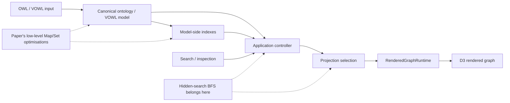
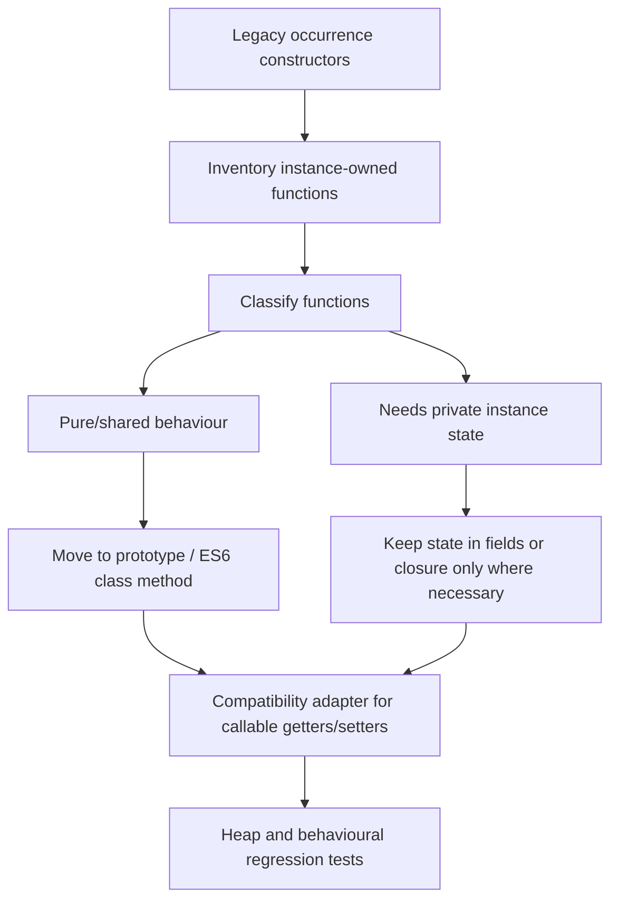
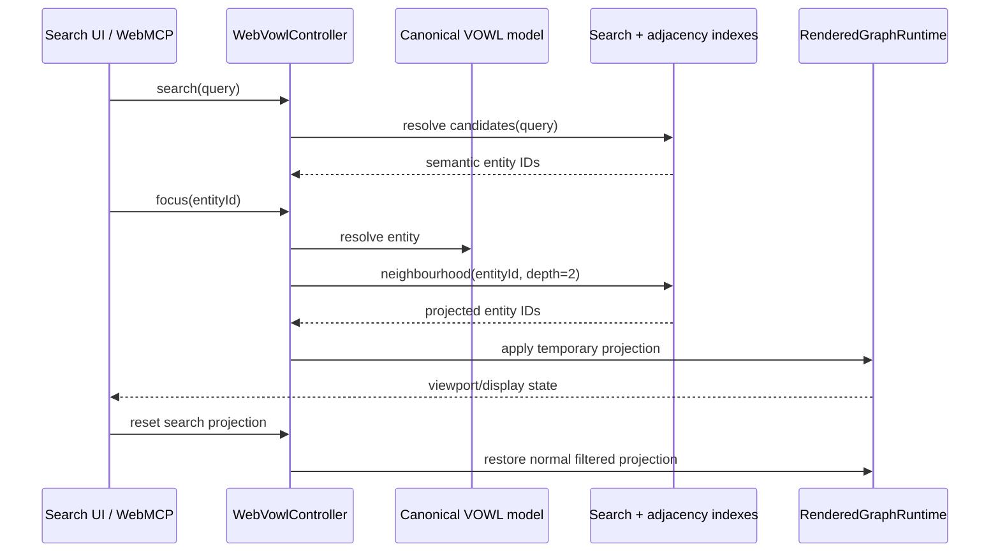

# WebVOWL Performance and Search Improvements: Catalogue and Applicability to Hadden-Industries/webvowl

## Executive summary

The attached paper, _Making WebVOWL Great Again: Improving Performance and Search_, is not a collection of cosmetic optimisations.
Its main contribution is a systematic removal of repeated linear scans from WebVOWL's ontology-loading pipeline, replacing them with `Map`/`Set`-based indexing, plus a substantial change to the JavaScript object model and two search improvements.
The reported effect is exceptional: ENVO loading falls from **631.7 seconds to 1.23 seconds, about 514× faster**, peak memory falls by as much as **57%**, and YAGO—132,882 nodes and 166,425 edges—goes from failing on a 32 GB machine to loading on the authors' 8 GB benchmark laptop.
The search work also removes the previous restriction that only currently rendered entities can effectively be found. fileciteturn0file0

The current `WebVOWL/WebVOWL-Legacy` repository contains the resulting implementations in recognisable form.
In particular, its `LinkCreator`, parser, subclass filter, degree filter and trie show the data-structure changes described by the paper. fileciteturn26file0 fileciteturn33file0 fileciteturn34file0 fileciteturn39file0 fileciteturn42file0 fileciteturn46file0

The most important finding for `Hadden-Industries/webvowl` is that **several of the original expensive algorithms are still present there**.
Its current `linkCreator.js` still repeatedly filters the whole link array to calculate layers and loops and still uses an array membership test while grouping inverse properties; its parser still computes every node's incident links by filtering the complete link array.
Those are near-direct opportunities to transplant the Legacy optimisations. fileciteturn57file0 fileciteturn60file0

However, the Hadden fork is architecturally much more advanced than the codebase targeted by the paper.
It has introduced a `RenderedGraphRuntime` boundary and explicitly adopted the rule that **the rendered graph is a projection of the ontology, not its system of record**.
Semantic inspection is intended to go through controller/model-side projections rather than D3/rendered objects.
Consequently, the low-level parser/link-creation optimisations can be ported relatively directly, whereas search, neighbourhood projection and the ES6 object-model refactor should be **reimplemented according to Hadden's newer architecture rather than cherry-picked wholesale**. fileciteturn32file0

My recommended order is:

| Priority | Improvement                                        |                Hadden applicability |     Effort |        Risk | Recommendation                                                        |
| -------- | -------------------------------------------------- | ----------------------------------: | ---------: | ----------: | --------------------------------------------------------------------- |
| **P0**   | Linear-time link-layer calculation                 |                             **Yes** |        Low |         Low | Port immediately                                                      |
| **P0**   | Linear-time loop calculation                       |                             **Yes** |        Low |         Low | Port with layer change                                                |
| **P0**   | `Set`-based link/inverse grouping                  |                             **Yes** |        Low |         Low | Port in same PR                                                       |
| **P0**   | Linear-time `storeLinksOnNodes`                    |                             **Yes** | Low–Medium |      Medium | Port immediately, preserve node API                                   |
| **P1**   | Solitary-subclass adjacency index                  |                     **Partial/Yes** |     Medium |      Medium | Reimplement after profiling/current-filter verification               |
| **P1**   | Equivalent-property lookup short-circuit           |                         **Partial** |        Low |         Low | Apply only where Hadden still performs eager lookup                   |
| **P1**   | Attribute-object indexing                          |        **Partial / partly present** |        Low |         Low | Audit rather than blindly port                                        |
| **P1**   | Initial degree-collapse computation                |                         **Partial** |     Medium |      Medium | Port concept; improve further with selection/histogram if appropriate |
| **P1**   | Hidden-entity neighbourhood search                 |    **Yes, architecturally adapted** |     Medium |      Medium | Implement through controller/model projection                         |
| **P2**   | Search trie/index                                  |                         **Partial** |     Medium | Medium–High | Adopt indexing, not necessarily prefix-only semantics                 |
| **P2**   | ES5-instance-method → shared ES6/prototype methods |    **Yes, strategically important** |       High |        High | Separate programme of work                                            |
| **P3**   | Equivalent-property range/domain merge index       |             **No as a direct port** |        Low |         Low | Hadden's current merger is already essentially linear in equivalents  |
| **P3**   | 50 MB JSON cache cut-off                           | **Partial / architecture-specific** | Low–Medium |         Low | Reassess against Hadden's browser ingestion/persistence model         |

The greatest near-term value is therefore a small, testable **graph-construction performance PR** containing layer counting, loop counting, inverse-property grouping and incident-link indexing.
It attacks algorithms that are demonstrably still quadratic in Hadden without colliding with its higher-level architectural work.

## Evidence base and architectural differences

The paper identifies performance problems using both runtime profiling and asymptotic analysis.
Its recurring diagnosis is that WebVOWL repeatedly searches arrays where it already has stable identifiers or object references, turning logically linear graph-building operations into quadratic ones.
The remedy is correspondingly consistent: build an index once and reuse it.
It separately attributes large memory consumption to the old ECMAScript 5-style object implementation, raw JSON retention/caching and poor lifetime control of variables. fileciteturn0file0

The maintained Legacy implementation has since evolved beyond the paper in some places.
`graph.js` now uses ES6 classes and modern collection types, the parser maintains maps, and `LinkCreator.createLinks()` performs layer and loop aggregation in shared passes rather than preserving the paper's original functions literally. fileciteturn15file0 fileciteturn26file0

Useful stable source locations are:

| Area                       | Legacy implementation                                                                                                                          | Hadden counterpart                                                                                                                      |
| -------------------------- | ---------------------------------------------------------------------------------------------------------------------------------------------- | --------------------------------------------------------------------------------------------------------------------------------------- |
| Link creation/layers/loops | [`src/main/webvowl/js/parsing/linkCreator.js`](https://github.com/WebVOWL/WebVOWL-Legacy/blob/main/src/main/webvowl/js/parsing/linkCreator.js) | [`src/webvowl/js/parsing/linkCreator.js`](https://github.com/Hadden-Industries/webvowl/blob/main/src/webvowl/js/parsing/linkCreator.js) |
| Parser/index construction  | [`src/main/webvowl/js/parser.js`](https://github.com/WebVOWL/WebVOWL-Legacy/blob/main/src/main/webvowl/js/parser.js)                           | [`src/webvowl/js/parser.js`](https://github.com/Hadden-Industries/webvowl/blob/main/src/webvowl/js/parser.js)                           |
| Subclass filtering         | [`subclassFilter.js`](https://github.com/WebVOWL/WebVOWL-Legacy/blob/main/src/main/webvowl/js/modules/filters/subclassFilter.js)               | Corresponding Hadden filtering layer should be integrated through its current filter/runtime architecture                               |
| Degree filtering           | [`nodeDegreeFilter.js`](https://github.com/WebVOWL/WebVOWL-Legacy/blob/main/src/main/webvowl/js/modules/filters/nodeDegreeFilter.js)           | Current Hadden filtering implementation requires adaptation rather than file replacement                                                |
| Trie                       | [`datastructures/trie.js`](https://github.com/WebVOWL/WebVOWL-Legacy/blob/main/src/main/webvowl/js/datastructures/trie.js)                     | Hadden search/controller layer                                                                                                          |
| Search UI                  | [`app/js/menu/searchMenu.js`](https://github.com/WebVOWL/WebVOWL-Legacy/blob/main/src/main/app/js/menu/searchMenu.js)                          | Hadden controller/application/search operations                                                                                         |
| Hadden architecture        | —                                                                                                                                              | [`ADR 0010`](https://github.com/Hadden-Industries/webvowl/blob/main/docs/adr/0010-rendered-graph-is-a-projection-not-the-store.md)      |

The difference that governs almost every integration decision is Hadden's ADR 0010.
The Hadden fork has deliberately introduced an application/controller boundary around rendering. The ontology/model should own semantic truth; the rendered graph should contain only its current visual projection.
The ADR specifically records a remaining legacy problem in rendered elements: constructors still create approximately **70 instance-owned closures per rendered node and 78 per rendered property**, an observation strongly related to the memory problem attacked by the paper's ES6 refactor. fileciteturn32file0



That architecture leads to a simple porting rule: **optimisations that improve creation/indexing of the canonical graph can be brought across; features that decide what graph to display must enter through Hadden's controller/projection interfaces.**

## Detailed improvement catalogue

The catalogue below separates changes that are sometimes conflated in the paper's overall benchmark because they have different compatibility characteristics.

| Improvement                                  | Original problem and design change                                                                                                                                                                                                                                  | Complexity claimed in paper                                                               | Legacy location / evidence                                                                                                                                                                  | Design or API consequence                                                                                                                                                                              |
| -------------------------------------------- | ------------------------------------------------------------------------------------------------------------------------------------------------------------------------------------------------------------------------------------------------------------------- | ----------------------------------------------------------------------------------------- | ------------------------------------------------------------------------------------------------------------------------------------------------------------------------------------------- | ------------------------------------------------------------------------------------------------------------------------------------------------------------------------------------------------------ |
| **Layer counting**                           | For every link, scan every link again to find parallel edges. New code indexes an unordered endpoint pair such as `(A,B)`/`(B,A)` in a `Map`, then annotates links from the count.                                                                                  | `O(n²) → O(n)`                                                                            | `LinkCreator.createLinks()`; current implementation builds a sorted endpoint key and `layerCounts` map. fileciteturn26file0                                                              | Internal representation changed from retaining/recomputing an edge-array layer to retaining an aggregate count/metadata in later Legacy code. Consumers that expect `layers()` arrays need adaptation. |
| **Loop counting**                            | Each self-loop repeatedly searches all links for loops on the same node. New code groups loops by node once and assigns the group/index.                                                                                                                            | `O(n²) → O(n)`                                                                            | Same `linkCreator.js`; `loopMap` maps a node to its loops. fileciteturn26file0                                                                                                           | Loop ordering/index must remain deterministic because geometry can depend on it.                                                                                                                       |
| **Initial link grouping**                    | `groupPropertiesToLinks` repeatedly tests whether a property/inverse has already been processed using linear array membership. Replace with a `Set`.                                                                                                                | Effectively removes another quadratic membership path                                     | Current Legacy `#groupPropertiesToLinks()` uses `Set`-style membership around property IDs. fileciteturn26file0                                                                          | No intended external API change; identity key must be chosen carefully.                                                                                                                                |
| **Equivalent-property lookup short-circuit** | Expensive “find the other equivalent property” work was evaluated even where an equivalent relation did not exist. Move lookup to the RHS of `&&` so JavaScript short-circuiting suppresses it.                                                                     | Worst case remains quadratic; substantially better best/average path                      | Current parser uses the equivalent of `propertyEquivalentElement && #findOtherElement(...)`. fileciteturn33file0                                                                         | Behaviour-preserving if falsy/no-equivalent cases were already valid.                                                                                                                                  |
| **Incident links on nodes**                  | For each node, filter the entire link list to find incident links. Instead, initialise node adjacency once and iterate links once, assigning each link to its endpoints.                                                                                            | `O(n·m) → O(n+m)`                                                                         | `parser.js`, `#storeLinksOnNodes`; current Legacy constructs a node map and traverses links once. fileciteturn34file0                                                                    | Establishes adjacency as an explicit index. Must handle self-loops only once if that is the old observable behaviour.                                                                                  |
| **Class/property attribute combination**     | For every base object, search its attribute array for matching ID. Build an `id → attribute` map first. The formerly duplicated class/property routines were consolidated.                                                                                          | `O(β²) → O(β)`                                                                            | Current parser's `#combineBaseObjects()` builds `attributeObjectMap`. fileciteturn33file0                                                                                                | Internal consolidation; ID uniqueness becomes an explicit assumption.                                                                                                                                  |
| **Automatic collapse degree**                | Recompute/filter graph connectivity for successive candidate thresholds. Count incident links once, derive the degree threshold from the resulting distribution.                                                                                                    | Paper presents `O(α(n+m)) → O(n+m)`                                                       | Current `nodeDegreeFilter.js` constructs a node→index map, one link-count array, then sorts counts. fileciteturn42file0                                                                  | Threshold selection semantics, especially ties at the maximum-node boundary, must be preserved.                                                                                                        |
| **Large JSON caching**                       | Raw ontology JSON was cached unconditionally while parsed structures were also resident, making large inputs consume memory twice. Do not cache strings above **50 MB**.                                                                                            | Memory optimisation rather than asymptotic CPU change                                     | Described explicitly by the paper; later repository storage/cache code implements guarded persistence. fileciteturn0file0                                                                | Large ontologies lose “cached reload” persistence. The paper also notes the raw string is not necessarily released immediately after parsing.                                                          |
| **Equivalent-property range/domain merging** | Equivalent-property resolution repeatedly searched larger property collections while propagating domain/range information. Build property lookup structures and visit equivalent groups without rescanning.                                                         | Paper: `O(n²·ε) → O(n·ε)`                                                                 | Current Legacy parser uses a `propertyMap` plus visited-domain/range sets in `#mergeRangesOfEquivalentProperties()` / recursive merge. fileciteturn35file0                               | Makes cycle/visited semantics explicit.                                                                                                                                                                |
| **Solitary-subclass filtering**              | Determining whether a subclass is “useful” repeatedly scans graph relationships during recursive traversal. Build subclass adjacency once, then traverse it.                                                                                                        | `O(n(n+m)) → O(n²+m)` worst case; much better practical behaviour                         | `subclassFilter.js`: builds `classSubClassMap`, then `#isNodeUseful()` recursively follows adjacent subclass properties with a visited set/object. fileciteturn39file0                   | Filter semantics unchanged; traversal state and cycle handling become explicit.                                                                                                                        |
| **ES6/refactored object model**              | ES5 constructor/prototype patterns and instance-local functions caused high per-element memory overhead; `var` also gave broader lifetimes than necessary. Refactor to ES6 classes and `let`/`const`, sharing methods instead of recreating functions per instance. | Up to **57% peak-memory reduction** in reported tests                                     | Modern Legacy is class-based; `Graph` and related implementation are ES6. fileciteturn15file0                                                                                            | This is a representation/ABI change if callers depend on instance-owned closures, callable getter/setter methods or prototype shape.                                                                   |
| **Trie-based search**                        | Search tested each candidate name with JavaScript substring matching. Insert searchable names into a trie and traverse by prefix.                                                                                                                                   | Paper describes average lookup in terms of prefix length rather than scanning all strings | `datastructures/trie.js`; `graph.loadSearchData()` calls `trie.find(...)`. Later optimisation added result limits and map-backed child nodes. fileciteturn46file0 fileciteturn53file0 | **User-visible semantic change:** substring search becomes prefix search. Additional memory is spent on the index.                                                                                     |
| **Extended hidden-element search**           | Old search only highlighted an entity if filtering had left it rendered. Search the complete graph; when result is hidden, compute a bounded BFS neighbourhood around it and temporarily render that subgraph. Reset restores normal filtered view.                 | BFS over bounded neighbourhood; paper uses fixed search depth `k=2`                       | Search-menu/graph integration; current UI calls `searchForHiddenElement` when the selected result is not visible. fileciteturn50file0                                                    | Introduces a temporary “search projection” distinct from the ordinary filtered projection.                                                                                                             |

Two nuances are worth recording.

First, the paper's complexity claim for automatic collapse should not be copied uncritically into engineering documentation.
The current Legacy implementation creates the degree counts in linear time **and then sorts them**, which normally makes that implementation `O(n log n + m)`, not strictly `O(n+m)`. fileciteturn42file0 The important optimisation is still valid—the expensive repeated graph passes disappear—but a Hadden implementation could potentially do better than the current Legacy source if degree values permit a histogram or selection algorithm.

Second, the current Legacy source is later than the paper.
For example, the paper discusses `countAndSetLayers` and `countAndSetLoops` independently, while the current `LinkCreator.createLinks()` performs both indexing tasks in consolidated passes.
The latter is the better source pattern to copy. fileciteturn26file0

### Repository history associated with the work

The Legacy history exposes a useful sequence of performance/search commits. The principal performance merge is commit [`3a100a0`](https://github.com/WebVOWL/WebVOWL-Legacy/commit/3a100a0c727be34e19a62c36ffebb0bbbe748aab), whose message is **“Merge pull request #6 … Performance improvements”**. A later link-specific change, [`8cdcc02`](https://github.com/WebVOWL/WebVOWL-Legacy/commit/8cdcc02841454579bf0172952e4590851461ded2), is titled **“Reorganized storing links for better performance and memory”**.

The search work has a clearer later sequence: [`526f5cf`](https://github.com/WebVOWL/WebVOWL-Legacy/commit/526f5cf1056cec58590b3dd4b86cf5358c7ed310) (“Improve performance of search”); [`fff49f7`](https://github.com/WebVOWL/WebVOWL-Legacy/commit/fff49f7763f68db66a29db9e3cb56dc9a1f12688) (“Use parser's classmap in bfs for better performance”); [`fb21bae`](https://github.com/WebVOWL/WebVOWL-Legacy/commit/fb21bae110e9deae622e733280792c8cd26a020b) adding a limit to trie `find()` and a proper map for trie children; [`d61c89c`](https://github.com/WebVOWL/WebVOWL-Legacy/commit/d61c89c12a656b96fe3ff334306f054277adfacd) moving trie generation into `graph.js`; and merge [`84a450d`](https://github.com/WebVOWL/WebVOWL-Legacy/commit/84a450d54c4358b7e201a39c46265b05bbd70c82), corresponding to [PR #14, “Improve search performance”](https://github.com/WebVOWL/WebVOWL-Legacy/pull/14).
A subsequent search-menu consistency change was merged in [PR #22](https://github.com/WebVOWL/WebVOWL-Legacy/pull/22).
These commits show that search/index construction continued to be tuned after the core paper implementation.

There is one repository-history caveat: the `3a100a0` commit message names “pull request #6”, but the repository's current PR #6 metadata resolves to a different later change.
That makes the **commit hash, not the current PR-number URL, the reliable provenance identifier** for the original performance merge.

## Applicability to Hadden-Industries/webvowl

### Comparison matrix

| Paper improvement                 | Applicability                   | Compatibility / adaptation required                                                                                                                                                     | Effort         | Regression/conflict risk                                                                                                            |
| --------------------------------- | ------------------------------- | --------------------------------------------------------------------------------------------------------------------------------------------------------------------------------------- | -------------- | ----------------------------------------------------------------------------------------------------------------------------------- |
| Layer counting                    | **Yes**                         | Hadden uses method-style accessors: `link.domain()`, `link.range()`, `link.layers(...)`; port algorithm, not Legacy field syntax                                                        | **Low**        | **Low–Medium**: `layers()` appears to hold the actual parallel-link array, whereas modern Legacy can work with count-style metadata |
| Loop counting                     | **Yes**                         | Preserve `link.loops(array)` and `link.loopIndex(index)` API; index by stable node identity or node ID                                                                                  | **Low**        | **Low** if loop ordering is preserved                                                                                               |
| `Set`-based property grouping     | **Yes**                         | Hadden currently stores property objects in `addedProperties`; use `Set<Property>` unless equality semantics require IDs                                                                | **Low**        | **Low**                                                                                                                             |
| Equivalent-property short-circuit | **Partial**                     | Apply only at current eager equivalent-resolution call sites; Hadden parser has already undergone some modernisation                                                                    | **Low**        | **Low**                                                                                                                             |
| `storeLinksOnNodes`               | **Yes**                         | Replace `nodes × links.filter(...)` with adjacency construction while continuing to call `node.links(array)`                                                                            | **Low–Medium** | **Medium**: self-loop duplication, ordering and node equality semantics must match old behaviour                                    |
| Attribute map                     | **Partial / partly present**    | Hadden already uses maps in portions of the parser; audit the actual combine phase before adding another index                                                                          | **Low**        | **Low**                                                                                                                             |
| Auto degree-collapse calculation  | **Partial**                     | Port the “count once” design into Hadden's filtering/controller seam; do not necessarily port sort-based Legacy code verbatim                                                           | **Medium**     | **Medium**: threshold tie behaviour can visibly alter graph size                                                                    |
| JSON cache threshold              | **Partial**                     | Hadden performs browser-side OWL/VOWL ingestion and has different persistence responsibilities; apply as a general raw-input-retention policy, not necessarily Legacy's exact menu code | **Low–Medium** | **Low**; main consequence is losing persistence of very large raw inputs                                                            |
| Equivalent range/domain merge     | **No, direct port unnecessary** | Current Hadden `equivalentPropertyMerger.js` already iterates each property's resolved `equivalents()` directly and propagates range/domain objects, effectively `O(n·ε)`               | **Low / none** | **Low**; adding Legacy's map machinery could merely add complexity                                                                  |
| Solitary-subclass adjacency       | **Partial / likely useful**     | Build adjacency in the canonical model/filter layer; avoid making renderer objects the semantic index                                                                                   | **Medium**     | **Medium**: recursive usefulness rules and `Thing` handling need parity tests                                                       |
| ES6/shared methods                | **Yes**                         | Hadden still documents heavy instance-owned closure counts, but this intersects renderer object contracts throughout the application                                                    | **High**       | **High**                                                                                                                            |
| Trie/indexed search               | **Partial**                     | Build index over canonical ontology/model, expose through controller/search service; decide whether Hadden wants prefix, substring or richer matching                                   | **Medium**     | **Medium–High**, mostly because prefix-only behaviour is a UX regression if users expect substring matches                          |
| BFS hidden-element subgraph       | **Yes**                         | Implement as a temporary model-side projection supplied to `RenderedGraphRuntime`; do not use rendered nodes as ontology storage                                                        | **Medium**     | **Medium**: must compose correctly with filters, selection, history/reset and agent/WebMCP operations                               |

### The direct wins: link construction and adjacency

The strongest case is visible directly in Hadden's current `src/webvowl/js/parsing/linkCreator.js`.
Its layer routine follows the old pattern conceptually equivalent to:

```js
links.forEach(link => {
    const layer = links.filter(otherLink =>
        /* same endpoint pair */
    );
    link.layers(layer);
});
```

and loop processing likewise filters the complete link collection once per loop.
`groupPropertiesToLinks()` also keeps `addedProperties` in an array and tests membership with `indexOf`. fileciteturn57file0

Legacy has replaced those repeated searches with indexing:

```js
const sortedKey = [link.domain.id, link.range.id]
    .sort()
    .join("|");

layerCounts.set(
    sortedKey,
    (layerCounts.get(sortedKey) || 0) + 1
);
```

and with a loop map keyed by the loop node; grouping uses a `Set`. fileciteturn26file0

For Hadden, I would **not** copy the field API above.
Instead retain its object API and use a two-pass structure along these lines:

```js
const linksByPair = new Map();
const loopsByNode = new Map();

for (const link of links) {
    const domain = link.domain();
    const range = link.range();

    const key = canonicalPairKey(domain.id(), range.id());

    let layer = linksByPair.get(key);
    if (!layer) {
        layer = [];
        linksByPair.set(key, layer);
    }
    layer.push(link);

    if (link.isLoop()) {
        let loops = loopsByNode.get(domain.id());
        if (!loops) {
            loops = [];
            loopsByNode.set(domain.id(), loops);
        }
        loops.push(link);
    }
}

for (const layer of linksByPair.values()) {
    for (const link of layer) {
        link.layers(layer);
    }
}

for (const loops of loopsByNode.values()) {
    loops.forEach((link, index) => {
        link.loops(loops);
        link.loopIndex(index);
    });
}
```

This keeps the current Hadden contract—`layers()` remains an array—while eliminating the quadratic discovery process.
That is safer than adopting Legacy's newer `layerSize`/count representation immediately.

The same applies even more clearly to incident-link construction.
Hadden currently does essentially:

```js
for (const node of nodes) {
    node.links(
        links.filter(link =>
            link.domain().equals(node) ||
            link.range().equals(node)
        )
    );
}
```

so its complexity is unambiguously proportional to nodes × links. fileciteturn60file0

Legacy's current parser instead creates an ID map, empties adjacency once, then processes each link once. fileciteturn34file0 Hadden can preserve its setter-style API by constructing arrays in a map and applying them after the single link pass.
This should be an early change because it is algorithmically strong, local, easy to benchmark and independent of Hadden's rendering architecture.

**Required tests:** exact layer membership and order for parallel A→B, B→A and duplicate properties; one and multiple self-loops; inverse properties; no accidental duplicate incident link for `domain === range`; empty graph; orphan nodes; IDs containing delimiter characters if pair keys are strings; and a large synthetic graph showing approximately linear rather than quadratic growth.

### Equivalent-property optimisations

The short-circuit improvement remains good defensive engineering wherever Hadden resolves the counterpart of an optional equivalent relation.
Modern Legacy expresses the idea directly:

```js
const equivalent =
    propertyEquivalentElement &&
    this.#findOtherElement(
        propertyEquivalentElement,
        propertyElementId,
        propertyMap
    );
```

so the lookup never runs in the overwhelmingly common “no equivalent declaration” case. fileciteturn33file0

The larger range/domain-merging optimisation should **not**, however, be imported mechanically. Hadden's present `parsing/equivalentPropertyMerger.js` already gets a property's resolved `equivalents()` array and iterates those objects directly, propagating range/domain references without searching the complete property list for every relation. fileciteturn62file0 In asymptotic terms, that is already close to the destination described by the paper.
Adding another global property map there is unlikely to deliver the paper's original gain unless profiling reveals that `equivalents()` itself is expensive.

Tests should cover chains and cycles—`A ≡ B ≡ C`, `C ≡ A`—conflicting/non-null domains and ranges, missing IDs, inverse properties, and reference identity after propagation.

### Attribute combination and degree filtering

Legacy's parser now normalises attribute lookup into:

```js
const attributeObjectMap =
    new Map(attributeObjects.map(attr => [attr.id, attr]));

for (const baseObject of baseObjects) {
    const attributes = attributeObjectMap.get(baseObject.id);
    // combine...
}
```

rather than performing a linear search of `attributeObjects` for each object. fileciteturn33file0

Hadden's parser already contains map-based attribute structures, so this is an **audit target**, not a justified blind port.
The correct acceptance criterion is that every phase matching a class/property definition to its attribute object performs `O(1)` expected lookup after a single index construction.
If that criterion is already true, no change is needed.

For automatic degree collapse, the conceptual improvement is still attractive: compute every node's degree in one link pass and derive the desired threshold from those counts.
Legacy does exactly that with a node index and count array. fileciteturn42file0

I would improve rather than duplicate Legacy here.
If a full sort is used:

```text
count degrees: O(n + m)
sort n counts: O(n log n)
```

whereas the threshold-selection problem does not inherently require a complete order.
A quick-select operation can give expected `O(n)` selection, while a degree histogram can be linear if maximum degree is manageable.
This matters less than eliminating the original repeated graph scans, but Hadden has no reason to reproduce an avoidable `sort()` merely for source parity.

Regression tests must pay particular attention to ties: if the node budget is 100 and the 100th through 120th nodes all have the same degree, WebVOWL's established policy for including/excluding that equal-degree block should remain unchanged.

### Subclass filtering

This improvement had one of the paper's most dramatic _feature-specific_ results: ENVO's solitary-subclass filter reportedly fell from **63.8 seconds to 0.6 seconds, about 106× faster**, while YAGO changed from not completing to 7.6 seconds. fileciteturn0file0

Legacy's implementation illustrates why.
It first builds:

```js
const classSubClassMap = new Map();

for (const property of subclassProperties) {
    // append property to adjacency of its domain
    // append property to adjacency of its range
}
```

and then recursive usefulness evaluation walks only adjacent subclass relations while tracking already visited nodes. fileciteturn39file0

For Hadden the algorithm is applicable, but the **location** matters.
Under ADR 0010, this adjacency structure should be built from the canonical VOWL/model representation, not inferred repeatedly from D3-rendered occurrences. fileciteturn32file0 It could either be built once with the model or lazily by the filtering service and invalidated when the ontology changes.

The essential regression suite is more important here than for link counting: subclass chains, branching trees, diamonds, cycles, classes with one non-subclass property, isolated subclasses, `owl:Thing`, and combinations where an upstream class becomes useful only because a descendant connects to a non-subclass relation.

### Memory/object-model refactor

This is the improvement with the greatest long-term relevance but the poorest suitability for a quick cherry-pick.

The paper reports that moving away from the old ECMAScript 5 object construction style towards ES6 classes/shared methods, together with more disciplined `let`/`const` scoping, contributed to a peak-memory reduction of **34% for FOAF and 57% for ENVO**, and enabled its YAGO benchmark to load where the pre-refactor implementation could not. fileciteturn0file0 Modern Legacy now uses ordinary ES6 class structures in places such as `Graph`. fileciteturn15file0

Crucially, Hadden's own ADR independently validates the same underlying concern: rendered nodes and properties still acquire dozens of instance-local closures because the legacy constructors initialise base-element methods on every instance. fileciteturn32file0

So the answer is emphatically **yes, applicable**, but the best Hadden implementation is not “replace all old constructors with the Legacy versions”.
Hadden should first characterise its current object contracts:



The highest-risk compatibility issue is Hadden's method-oriented legacy API.
A consumer may call:

```js
node.id()
link.domain()
property.range(newRange)
```

where a modernised Legacy object may expose:

```js
node.id
link.domain
property.range = newRange
```

Changing that surface everywhere at once would produce a large, difficult-to-review migration.
A better first stage is to retain callable accessors but place their implementations on the prototype/class rather than allocating closures per instance wherever possible.
Then, only if worthwhile, perform a separate API simplification.

Tests should include heap snapshots or automated allocation statistics for 1k, 10k and 100k synthetic entities; object-method identity tests such as `nodeA.someMethod === nodeB.someMethod` where sharing is intended; all rendering behaviour; drag/selection/hover; property setters; inverse-property relationships; export; filtering; and Hadden's controller/runtime contract tests.

### Search index and hidden-element projection

The paper's search work actually comprises two independent ideas.

The first is **indexing**.
Legacy has a custom `Trie` whose nodes use `Map` children and whose `find(prefix, limit)` traverses from the prefix node to collect matching values. fileciteturn46file0 Later commits added the result limit precisely to prevent a common prefix from causing needless traversal of a huge subtree.
Search data is subsequently obtained through `graph.trie.find(...)`. fileciteturn53file0

The second is **visibility-independent navigation**.
Selecting a search result that is not currently rendered invokes the hidden-element search path; the paper defines a bounded BFS and uses depth **2** to create a local subgraph around the result. fileciteturn0file0 fileciteturn50file0

For Hadden I recommend adopting the second feature almost exactly at the behavioural level, but **not at Legacy's architectural level**:

1. Search the canonical ontology/model, not rendered nodes.
2. Resolve the selected semantic entity.
3. For a class, use that entity as the BFS origin; for a property, seed the neighbourhood from its domain/range endpoints and ensure the property itself is retained.
4. Traverse canonical adjacency to depth `k`—initially `k=2` for compatibility.
5. Produce an immutable search-projection specification.
6. Send that projection to `RenderedGraphRuntime`.
7. Keep “Reset search projection” distinct from clearing the user's ordinary filter settings.
8. Publish the same operation through Hadden's structured controller/WebMCP surface so human and agent actions have identical semantics.

That aligns almost perfectly with Hadden's rule that the renderer is a projection rather than a store. fileciteturn32file0

The trie is more nuanced.
The paper deliberately changes matching from substring search to **prefix-only** search.
That is faster, but it is not semantically equivalent.
Searching `"Person"` can find `"PersonAddress"` with a prefix index, while a name such as `"RegisteredPerson"` will no longer match unless another token/index strategy is used. fileciteturn0file0

For an advanced fork, a better design is to separate **indexing technology** from **search semantics**.
Possible indexes can include normalised full labels, token prefixes and identifiers while retaining richer matching at a bounded candidate stage.
At minimum, the index should include labels, IRIs/IDs and whichever alternate labels Hadden's ontology inspector exposes.
The search service rather than `RenderedGraphRuntime` should own this index.

## Recommended integration programme and tests

A staged programme provides considerably lower regression risk than attempting to merge the paper's branch as a whole.

| Stage                            | Changes                                                                             | Expected value                              | Acceptance criteria                                                                                 |
| -------------------------------- | ----------------------------------------------------------------------------------- | ------------------------------------------- | --------------------------------------------------------------------------------------------------- |
| **Quick-win graph construction** | Layer map, loop map, `Set` property grouping, linear incident-link indexing         | Very high for large graphs; very local code | Exact graph-equivalence tests pass; synthetic scaling no longer shows quadratic curves              |
| **Parser/filter indexing**       | Audit attribute maps, equivalent short circuit, degree counting, subclass adjacency | High on larger/filtered ontologies          | Identical visible result sets and threshold choices; ENVO-scale benchmark improves                  |
| **Search projection**            | Canonical-model search plus bounded neighbourhood projection                        | High UX/functional value                    | Hidden entities are searchable; `k=2` neighbourhood correct; reset restores prior filtered state    |
| **Search index**                 | Model-owned index, bounded result retrieval                                         | Medium–high                                 | Search latency independent or weakly dependent on ontology size; explicitly tested search semantics |
| **Memory programme**             | Remove instance-owned method closures; reduce raw-source retention                  | Potentially very high                       | Heap/object-count benchmarks materially improve with no controller/runtime API break                |

For the first stage, the strongest implementation shape is a shared graph-index construction pass where feasible:

```js
function buildGraphIndexes(nodes, links) {
    const nodeById = new Map(nodes.map(node => [node.id(), node]));
    const incident = new Map(nodes.map(node => [node.id(), []]));
    const linksByPair = new Map();
    const loopsByNode = new Map();

    for (const link of links) {
        const domain = link.domain();
        const range = link.range();

        incident.get(domain.id())?.push(link);

        if (!domain.equals(range)) {
            incident.get(range.id())?.push(link);
        }

        const pairKey = canonicalPairKey(domain.id(), range.id());
        if (!linksByPair.has(pairKey)) {
            linksByPair.set(pairKey, []);
        }
        linksByPair.get(pairKey).push(link);

        if (link.isLoop()) {
            if (!loopsByNode.has(domain.id())) {
                loopsByNode.set(domain.id(), []);
            }
            loopsByNode.get(domain.id()).push(link);
        }
    }

    return {nodeById, incident, linksByPair, loopsByNode};
}
```

Whether this is literally one Hadden module or several functions is less important than the underlying rule: **derive reusable indexes in one traversal instead of rediscovering relationships by repeated `filter`, `find` and `indexOf` calls**.

The test programme should have four layers.

**Semantic equivalence tests** should serialise a normalised description of nodes, links, layers, loop indexes, domains/ranges, adjacency and filter output before and after each change.
Performance optimisation PRs should not require visual inspection to prove equivalence.

**Pathological graph fixtures** should include no edges; all edges between the same pair; all self-loops; bidirectional A↔B links; very high-degree hubs; disconnected components; long subclass chains; subclass cycles; large equivalent-property groups; and missing/undefined IDs where current WebVOWL supports them.

**Complexity tests** should generate doubling series—for example 1k, 2k, 4k, 8k, 16k links—and record parser/link-index time. A supposedly linear optimisation should not merely be “faster on my laptop”; the slope should cease resembling quadratic growth. Absolute CI timing thresholds should be loose, while ratio/trend checks can be used as non-flaky diagnostic benchmarks.

**End-to-end tests** should include the paper's small/medium/large ontology pattern and Hadden's existing corpus: load, render, apply solitary-subclass filtering, auto-collapse, search a visible node, search a filtered-out node/property, reset, export, reload and exercise the equivalent human/WebMCP operation where applicable.
Hadden already has a more substantial test-oriented structure than the historical WebVOWL code, making this safer than the original migration. fileciteturn14file0

A useful performance budget for each PR is:

| Metric                              | Why record it                                                    |
| ----------------------------------- | ---------------------------------------------------------------- |
| Parse/conversion wall time          | Detect parser regressions                                        |
| `createLinks` wall time             | Directly validates layer/loop/grouping work                      |
| Incident-adjacency build time       | Validates `storeLinksOnNodes` replacement                        |
| Filtering time                      | Captures subclass/degree changes                                 |
| Search-index construction time      | Ensures indexing does not simply move the bottleneck             |
| Query p50/p95                       | Measures interactive search                                      |
| JS heap after parse                 | Detects retained source/index objects                            |
| JS heap after render                | Captures occurrence-object overhead                              |
| Number of function objects / entity | Directly measures the ES5-closure problem                        |
| Rendered node/link counts           | Prevents “performance improvement by accidentally dropping data” |

The paper's own benchmark numbers are best treated as evidence of the **magnitude of the original problem**, not as performance targets for Hadden.
Its complete set of changes yielded approximately **6.5× on FOAF and 513.6× on ENVO** in the reported loading tests; the enormous ENVO ratio means the old implementation crossed a pathological scaling threshold rather than implying every modern machine or fork will receive a 500× improvement. fileciteturn0file0

## Priority assessment and final recommendations

The improvements divide naturally into three classes.

**The first class should be integrated now.**
Hadden still contains the precise pathological patterns the paper removed in link creation and incident adjacency.
The layer, loop, property-grouping and `storeLinksOnNodes` changes are small enough to review in isolation and sufficiently fundamental that virtually every large ontology benefits.
They do not require changing Hadden's new renderer/model architecture. fileciteturn57file0 fileciteturn60file0

A good first PR would therefore be:

> **Optimise graph link indexing without changing WebVOWL element APIs**

It should preserve `domain()`, `range()`, `layers()`, `loops()`, `loopIndex()` and `node.links()` externally; replace only the way those values are computed; include before/after synthetic benchmarks; and explicitly assert equality of resulting graph metadata.

**The second class should be reimplemented rather than ported.**
The subclass index, degree-collapse optimisation, indexed search and hidden-result neighbourhood are valuable, but in Hadden their natural home is the canonical model/application-controller side of the ADR 0010 boundary.
Especially for hidden-element search, copying Legacy's graph-centric implementation would move Hadden backwards architecturally. fileciteturn32file0

The desired flow is:



**The third class requires strategic treatment.**
The ES6/shared-method conversion is arguably more important for Hadden than for many forks because Hadden's own architecture record independently identifies dozens of instance-owned functions per rendered entity.
But it should be a dedicated migration with heap benchmarks and compatibility adapters, not mixed into parser micro-optimisations. fileciteturn32file0

Conversely, the paper's equivalent-range/domain merger should **not** be scheduled simply because it appears in the paper: Hadden's present implementation already works directly over resolved equivalent-property objects and therefore appears to have avoided the original quadratic lookup mechanism. fileciteturn62file0 That is an important example of why the paper should be treated as a catalogue of performance principles rather than a patch set to apply indiscriminately.

The JSON-cache threshold is similarly better interpreted as a principle—**do not retain a multi-hundred-megabyte or gigabyte raw representation after canonical structures exist**—because Hadden has moved ontology ingestion into the browser and no longer has exactly the same loading architecture as the historical WebVOWL deployment.
Its README describes the newer client-side OWL-to-VOWL direction and static-hosting model. fileciteturn14file0

On impact versus implementation ease, the resulting order is therefore:

**Highest return:** linear layer/loop construction → `Set` property grouping → linear node adjacency.

**Next:** subclass adjacency/filter indexing → equivalent short-circuit and parser-map audit → one-pass degree calculation.

**Then:** controller/model-based hidden-result neighbourhood → model-side search index with explicitly chosen matching semantics.

**Strategic/high effort:** shared-method/ES6 renderer-object refactor and memory-lifetime work.

**Do not port without evidence:** equivalent-property merge map, because Hadden already appears to have the relevant complexity; Legacy's exact 50 MB cache mechanism, because Hadden's ingestion/persistence model differs.

## Limitations and provenance notes

The analysis uses the attached paper as the normative description of the intended improvements, the current `WebVOWL/WebVOWL-Legacy` implementation as evidence of how those ideas ended up in maintained code, and the current `Hadden-Industries/webvowl` sources and ADRs as the target architecture.
The paper itself states that the work includes material from the authors' ESWC 2025 demo paper. fileciteturn0file0

The Legacy repository has continued to evolve after the paper, so current functions do not always have the names or exact representation shown in the paper.
Most notably, layer and loop work has been consolidated inside `LinkCreator`, trie search was subsequently optimised further, and the parser now uses additional maps and sets. fileciteturn26file0 fileciteturn46file0

Fine-grained commit attribution is consequently stronger for the broad performance/search batches than for every individual algorithm.
The commit hashes listed above are reliable provenance points, but the historical “PR #6” reference attached to the main performance merge conflicts with what the repository's current PR #6 endpoint represents.
That PR number should therefore not be used as a stable identifier for the paper's original performance work.

Finally, some Hadden subsystems—notably the exact current solitary-subclass and auto-degree filter call paths and all current search UX semantics—were not sufficiently evidenced to justify claiming byte-for-byte portability.
Those entries are deliberately marked **Partial**, even though the underlying algorithms remain applicable.
In contrast, the four highest-priority findings are based on direct current-source comparisons: Hadden demonstrably still has the quadratic layer/loop scans and node×link adjacency construction, while Legacy demonstrably replaces them with indexed linear passes. fileciteturn57file0 fileciteturn60file0 fileciteturn26file0 fileciteturn34file0
