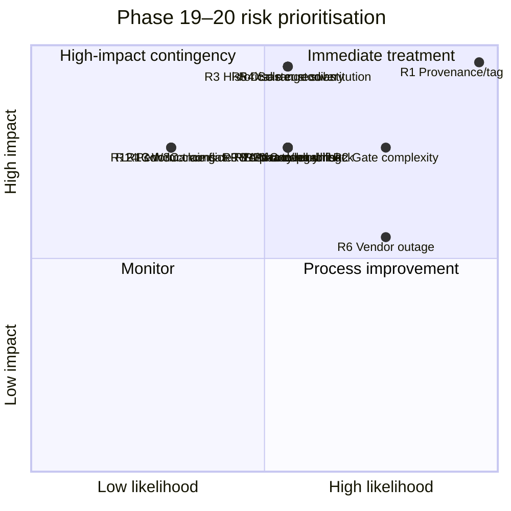
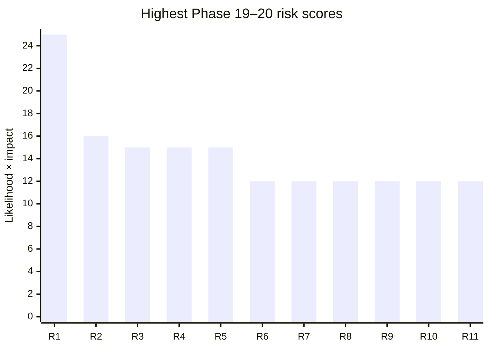
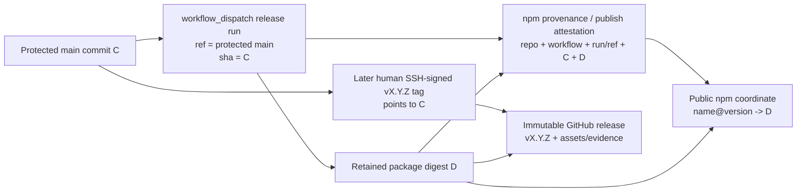

# Deep Review of Phase 19 and Phase 20 of the `owlapi` Implementation Plan

## Executive summary

The supplied `implementation-plan.md` is unusually rigorous in release integrity, supply-chain controls, package-boundary testing, immutable evidence, licence provenance, cross-runtime verification, and failure semantics. Phase 19 is essentially a **repository-extraction and first-publication programme**, while Phase 20 is a **stabilisation and first-stable-release programme**. The intended sequence is coherent: Phase 18 supplies the accepted semantic implementation; Phase 19 extracts and publishes that implementation as `owlapi@0.1.0-alpha.0` and converts WebVOWL into an ordinary registry consumer; Phase 20 freezes the public/environment contracts, produces one or more `1.0.1-rc.N` releases, and normally promotes the same capability surface to stable `1.0.1`. fileciteturn0file0

My principal conclusion, however, is that **Phase 20 should not be executed unchanged**. I found one likely release-blocking technical inconsistency, one fundamental versioning/identity tension, and several high-value omissions that should be resolved before the stable gate.

The most important finding is the **npm-provenance/tag ordering problem**. The plan deliberately stages the package from a manually dispatched workflow on protected `main` **before** the canonical `v<version>` tag exists, and creates the signed tag only after staged-byte verification. Later, however, Phase 20 requires the npm root provenance/attestation to validate the package's “repository, tag/commit/workflow” identity. fileciteturn0file0 GitHub's OIDC identity records the Git ref that triggered the workflow; for a `workflow_dispatch` run from `main`, that is a branch ref, not a tag created later in the run. GitHub documents `ref`, `ref_type`, `workflow_ref`, `workflow_sha`, run identity and related claims as properties of the triggering workflow. citeturn9search0turn9search5 npm provenance is generated at publication/staging time from that build environment and establishes the package's source/build identity. citeturn3search1turn8search0 A later Git tag can and should independently bind the same commit, but it cannot retroactively become the triggering ref of an earlier OIDC provenance statement. The stable acceptance test should therefore validate **npm provenance → repository/workflow/captured commit/actual triggering ref**, and separately validate **signed tag → same captured commit**.

The second major problem is the planned use of **`1.0.1` as the first stable release of a completely unrelated implementation after an unrelated historical `owlapi@1.0.0`**. The document openly recognises this namespace discontinuity and the possibility that dormant `^1.0.0`, `~1.0.0` or `1.x` dependencies could resolve to the new library. fileciteturn0file0 npm correctly treats previously used `name@version` coordinates as permanently consumed even after unpublication. citeturn4search0turn4search5 But SemVer defines a `1.0.1` patch as a backwards-compatible correction to the API defined by `1.0.0`; the new package is expressly **not** compatible with that historical API. citeturn4search10 The plan's “namespace-discontinuity exception” is therefore operationally possible at npm but semantically incompatible with normal SemVer interpretation. The historical-dependency audit mitigates known public exposure but cannot prove that private or dormant consumers do not exist.

Other material findings are:

| Severity | Finding | Assessment |
|---|---|---|
| **Critical** | npm provenance is expected to validate a tag created only after staging/provenance generation | Likely impossible under the current wording; release gate can deadlock |
| **High** | New unrelated product begins stable life at `1.0.1` after unrelated `1.0.0` | Deliberate but conflicts with ordinary SemVer interpretation and permits stale ranges to substitute the new product |
| **High** | Sole human npm/GitHub/security/conduct custodian and self-approval | Explicitly accepted, but creates availability, recovery, incident-response and conflict-of-interest concentration |
| **High** | No tested off-platform disaster-recovery/cold-backup mechanism | Release immutability is excellent, but service/account loss and signer recovery are weakly covered |
| **High** | Phase 19 moves maintained WebVOWL to an alpha registry package without an explicit production-deployment prohibition | Could inadvertently turn a prerelease integration milestone into a production dependency |
| **High** | No explicit post-WebVOWL-cutover rollback/runbook | Package-level bad-release recovery is strong; application rollback after cutover is under-specified |
| **High** | Acceptance gate has become extremely large and cross-referential | Increases hidden deadlock, stale-control and “green by interpretation” risks |
| **Medium–High** | Security/conduct mailboxes process personal and potentially sensitive information without an explicit privacy/retention regime | UK data-protection obligations should be separately addressed |
| **Medium** | Phase 20 does not restate the hard performance/benchmark gate as clearly as Phase 19 | Global requirements may cover it, but the stable acceptance contract should be explicit |
| **Medium** | Live third-party provider/service checks are release blockers with no vendor-outage decision matrix | Strong fail-closed posture, but availability failure becomes indistinguishable from package defect at programme level |
| **Medium** | Formal W3C test-reporting is deferred until after the stable release | Acceptable if stable claims are carefully qualified; not sufficient for broad “conformant OWL 2 implementation” wording |
| **Low–Medium** | Accessibility, localisation and documentation-language policy are largely unstated | Low runtime risk, but worthwhile to define explicitly |

The strongest recommendation is therefore to treat the Phase 19→20 boundary as an **architecture-control checkpoint**, not merely a Git checkpoint: resolve the provenance wording; explicitly accept or change the `1.0.1` namespace strategy; add operational rollback, privacy and disaster-recovery clauses; and turn the enormous prose acceptance contract into a machine-readable gate inventory before the first `1.0.1-rc.0` release.

## Extracted phase baseline and side-by-side comparison

The table below consolidates the statements, requirements, assumptions, inputs, outputs, dependencies, resources, stakeholders, tests, success criteria and deliverables that are materially operative in the two phases. It is a semantic consolidation rather than a verbatim reproduction of every normative sentence. fileciteturn0file0

| Dimension | Phase 19 — extract and publish standalone package | Phase 20 — stabilise and publish stable | Review finding |
|---|---|---|---|
| **Primary statement of purpose** | Extract the Phase 18 `owlapi-js` implementation from WebVOWL into the sole canonical `Hadden-Industries/owlapi` repository; package and publish a useful alpha; make WebVOWL consume the registry package. fileciteturn0file0 | Productionise the already accepted alpha capability surface, produce RCs and publish the first stable release, normally `1.0.1`; make WebVOWL consume that stable package. fileciteturn0file0 | Clean architectural hand-off between extraction and stabilisation. |
| **Scope boundary** | Release engineering, packaging, repository restructuring and portability fixes; no new semantic programme. Accepted Phase 18 semantics are the baseline. fileciteturn0file0 | Defect/security/resource/portability/diagnostic/package/release corrections only; no new parser, storer, ontology-operation family, public RDF API or speculative compatibility type. fileciteturn0file0 | Strong scope control. Clarify whether alpha public-API facade breaking corrections are explicitly permitted. |
| **Entry assumption** | Phase 18 is committed and accepted; the capability surface is frozen; the mixed WebVOWL history remains available as extraction evidence. fileciteturn0file0 | Phase 19 alpha has been published and verified; WebVOWL already consumes that exact registry artefact; Phase 19 checkpoint is committed and pushed. fileciteturn0file0 | Sequential dependency is unambiguous. |
| **Primary input artefacts** | `src/owlapi-js/`, associated tests/docs/corpora, Phase 18 checkpoint, capability matrix, WebVOWL history, exact dependency/tool versions, repository settings and release configuration. fileciteturn0file0 | Published alpha, canonical `owlapi` repository, exact registry-backed WebVOWL integration, Public API Surface Registry, Java reference inventory, stable environment matrix and Phase 19 release machinery. fileciteturn0file0 | Good traceability. |
| **Repository requirement** | `Hadden-Industries/owlapi` becomes the only maintained package source. History is filtered/replayed with mapping evidence; WebVOWL's staging copy is frozen and ultimately deleted. fileciteturn0file0 | All package work remains in the canonical repository; WebVOWL remains only a normal package consumer. fileciteturn0file0 | Strong anti-dual-authority design. |
| **History requirements** | Classify mixed history, use exact `git-filter-repo`, preserve original mixed branch as evidence until verification, preserve mapping/hashes/authorship and split mixed commits where necessary. fileciteturn0file0 | No further extraction; retain Phase 19 extraction identity/digests as provenance evidence. fileciteturn0file0 | Excellent provenance controls. |
| **Public package identity** | `owlapi@0.1.0-alpha.0`, normally under `next`; exact five public roots; native ESM; AGPL-3.0-only. fileciteturn0file0 | `1.0.1-rc.N` under `next`, followed normally by `1.0.1` under `latest`; contingencies can move first stable to a later same-surface patch. fileciteturn0file0 | Version-history issue is the largest non-provenance concern. |
| **Public API requirements** | Five roots only: package aggregate, `apibinding`, `model`, `io`, `formats`; no wildcards, direct internal RDF surface, aliases or TypeScript declarations. fileciteturn0file0 | Reconcile every public binding with Java package/type inventory, classify stable/private/deprecated rows, make explicit facades, prove deep/internal paths fail. fileciteturn0file0 | Very strong stable-surface discipline. |
| **Runtime contract** | Node 22/24 native ESM, browser bundler, document import-map and bundled dedicated-worker paths; Windows/macOS candidate qualification; alpha uses moving `baseline widely available`. fileciteturn0file0 | Freeze browser feature ceiling with `baseline widely available on <UTC date>`; keep Node 22/24; optionally evaluate Node 26 separately if LTS. fileciteturn0file0 | Date-pinned Baseline is technically sound; Browserslist explicitly supports this query form, and WebDX recommends date-pinning for reproducibility. citeturn5search0turn5search2 |
| **Parser/capability surface** | Existing twelve accepted input formats retained; no new capability required merely for packaging. fileciteturn0file0 | The same twelve representative formats must remain green through the manager API. fileciteturn0file0 | Good regression continuity. |
| **Dependencies** | Six foundational runtime dependencies exact-pinned; exact package manager and release tools; direct dependency ownership moved out of WebVOWL where appropriate. fileciteturn0file0 | Repeat locked and lockless graph verification, audit WebVOWL after extraction, no implementation/dependency change after accepted RC without returning to a new RC. fileciteturn0file0 | Strong dependency hygiene. |
| **Supply-chain controls** | Exact tool versions, exact Action SHAs, no implicit cache, one retained tarball, CycloneDX SBOM, checksums, `publint`, npm provenance, immutable GitHub release, machine-readable evidence. fileciteturn0file0 | Re-run the same controls against each RC and stable candidate; stable cannot inherit mutable alpha evidence. fileciteturn0file0 | Excellent defence in depth. |
| **npm bootstrap** | Direct initial publish because the package does not yet have the steady-state trusted-publisher path; protected short-lived granular token, then revoke/remove. fileciteturn0file0 | OIDC trusted-publisher staged path, staged download/digest verification, later interactive 2FA promotion. fileciteturn0file0 | npm officially recommends trusted publishing and supports stage-only trusted publishers. citeturn3search3 |
| **Tag ordering** | Candidate is qualified before immutable canonical tag; bootstrap tag created immediately before direct publish. Later releases stage before creating tag. fileciteturn0file0 | RC and stable candidates are staged/downloaded/verified, then human creates signed tag, then staged candidate is approved. fileciteturn0file0 | Strong late-tag integrity model, but conflicts with the later wording of npm provenance validation. |
| **Publication channels** | Alpha publishes only to `next`; `latest` must remain absent. fileciteturn0file0 | RC remains on `next`; stable establishes `latest`; after verification stale `next` is removed. fileciteturn0file0 | Coherent. |
| **WebVOWL input/output** | Pre-publication disposable tarball test, then maintained WebVOWL switches to exact public alpha and source copy is deleted. fileciteturn0file0 | Test exact RC in an isolated checkout, then switch maintained WebVOWL to exact stable cutover version after final registry verification. fileciteturn0file0 | Missing explicit “alpha must not be deployed to production” rule. |
| **Security** | GitHub private vulnerability reporting, company role mailbox, five-working-day acknowledgement target, CodeQL, secret scanning, push protection, no telemetry, network restrictions. fileciteturn0file0 | Revalidate all mutable security controls, audits and exceptions; stable support shifts from current prerelease to current stable 1.x. fileciteturn0file0 | Strong technical controls; human responder concentration and privacy handling remain gaps. |
| **Contributor governance** | AGPL inbound=outbound, first substantive external contribution cannot merge until contributor-rights model is explicitly confirmed; Contributor Covenant adopted. fileciteturn0file0 | Reconfirm rights inventory and governance state before stable. fileciteturn0file0 | Good IP gate; still warrants name/trademark review. |
| **Human stakeholders** | Maksym Shostak: copyright holder for existing work, sole required npm/GitHub custodian, release approver, security recipient and sole required conduct moderator; HADDEN INDUSTRIES LTD: steward. fileciteturn0file0 | Same governance model carries into stable unless separately changed. fileciteturn0file0 | High concentration of operational and adjudicative authority. |
| **External stakeholders/dependencies** | npm registry, GitHub Actions/releases/attestations, JSPM reference provider, Node/browser ecosystems, WebVOWL users/contributors/security reporters. fileciteturn0file0 | Same, plus consumers receiving the stable package and any historical package consumers discovered by the audit. fileciteturn0file0 | Vendor dependency is well tested but operational outage policy is missing. |
| **Privacy/data subjects** | Security and conduct reporters may communicate through role addresses; sensitive material is prohibited from release evidence. fileciteturn0file0 | Same channels continue into stable. fileciteturn0file0 | No explicit privacy notice, lawful-basis analysis, retention schedule or data-subject-rights process. |
| **Acceptance tests** | Full semantic/differential/resource/benchmark suites; Node 22/24; Windows/macOS; Chromium/Firefox/WebKit; import-map; worker; package lint; audit; SBOM; no-network; import purity; WebVOWL builds/corpus; release integrity. fileciteturn0file0 | Same package/runtime/WebVOWL gates, stable public-surface checks, stable browser ceiling, historical audit, RC loop, stable registry and release verification. fileciteturn0file0 | Phase 20 should explicitly name the hard performance/benchmark gate rather than relying on inherited/global clauses. |
| **Success criteria** | Alpha publicly installable and verified; immutable release evidence complete; WebVOWL consumes registry alpha; staging copy gone; trusted publisher configured; governance/security/custody controls operational. fileciteturn0file0 | Stable public artefact verified; `latest` correct and `next` absent; immutable release evidence complete; WebVOWL exact stable cutover green; no remaining Phase 19/20 work. fileciteturn0file0 | Success criteria are comprehensive but excessively distributed across cross-references. |
| **Timeline/deadlines** | Strict sequential flow; temporary npm token one day; Actions diagnostics 90 days; private-report acknowledgement target five working days; manual release gates may wait under GitHub environment rules. fileciteturn0file0 | Stable historical dependency audit no more than seven calendar days before publication; potentially multiple RCs; two explicit Git checkpoints. fileciteturn0file0 | No project-level target duration, release RTO or critical-vulnerability remediation target. |
| **Deliverables** | Canonical repository; history map; machine-readable API/capability registries; package files/docs/policies; tarball; SBOM; checksums; release evidence; immutable alpha release; WebVOWL alpha integration; OIDC steady-state config. fileciteturn0file0 | Stable API/environment records; RC release(s); stable tarball/SBOM/checksums/evidence; immutable stable GitHub release; npm channel cleanup; stable WebVOWL dependency and deployment notice inventory. fileciteturn0file0 | Deliverable ownership is generally clear. |
| **Explicit deferrals** | Post-1.0 mutation/storage/import-closure functionality does not block alpha. fileciteturn0file0 | Same features remain deferred; W3C conformance-reporting programme begins only after this implementation plan completes. fileciteturn0file0 | Conformance language needs care until that later programme completes. |

The sequencing itself is well designed. The most notable hidden assumption is that **all external control planes required by the gates remain sufficiently available at release time**: npm registry/audit/staging/provenance, GitHub Actions/environments/releases/attestations, JSPM provider resolution, browser downloads and relevant upstream metadata all participate directly or indirectly in a fail-closed release. fileciteturn0file0 That maximises integrity, but it means the project does not currently distinguish “product failed” from “mandatory third-party validation service unavailable” at the programme-management level.

## Contradictions and internal inconsistencies

### Provenance is generated before the tag it is later expected to validate

**Flagged statements**

Phase 19/20 deliberately use manual `workflow_dispatch` at a protected `main` commit, require the canonical tag to be absent during deterministic qualification and steady-state npm staging, and only allow the human to create the signed canonical tag after the staged package has been downloaded and byte-verified. Phase 20 later says that the exact root npm coordinate must pass validation of “repository, tag/commit/workflow and transparency”. fileciteturn0file0

GitHub's OIDC claims describe the `ref` that **triggered the workflow**, as well as the workflow ref/SHA and run identity. A manually dispatched job launched from `main` therefore has a branch ref; a Git tag created afterwards does not change the identity of the already-running workflow. citeturn9search0turn9search5 npm provenance is generated by the publishing environment and establishes the package source/build relationship at publication time. citeturn3search1turn8search0

**Why this matters**

If the validator literally requires the npm provenance to say the release was generated from `refs/tags/v1.0.1`, the late-tag workflow can never satisfy it. Weakening the late-tag architecture is unnecessary: the architecture is defensible; the validation sentence is the problem.

**Recommended rewording**

> “Validate npm provenance and publish attestations against the exact package digest, public repository, authorised `release.yml` workflow identity, captured workflow-dispatch run, captured protected-`main` commit and the actual triggering Git ref. Separately verify that the subsequently created SSH-signed annotated `v<version>` tag targets that same captured commit and that the immutable GitHub release is bound to that tag. The npm provenance MUST NOT be required to identify a tag that did not exist when the provenance was generated.”

This is the highest-priority edit.

### `1.0.1` is called a new unrelated first stable while SemVer interprets it as a patch of `1.0.0`

**Flagged statements**

The document says the historical `owlapi@1.0.0` belongs to an unrelated Overwatch-oriented package and the new `1.0.1` **must not** be described as a patch, compatible successor or continuation of it. At the same time, the document explicitly adopts SemVer-based stable-contract rules and uses `1.0.1` as the new implementation's first stable. fileciteturn0file0

npm permits new versions under a previously unpublished package name but permanently reserves every previously used exact `name@version` coordinate. citeturn4search0turn4search5 SemVer, however, assigns semantic meaning to the numeric lineage: `1.0.0` defines the public API, and `1.0.1` denotes a backwards-compatible patch to that API. citeturn4search10

**Why this matters**

A package manager does not understand the prose “namespace discontinuity” exception. A dormant dependency such as `^1.0.0` or `1.x` can select the new implementation once `1.0.1` exists—the precise residual risk the plan already recognises. fileciteturn0file0 The historical audit reduces known exposure but cannot discover every private manifest, archived deployment, offline lockfile regeneration or abandoned-but-still-built project.

**Recommended resolution**

The architecturally clean resolution is a package coordinate/version lineage that does not imply compatibility with the former product—for example the document's own conservative `3.0.0` alternative, or a separately approved distinct package identity. If retaining `1.0.1`, change the language from “SemVer exception” to an explicit risk acceptance:

> “npm coordinate constraints force a historical namespace discontinuity. `owlapi@1.0.1` uses SemVer for the Hadden Industries implementation **from this release forward**, but no SemVer compatibility relationship with any unpublished pre-existing `owlapi@1.x` artefact is claimed or possible. Consumers of the historical package MUST NOT use an old range to obtain this implementation.”

That does not eliminate the ecosystem risk; it merely describes it honestly.

### The npm organisation-team continuity experiment conflicts with npm's documented unscoped-package ownership model

The plan intends to test whether an `@hadden-industries:owlapi-maintainers` organisation team can gain read-write access to the **unscoped** `owlapi` package, while accepting that the test may show it is unsupported. fileciteturn0file0 Current npm documentation states that only user accounts can create and manage unscoped packages and organisations manage scoped packages; the access matrix identifies an unscoped public package's writers as its owner and directly granted users. citeturn4search11

This does not currently make the phase impossible because the plan explicitly permits a negative empirical result, but the test should not appear as a plausible redundancy control.

**Suggested rewording**

> “Record npm's then-current documented and empirical custody model for the unscoped package. Do not count an npm organisation team as a continuity control unless npm explicitly supports that arrangement for this unscoped coordinate and effective access is independently demonstrated. Human redundancy, if later required, shall use supported named-user package access rather than a fictional organisation ownership model.”

### “Freeze observable behaviour” conflicts with intentionally observable stable metadata changes

Phase 20 says that once an RC is accepted, “freeze observable behaviour”, but the stable pull request deliberately changes version, `publishConfig.tag`, release documentation, compatibility/stability classifications and other metadata. fileciteturn0file0 Those are observable package properties even though they do not alter ontology-processing semantics.

**Suggested rewording**

> “Once an RC is accepted, freeze the runtime public API, ontology semantics, supported capability set, production dependency graph and environment behaviour. The stable release pull request may change only the version coordinate, SemVer-derived publication channel and explicitly enumerated release/documentation metadata.”

This eliminates an unnecessary ambiguity around what “observable” means.

### Formal W3C reporting is deferred while stable language can imply standards conformance

Phase 20 explicitly states that W3C test-suite result completion and formal reporting occur only after the implementation plan is complete. fileciteturn0file0 W3C's OWL 2 conformance Recommendation says approved test cases are useful evidence but are themselves incomplete: passing them does not prove conformance, while failing an applicable test demonstrates non-conformance. citeturn7search0turn7search1

There is no requirement that formal W3C report submission precede a software release, so deferral is not inherently contradictory. The risk is **wording**: a stable package should not imply that completion of this plan itself amounts to complete W3C conformance certification.

**Suggested clause**

> “Stable `1.0.1` represents the capability and standards behaviour proven by the version-specific project test corpus. Formal W3C OWL 2 test-suite reporting is separate future evidence and has not been completed as a condition of this release. No release documentation shall describe W3C approval, certification or exhaustive OWL 2 conformance.”

### Phase 20's performance gate is less explicit than Phase 19's

Phase 19 explicitly requires differential, resource and accepted benchmark gates and includes package/bundle resource budgets in candidate verification. fileciteturn0file0 Phase 20 requires the complete package suite and resource/security gates but its stable safety section concentrates on §§2.43–2.61 and does not restate the hard benchmark/performance acceptance criterion with equivalent prominence. fileciteturn0file0

This may be covered by the document's global performance requirements, so I classify it as **ambiguity rather than a definite contradiction**. Stable publication should nevertheless say directly that no RC or stable candidate may regress an applicable hard resource/performance budget.

### Package-level bad-release recovery is comprehensive; post-application-cutover rollback is not

Phase 20 has detailed handling for failure before WebVOWL's stable cutover: remove `latest`, deprecate a bad stable, issue a corrective patch, preserve immutable history, and only then perform the WebVOWL cutover. fileciteturn0file0 What is not equally explicit is the situation where a defect appears **after the stable WebVOWL commit has been deployed**, possibly after Phase 20 has formally completed.

That is not an internal contradiction, but it is an operational discontinuity exactly at the point at which the plan moves from release verification into production operation.

A suitable clause is:

> “Before stable WebVOWL deployment, identify the immediately restorable application commit, registry lockfile and `owlapi` coordinate. A post-cutover incident MUST have a tested application rollback path that does not mutate an npm release. Rollback restores the last known-good WebVOWL artefact/lockfile or deploys a fully gated corrective package release according to severity. Define owner, RTO, validation smoke tests and the security-support status of any temporarily restored prerelease.”

## Missing considerations and edge-case review

### Security, privacy and governance

The technical security design is notably strong: no telemetry; local parsing must not cause network access; secrets are kept away from untrusted PR execution; external mutations are one-attempt plus reconciliation; package release roles receive tightly limited authority; secret scanning/CodeQL/dependency review/audit are independently enforced; vulnerability reporting is private. fileciteturn0file0 npm's trusted-publisher model is also consistent with the plan's intention to replace persistent publication credentials with short-lived workflow-specific OIDC authority. citeturn3search3

The missing layer is **human-information governance**. `security@haddenindustries.com` and especially `conduct@haddenindustries.com` can receive names, email addresses, employment relationships, allegations, evidence, correspondence and information about third parties. fileciteturn0file0 The ICO states that organisations collecting personal data must provide privacy information covering matters including purposes, retention periods and sharing, and generally provide that information when data are collected. citeturn6search0turn6search2 UK GDPR's storage-limitation principle also requires personal information not to be retained longer than necessary for its purposes. citeturn6search12

Phase 19 should therefore add a **repository-governance privacy notice** linked directly from vulnerability and conduct reporting instructions. At minimum it should specify the controller, purposes, lawful basis determined by the company, data categories, access roles, processors/mail provider, international-transfer position where applicable, retention/deletion criteria, incident handling, data-subject rights, complaint route and what information reporters should avoid sending. Legal review is appropriate because conduct allegations can be unusually sensitive and may contain information about people other than the reporter.

The conduct arrangement has a second structural issue: Maksym Shostak is both sole required moderator and potentially conflicted subject. The document correctly says he must not adjudicate a report in which he is conflicted, but then leaves the report pending until future governance or an external process exists. fileciteturn0file0 That is accurate, but operationally weak. Before inviting public conduct reports, appointing at least an **external conflict substitute** is a low-cost mitigation even if a second day-to-day moderator remains non-mandatory.

### Operational resilience, recovery and maintenance

The design is exceptionally good at preserving **immutable evidence**, but immutability is not the same as disaster recovery. GitHub release assets, npm registry artefacts and repository history provide multiple public copies of published material, yet account control, signing-key recovery, mailbox administration and future publication capability remain concentrated in one person. fileciteturn0file0

Missing controls include:

- a cold, non-authoritative off-platform Git repository backup containing tags and release/provenance records;
- encrypted recovery material for the human signing key and account recovery codes, stored outside the working machine;
- a documented GitHub/npm account-loss procedure;
- a restore drill proving that repository history, release evidence and signer registry can be reconstructed without creating a second maintained authority;
- a mailbox continuity/recovery procedure; and
- an RPO/RTO decision for “source/release infrastructure unavailable”, “signing key unavailable”, “npm account unavailable” and “canonical repository unavailable”.

These need not violate the “sole canonical repository” rule: an **offline backup is not a maintained mirror** if it has no development or release authority.

Monitoring is present but uneven. Phase 19 establishes a weekly lockless `owlapi@latest` health monitor and extended tests. fileciteturn0file0 Add a read-only **control-plane drift monitor** for at least: npm trusted-publisher identity, token-publication restrictions, `latest`/`next` state, package owners/collaborators, repository rulesets, environment reviewers/self-review settings, Action allowlist, CodeQL/secret-scanning state, release immutability and mailbox deliverability. A release process that depends heavily on mutable SaaS settings benefits from observing those settings between releases rather than discovering drift at the next emergency publication.

### Third parties, vendor availability and contractual dependencies

The plan intentionally fail-closes on live npm audit state, registry state, staging, provenance, GitHub release verification and JSPM/provider checks. fileciteturn0file0 This is defensible for security, and npm's current documentation confirms staged publishing and interactive 2FA promotion are real supported mechanisms. citeturn3search7turn3search3

What is missing is a **vendor-failure classification**. For example:

| Failure | Current practical result | Recommended explicit policy |
|---|---|---|
| npm staging unavailable | Release cannot proceed | `EXTERNAL_BLOCKED`; wait or invoke separately approved alternate publication architecture |
| npm audit endpoint unavailable | Stable release blocked | Preserve fail-closed rule, but distinguish service outage from package vulnerability |
| GitHub environment/release/attestation unavailable | Release cannot complete | `EXTERNAL_BLOCKED`; no weakening of integrity chain without architecture approval |
| JSPM public provider unavailable while integrity-verified local mirror still passes | Release currently risks blocking | Decide whether live-provider reachability is a release requirement or only reference-path health |
| Browser download infrastructure fails | Required browser job invalid | Define limited retriable infrastructure classification before final failure |
| Role mailbox outage | Security/conduct channel not operational | Block stable if both preferred/fallback intake channels are unavailable |

This does **not** mean adding a bypass. It means making “product defect”, “security-policy failure” and “vendor outage” distinct states, with an owner and escalation route.

The plan also deserves a separate legal/name review before stable publication. npm registry availability does not resolve possible trademark, passing-off, affiliation or ecosystem-confusion questions around using the very direct name `owlapi` while publicly describing Java OWLAPI compatibility. The README's non-affiliation wording helps, but a brief legal/name-clearance record would close a gap not covered by source-code copyright analysis.

### Performance, availability, scale and resource exhaustion

The document already treats finite-resource behaviour seriously and Phase 19 runs resource and benchmark gates. fileciteturn0file0 The stable phase should make these explicit again because the stable candidate is produced from a different commit and package coordinate, with a newly frozen browser baseline.

Recommended stable acceptance wording:

> “Every RC and stable tarball MUST pass every applicable §20.6 hard resource/performance budget against the packed/installed public boundary. Required results include adversarial finite-resource tests, benchmark regression comparison against the accepted RC/baseline, Node 22/24 results, required browser modes and package/bundle size budgets. A threshold change is a separately approved requirement change, not a means of making a failing release green.”

Also specify benchmark-noise handling: number of repetitions, machine class, warm-up policy, statistical threshold and how GitHub-hosted image drift is treated. Otherwise a “benchmark gate” can become either flaky or silently discretionary.

### UX, documentation, accessibility and localisation

Because this is a developer library rather than an end-user UI, accessibility risk is lower than for WebVOWL itself. Even so, Phase 19 creates README/API documentation, issue forms, contribution/security/conduct routes and compatibility tables. fileciteturn0file0 The plan should say whether English is the only supported project/documentation/diagnostic language for 1.x rather than allowing users to infer localisation obligations.

A lightweight accessibility clause is worthwhile:

> “Consumer-facing repository documentation and issue forms MUST remain usable without colour-only distinctions, provide textual equivalents for diagrams where material information would otherwise be inaccessible, use meaningful link text and headings, preserve keyboard-accessible native form controls, and use UTF-8 safely for ontology identifiers and diagnostic text. Project documentation and diagnostics are English-language for the initial 1.x line; localisation is not a supported 1.x capability unless separately added.”

### Financial and capacity governance

The plan fixes multiple required Node/OS/browser lanes, repeat RC executions, WebVOWL builds, SBOMs, 90-day artefacts and extended tests. fileciteturn0file0 It does not specify an Actions/storage/provider budget, quota alert or release-capacity assumption.

For a public project this may be inexpensive, but the missing architectural question is not merely monetary: **what happens if a SaaS quota or organisation-plan change prevents a mandatory lane?** Add a quarterly or release-time quota/cost check covering Actions minutes/storage, macOS/Windows availability, package registry requirements and any mailbox/provider plan required by the governance model.

### Formal acceptance-management and scope control

The largest process risk is the sheer size of the completion clauses. Phase 19 and Phase 20 each require dozens of cross-referenced controls, exact versions, workflow conclusions, mutable repository settings, test suites and evidence records to agree simultaneously. fileciteturn0file0 The intent is excellent; the prose implementation is vulnerable to accidental omission.

Create a machine-readable acceptance manifest such as:

```json
{
  "gateId": "P20-PROV-001",
  "requirement": "npm provenance binds retained tarball to authorised release workflow and captured commit",
  "phase": "20",
  "blocking": true,
  "owner": "release-custodian",
  "evidence": "release-evidence.npm.rootAttestation",
  "test": "npm:verify-root-attestation",
  "failureClass": ["PRODUCT", "CONFIGURATION", "EXTERNAL_BLOCKED"],
  "waiverAllowed": false
}
```

Every normative completion item should map to exactly one such gate or an explicitly identified composite gate. The final `Release / qualified` evaluator should reconcile itself against this registry. That reduces scope creep and makes contradictions such as the provenance/tag issue machine-visible much earlier.

## Prioritised risk register

Scores below use **Likelihood 1–5 × Impact 1–5**. They are architecture-review judgements, not statistical probabilities.

| ID | Risk | L | I | Score | Priority | Recommended mitigation |
|---|---|---:|---:|---:|---|---|
| **R1** | Late-tag architecture cannot satisfy literal npm “tag” provenance requirement | 5 | 5 | **25** | Critical | Rewrite provenance gate before first RC: validate npm branch/workflow/commit provenance and signed tag→same commit independently |
| **R2** | Acceptance/control complexity causes an impossible, stale or incorrectly interpreted gate | 4 | 4 | **16** | High | Machine-readable gate registry; one ID/owner/test/evidence/failure state per requirement |
| **R3** | Historical `^1.0.0`/`1.x` consumers silently receive unrelated new `1.0.1` | 3 | 5 | **15** | High | Prefer non-conflicting lineage; otherwise explicit namespace-discontinuity risk acceptance, expanded audit and prominent warning |
| **R4** | Sole human custodian loses access, is unavailable or cannot release a security fix | 3 | 5 | **15** | High | Named secondary recovery custodian or formally accept quantified RTO risk; cold backups and tested account recovery |
| **R5** | No tested off-platform restoration after GitHub/account/key loss | 3 | 5 | **15** | High | Encrypted cold backup, signer/account recovery procedure and periodic restore exercise |
| **R6** | Vendor outage blocks urgent release despite a technically sound candidate | 4 | 3 | **12** | High | `EXTERNAL_BLOCKED` state, outage decision matrix, escalation owner, no silent bypass |
| **R7** | Security/conduct mailbox handling breaches privacy/retention obligations | 3 | 4 | **12** | High | Privacy notice, lawful-basis review, retention schedule, restricted access, processor/transfer review, rights process |
| **R8** | Alpha WebVOWL cutover is mistaken for production approval | 3 | 4 | **12** | High | Explicit “alpha integration is non-production” deployment guard unless separately authorised |
| **R9** | Defect discovered after stable WebVOWL deployment lacks application rollback procedure | 3 | 4 | **12** | High | Predefine last-known-good artefact, lockfile, RTO, rollback smoke tests and security-support handling |
| **R10** | Mutable repository/npm governance drifts between releases | 3 | 4 | **12** | High | Weekly/monthly read-only drift monitor for trusted publisher, owners, rulesets, environments and tags |
| **R11** | Package-name/compatibility language creates legal or ecosystem-confusion issue | 3 | 4 | **12** | High | Legal/name clearance and persistent non-affiliation wording |
| **R12** | Stable regression passes because performance gate is inherited implicitly rather than directly asserted | 2 | 4 | **8** | Medium | Explicit Phase 20 benchmark/resource gate on RC and stable tarballs |
| **R13** | Stable release is interpreted as formal/exhaustive W3C conformance before reporting programme completes | 2 | 4 | **8** | Medium | Qualify claims; publish exact test coverage/deviations and state formal reporting is pending |
| **R14** | Sole conduct moderator is conflicted and no substitute can act | 2 | 4 | **8** | Medium | Preappoint independent conflict handler or external escalation procedure |





The risk profile is notable because the highest items are **not ontology-parser defects**. The document has comparatively extensive semantic and package testing; the larger residual exposure lies at the boundaries between version identity, provenance identity, human custody and operational continuity. fileciteturn0file0

## Dependencies, timeline and control flow

The document does not set calendar completion dates for either phase. Its schedule is instead gate-driven: Phase 20 cannot begin until Phase 19 has a verified public alpha, exact WebVOWL registry consumption and a pushed checkpoint; Phase 20 may run an arbitrary number of RC iterations; the historical dependency audit must be refreshed within seven calendar days of the stable publication attempt. fileciteturn0file0

The intended dependency graph is:

```mermaid
flowchart TD
    P18["Accepted Phase 18 semantic checkpoint"]
    H["Phase 19 history partition and hash/provenance mapping"]
    C["Canonical repository + configuration approvals"]
    A["Alpha deterministic artefact qualification"]
    T0["Create signed alpha tag"]
    N0["Direct npm bootstrap publication under next"]
    V0["Fresh registry + provenance + immutable-release verification"]
    W0["WebVOWL exact alpha registry cutover; staging source removed"]
    OIDC["Remove bootstrap token path; configure stage-only OIDC trusted publisher"]
    P19["Phase 19 checkpoint committed and pushed"]

    F["Phase 20 API and environment freeze"]
    S["Stable safety gates + <=7-day historical dependency audit"]
    RC["Build and fully qualify 1.0.1-rc.N"]
    STGRC["Stage RC under next and byte-verify"]
    TAGRC["Create signed RC tag"]
    PUBRC["Interactive RC promotion + immutable verification"]
    WVRC["Isolated WebVOWL RC verification"]
    ACCEPT{"RC accepted?"}

    STABLE["Stable-only version/release metadata PR"]
    STGST["Stage stable under latest and byte-verify"]
    TAGST["Create signed stable tag"]
    PUBST["Interactive stable promotion"]
    VERIFY["Fresh npm/provenance/release verification"]
    NEXT["Remove stale next tag"]
    WVST["WebVOWL exact stable cutover"]
    DONE["Final checkpoint / plan complete"]

    P18 --> H --> C --> A --> T0 --> N0 --> V0 --> W0 --> OIDC --> P19
    P19 --> F --> S --> RC --> STGRC --> TAGRC --> PUBRC --> WVRC --> ACCEPT
    ACCEPT -- "No: defect correction" --> RC
    ACCEPT -- "Yes" --> STABLE --> STGST --> TAGST --> PUBST --> VERIFY --> NEXT --> WVST --> DONE
```



The corrected provenance relationship should be understood separately from release sequencing:



This preserves the plan's valuable late-tag property while avoiding the impossible implication that a tag created after staging somehow becomes the OIDC triggering ref. GitHub's OIDC documentation confirms that the token carries the triggering `ref`, `ref_type`, workflow and run identity. citeturn9search0 npm's provenance documentation describes provenance as evidence of where/how the package was built and links it to source and build instructions. citeturn3search1

There are also four timing controls that deserve explicit operational treatment:

| Timing condition | Existing rule | Recommended addition |
|---|---|---|
| Bootstrap npm token | One-day token; immediate revocation after authorised attempt fileciteturn0file0 | Alert if secret/token still exists after bootstrap verification |
| Actions diagnostics | 90-day logs/artifacts; durable evidence moved to immutable release/repository records fileciteturn0file0 | Test evidence restoration before 90-day expiry |
| Historical package audit | Refresh ≤7 calendar days before stable attempt fileciteturn0file0 | Define whether a delayed release beyond seven days automatically invalidates approval—it should |
| Security acknowledgement | Target ≤5 working days, expressly not an SLA fileciteturn0file0 | Add severity-based triage/escalation targets and an alternate responder for custodian unavailability |

## Recommended edits and clarifying questions

### High-priority clauses to add before `1.0.1-rc.0`

**Provenance identity clause**

> npm provenance MUST validate the package subject digest, repository, authorised publishing workflow, triggering workflow ref, workflow/run identity and captured source commit that actually existed when provenance was generated. The subsequently created signed canonical release tag MUST independently target that same captured source commit. A release MUST NOT require npm provenance generated before tag creation to claim that later-created tag as its triggering Git ref.

This aligns the late-tag architecture with the semantics of GitHub's workflow/OIDC identity and npm provenance. citeturn9search0turn3search1

**Historical namespace clause**

> The project SHALL make an explicit pre-stable decision whether preserving the unscoped `owlapi` identity justifies the incompatible historical SemVer lineage. If `1.0.1` is retained, release documentation MUST state that no compatibility relationship with the unrelated historical `owlapi@1.x` package exists; the bounded dependency audit reduces but does not eliminate dormant-range substitution risk. The decision and risk owner MUST be recorded in stable release evidence.

npm's permanent `name@version` history and SemVer's patch semantics make this a governance decision rather than something tests can entirely solve. citeturn4search5turn4search10

**WebVOWL alpha deployment clause**

> Phase 19's maintained WebVOWL switch to the registry alpha establishes package-boundary integration evidence only. A WebVOWL artefact containing `owlapi@0.x` MUST NOT be promoted to a production deployment unless a separate deployment decision explicitly accepts prerelease support, rollback and security consequences.

**Stable performance clause**

> Every Phase 20 RC and stable candidate MUST independently pass all applicable hard performance, memory, resource, package-size and bundle-size budgets against the exact retained tarball. Stable publication may not rely solely on an alpha result. Threshold changes require an explicit requirements change and benchmark-evidence review.

**Application rollback clause**

> Before stable WebVOWL cutover, record and test the last-known-good application artefact, manifest, lockfile, package coordinate, rollback command/runbook, health checks, owner and target recovery time. A package release is never mutated as an application rollback mechanism.

**Disaster-recovery clause**

> Maintain a non-authoritative encrypted cold backup of repository history/tags, release/provenance records, signer registry and required recovery material. The backup has no release authority and therefore does not constitute a second canonical repository. Perform and record a restore exercise before stable publication and at a defined recurring interval.

**Privacy clause**

> Before activating public security and conduct intake, publish privacy information describing HADDEN INDUSTRIES LTD's processing of report-related personal data, including purposes, applicable lawful basis, data categories, recipients/processors, transfer position, retention/deletion criteria, access restrictions, individual rights and complaint route. Reporter guidance MUST minimise unnecessary third-party and sensitive information.

ICO guidance requires transparency around purposes, retention and sharing when personal data are collected, and the storage-limitation principle requires retention no longer than necessary. citeturn6search0turn6search12

**Conflict-handler clause**

> At least one documented route MUST exist for handling a Code of Conduct report in which the sole ordinary moderator is conflicted. The substitute may be an external appointed person or defined external process and need not have ordinary repository administration authority.

**Control-drift clause**

> A scheduled read-only governance check MUST compare actual npm/GitHub mutable release controls with their approved values, including trusted publisher identity, token-publication policy, package collaborators, distribution tags, branch/tag rulesets, environment review settings, Actions allowlist and scanning state. Drift opens one actionable maintenance finding and never changes state automatically.

**Acceptance-manifest clause**

> Every blocking Phase 19/20 requirement MUST have a stable gate identifier, owner, applicability rule, executable or human verification method, evidence location, failure classification and waiver policy. Phase completion requires the gate registry to contain no unresolved blocking row. Narrative completion lists and the machine-readable registry MUST be mechanically reconciled.

### Clarifying questions that should be answered in the document

| Clarifying question | Why it matters | Recommended default |
|---|---|---|
| Does “npm provenance validates the tag” mean the provenance must literally contain the later tag, or merely that provenance and tag independently converge on the same commit? | Current late-tag design makes the former impossible. | **Independent convergence on same commit.** |
| Is the project knowingly accepting non-standard SemVer lineage by calling the new unrelated implementation `1.0.1`? | Determines range-substitution and compatibility expectations. | Prefer a clean version lineage; otherwise record explicit exception/risk owner. |
| Can the alpha-backed maintained WebVOWL branch be deployed to production? | Phase 19 currently makes the alpha an exact production dependency at manifest level. | **No**, absent separate deployment authorisation. |
| What is the application rollback target immediately after WebVOWL stable cutover? | Package recovery does not itself roll back a deployed application. | Recorded last-known-good WebVOWL artefact/lockfile and tested runbook. |
| What recovery objective applies if the sole release custodian is unavailable during a critical vulnerability? | Single-custodian risk is acknowledged but not quantified. | Define maximum tolerable delay or add secondary emergency custodian. |
| Where are security/conduct report privacy information and retention periods defined? | Role mailboxes process personal data. | Dedicated governance privacy notice and retention schedule. |
| Who handles a conduct report involving the sole moderator? | Existing policy leaves such a report pending. | Pre-appointed independent conflict handler. |
| Which Phase 20 gate proves performance has not regressed from the accepted RC? | The global rule exists but Phase 20 wording is indirect. | Explicit stable tarball benchmark/resource gate. |
| When a mandatory third-party service is unavailable, is the result `PRODUCT_FAILURE`, `CONTROL_FAILURE`, or `EXTERNAL_BLOCKED`? | Needed for operational decision-making without weakening fail-closed controls. | Three distinct machine-readable states; all block publication where required. |
| Is live `jspm.io` availability itself part of the stable package contract, or only a health check for the replaceable reference provider? | The plan says the provider is replaceable but also makes public URL validation a blocker. | Treat local integrity/semantic execution as package evidence; classify provider reachability separately unless availability itself is intentionally promised. |
| What exact wording may the stable README use about OWL 2 conformance before the follow-on W3C reporting plan is complete? | Avoids over-claiming standards certification. | “Tested against declared capability/conformance corpus; formal W3C reporting pending.” |
| Is an npm organisation team still being treated as potential redundancy for an unscoped package? | npm's current package-access guidance says unscoped packages are user-managed. citeturn4search11 | Do not count it; use supported named-user access if future redundancy is approved. |
| What constitutes evidence that the cold backup/recovery path actually works? | Backup without a restore test provides weak assurance. | Disposable restore plus signed-tag/evidence verification. |
| What is the support language of repository/API/error documentation? | Avoids accidental localisation expectations. | English/en-GB documentation; programmatic identifiers remain stable and language-neutral. |
| What are the cost/quota thresholds for the mandatory CI/release matrix? | A quota exhaustion can otherwise unexpectedly become a release blocker. | Record provider quota and alert threshold, reviewed before stable. |

### Recommended release decision

Phase 19 is broadly executable with targeted amendments, although the team-access experiment should be reframed and the WebVOWL alpha deployment boundary should be made explicit. Phase 20 should be considered **conditionally blocked** until the provenance/tag acceptance criterion is corrected. fileciteturn0file0

After that correction, the remaining gate for architectural approval should be the package-version decision. Keeping `1.0.1` is an informed business/ecosystem risk rather than a technical impossibility: npm's immutable-version rules support using an unused coordinate, but SemVer's normal interpretation and dormant dependency ranges do not respect the document's prose discontinuity. citeturn4search5turn4search10 If the project retains `1.0.1`, the stable release evidence should record that exception prominently rather than characterising the new release as ordinary SemVer continuation.

With those two issues resolved, plus explicit clauses for rollback, privacy, disaster recovery, stable performance verification and machine-readable acceptance management, Phases 19 and 20 form a strong release architecture. The plan's existing strengths—single retained artefact, immutable source tags/releases, byte-level staged-candidate comparison, exact dependency/tool pins, least-privilege workflow separation, clean consumer testing, registry re-download, no-telemetry contract, cross-platform/browser qualification, rights inventory and append-only release evidence—already address a much larger proportion of software-release failure modes than a conventional npm extraction plan. fileciteturn0file0