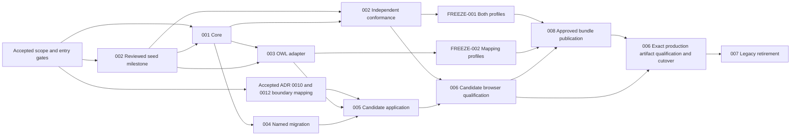

# Canonical VOWL implementation plan

**Status:** Draft for review; implementation, requirement baseline, v1 freeze, and release remain unapproved.
**Planning date:** 24 September 2026.
**Decision owner:** Maksym Shostak.
**Procedure:** HISEW Thin Implementation Plan, applying its risk, evidence, ownership, native reuse, and recovery rules.
**Goal:** Let independent producers exchange identical bytes for the same retained VOWL representation, and let WebVOWL consume and restore that representation without losing its declared semantics or portable scene.
**Architecture:** A producer-neutral core in `packages/vowl` owns the closed model, whole-profile graph labelling, and exact JSON bytes.
OWL and historical ingress build that model through separate adapters; WebVOWL owns editing, application state, acquisition policy, and rendering.
**Technology:** Native ESM JavaScript, JSON Schema 2020-12, RFC 8785, RDFC-1.0 with internal SHA-256, the public `owlapi` API, and a dedicated browser worker.

## 1. Planning basis and authority

Read these four documents together before implementing any slice:

| Reference | Authoritative input                                                                           | Role                                                                                    |
| --------- | --------------------------------------------------------------------------------------------- | --------------------------------------------------------------------------------------- |
| D         | [Canonical VOWL design](../specs/2026-09-24-canonical-vowl-design.md)                         | Scope, architecture, public interfaces, identity, delivery, and freeze gates.           |
| A         | [Core contract](../specs/2026-09-24-canonical-vowl-core-contract.md)                          | Closed grammar, normalization, RDF templates, validation, errors, limits, and adapters. |
| B         | [Projection and artifact contract](../specs/2026-09-24-canonical-vowl-projection-contract.md) | Exact topology, portable state, and deterministic display rules.                        |
| C         | [Research and design decisions](../specs/2026-09-24-canonical-vowl-design-decisions.md)       | Resolved alternatives, research rationale, and remaining implementation evidence.       |

The planning checkout was `main` at `1c64045bf5724ef8472870c20307ac7602830788`.
The four supplied files were tracked without local modifications.
Their checked-out SHA-256 values identify the exact text read; they are document fingerprints, not Canonical VOWL conformance evidence.

| Input | SHA-256 of checked-out bytes                                       |
| ----- | ------------------------------------------------------------------ |
| D     | `174535bb8cb43f317631f0799721adebfbbc4ceff4d577595be8fb91dd940fac` |
| A     | `711ba30c291cfb0960334328203188600f60a331996e83379267a4a77b87988d` |
| B     | `4c1cf6a7e187f98d40d390e6ff0b5354aca46a8ff195fba5b6badace7eb6078b` |
| C     | `f314ec3448f2cf87f73ce6ce8871f3695d4b3b26dee687383b36e36a4fc0a43e` |

The user authorized creation of this plan in `docs/plans`.
The design explicitly permits planning before executable schemas, independent vectors, or benchmarks exist.
Those artifacts are deliverables below, not prerequisites manufactured to prevent planning.
No product or configuration changes are part of this planning task.
The pre-existing `skills-lock.json` modification is unrelated user-owned work.

HISEW inspection confirmed active personal applicability and a ready admitted worktree: project `9a11c4f6-5850-4799-85a6-af0cf3eee5a8`, worktree `4200f543-f93d-41d8-902c-971a9ce530f9`.
`inspect-change-execution` returned no active execution for this session.
The latest stored handoff, `200d0fd4-e006-42a1-bd5f-8e0015f1dc09`, concerns proportional documentation CI in another task; its R0 approval is not Canonical VOWL authority.
No Canonical VOWL requirement snapshot or accepted implementation route was found in the inspected project evidence.
Consequently, the traceability identifiers and R2 assessment below are draft planning records derived from the supplied design, not claims of a previously accepted engine baseline.
Before implementation, the owner must accept the exact scope and route and establish the required HISEW baseline through its normal procedure.
This plan does not start, adopt, reroute, or baseline an execution.

### Proposed implementation risk route

**Risk class:** R2, proposed for the implementation programme.
**Decision owner:** Maksym Shostak.
**Reasoning:** Public byte contracts, persistent exported artifacts, lossy historical ingress, cross-package ownership, and hostile-input resource consumption are explicit R2 triggers.
**Potential blast radius:** Package consumers, saved VOWL files, browser ingestion, semantic inspection, editing, export, and downstream identity/digest users.
**Reversibility:** Unreleased package changes can be revised; lost historical information cannot be recovered, and a published byte contract cannot be silently replaced.
**Principal unknowns:** Current dependency qualification, editing through the declared core boundary, complete `owlapi` validation coverage, independent producer availability, legacy-state recoverability, and measured browser limits.
**Required artifacts:** Accepted requirement baseline, this plan, schemas, mapping/projection catalogs, independent corpus, per-slice evidence, migration report, and release/recovery assessment.
**Required specialist lenses:** Independent protocol/oracle review; OWL structural validation review; hostile-input and worker-boundary security review; browser accessibility review for cutover.
**Required verification:** HISEW's selected `full` profile plus the additional checks in section 7; a profile named `full` does not prove interoperability by itself.
**Required human approvals:** Baseline and route, exact configuration edits, any cross-repository implementation, any required delegation or scan, browser cutover, freeze, and publication; commits and pushes require their separate repository authorizations.
**Maximum sensible autonomy:** Implement and check only an accepted slice within its approved files and constraints; stop the affected work at a material contract, rights, recovery, or approval gap.
**Next lifecycle step:** Review this draft and establish its accepted implementation scope; then complete the entry gates of SLICE-001.

## 2. Scope, invariants, and outcome guardrails

The programme covers the two canonical profiles, the three package surfaces, the fixed OWL mapping policies, the one named migration dialect, application adoption, and eventual retirement and publication.
SLICE-001 is entirely package-local: it does not change the existing loader, renderer, menus, editor, or export behavior.
Later application work starts only after its ownership and cutover gates are satisfied.

All slices inherit these invariants:

- Identity means normalized retained VOWL structure, not OWL entailment equivalence or source-byte identity.
- The effective resolved structural content and root direct imports participate; retrieval topology, source URLs, imported ontology metadata, diagnostics, digests, and signatures remain external.
- Subjects, roles, expressions, constructs, and occurrences remain distinct categories; handles and category IDs are never durable identity.
- The core validates normalized input; adapters deduplicate and normalize before calling it.
  No reasoner inference, endpoint propagation, nested-constructor flattening, or weakest-bound approximation is introduced.
- Every annotated retained assertion keeps its exact supported assertion anchor; literal lexemes, full annotation IRIs, nesting, and anonymous multiplicity survive.
- Only property-chain `members` is a sequence; every other array is a set, with complete-member JCS UTF-8 ordering after ID issuance.
- Artifact facts enter the graph before RDFC; matching local IDs across profiles or revisions is never a join strategy.
- Core operations have no network access and use their bundled profile contracts.
- Strict OWL mapping validates the complete closure before retention filtering; compatibility uses only A9.2's six named recoveries and its separately specified exclusions/omission.
  Multi-property data quantification fails with `MAPPING_UNSUPPORTED_CONSTRUCT` in strict mode and is omitted as a whole with that diagnostic in compatibility mode; it is never approximated as unary restrictions.
- v1 retains direct class membership and referenced individuals, but excludes the specified property assertions and individual equality/difference axioms with diagnostics.
- Portable artifacts contain complete effective state and restore paused; missing state never invokes an automatic layout during canonicalization or migration.
- Unsupported, ambiguous, unsafe, noncanonical, exhausted, and cancelled operations fail without fallback bytes.
- Before freeze, identify candidate artifacts as experimental outside canonical bytes and record their exact specification revision; do not enable stable production writes under the proposed `/v1` identifiers.
  Both canonical profiles and every OWL mapping profile used in production must pass their explicit freeze and publication gates before cutover or legacy retirement.
- The package and specification materials use `AGPL-3.0-only`; preserve required third-party provenance and notices.

Excluded work includes a general ABox graph, inference, a fourth public surface, RDF/JSON-LD companion output, SHACL replacement validation, signing, a media-type registration, and unrelated deterministic-ordering repairs from D25.
The existing legacy export is useful migration evidence, not a canonical oracle.

The higher outcome is trustworthy exchange that remains useful for visual exploration.
Evaluate three trade-offs throughout: canonical identity versus computational cost; strict validation versus compatibility usability; and exact retained meaning versus the narrower VOWL 2 visual vocabulary.
Performance tuning may change finite acceptance budgets but never successful bytes.
A details-only fact must remain inspectable rather than disappear to simplify the drawing.
Reassess the design if ordinary supported ontologies systematically fail the measured budgets, required retained meaning is lost, or the consumer needs information the three surfaces cannot express.

## 3. Draft requirements, acceptance criteria, and decisions

These stable plan-local IDs name requirements already expressed in D/A/B/C.
They add traceability without replacing the normative text or implying owner acceptance.
Every acceptance criterion is a future pass condition, not a result obtained while planning.

| Requirement                                                                                    | Acceptance criterion                                                                                                                                                                                                                                                                                              | Source                                                  |
| ---------------------------------------------------------------------------------------------- | ----------------------------------------------------------------------------------------------------------------------------------------------------------------------------------------------------------------------------------------------------------------------------------------------------------------- | ------------------------------------------------------- |
| REQ-001: Implement the closed retained model and adapter/core normalization boundary.          | AC-001: Every A1–A5 grammar row has positive and negative cases covering typed references, uniqueness, reachability, signature closure, original arity, singleton retention, endpoint aggregation, and exact annotation support.                                                                                  | D8–13, D16–17; A1–A5; C3.                               |
| REQ-002: Derive identity through the complete selected-profile RDF mapping and category ranks. | AC-002: Field-distinction fixtures and handle/set permutations agree with independently checked datasets, numeric `c14nN` ranks, contiguous category IDs, and complete output under symmetry.                                                                                                                     | D18; A6; C4.                                            |
| REQ-003: Expose only the specified core admission and byte operations.                         | AC-003: Public API tests prove safe pre-await snapshots, deep immutability, module-local `encode` admission, fresh byte arrays, duplicate-safe exact decoding, reconstruction, stable errors, and no serializer coercion.                                                                                         | D7.2, D19–20; A7; C5.                                   |
| REQ-004: Generate the exact v1 topology and preserve details-only meaning.                     | AC-004: Every B2.5 token and conditional rule has a matrix row and full-topology fixture; missing, extra, duplicate, or wrongly connected occurrences fail.                                                                                                                                                       | D14; B1–B2, B6; C6.                                     |
| REQ-005: Preserve portable artifact state and deterministic display.                           | AC-005: Core tests prove complete state/scalar validation and state-dependent RDFC/ID relabelling; application display tests pass the shared B4/B5 vectors independently of locale; browser restoration preserves the scene while paused.                                                                         | D15; B3–B6; C7.                                         |
| REQ-006: Bound every expensive ingress and canonical operation.                                | AC-006: All A8 default/override and counter boundaries, shared adapter budgets, cancellation, deadlines, poisoned graphs, and worker termination pass without partial output.                                                                                                                                     | D20; A7–A8; C8.                                         |
| REQ-007: Map OWL bytes through the public parser/closure boundary.                             | AC-007: Supported syntaxes and import-order permutations agree; full-closure strict checks precede exclusions; every recovery, fatal ambiguity, and exclusion has the specified immutable diagnostic or error.                                                                                                    | D7.3, D10, D21; A9.1–A9.2; C9.                          |
| REQ-008: Migrate only the named historical dialect with explicit resolutions.                  | AC-008: A pinned ingress schema/field inventory explains every field; positive, ambiguous, conflicting, dropped-field, resolution, and incomplete-artifact cases pass without guessed semantics or layout.                                                                                                        | D7.4, D26; A9.3; C9.                                    |
| REQ-009: Make the new model the application source of truth.                                   | AC-009: Load, inspect, edit, draw, capture, export, and reload use the new model; semantic queries work before rendering; generation changes invalidate stale references and worker results.                                                                                                                      | D7, D14.4, D26–27; B6; ADR 0010 as amended by ADR 0012. |
| REQ-010: Establish independent interoperability evidence before freeze.                        | AC-010: A separately implemented Canonical VOWL pipeline reproduces the independently reviewed corpus exactly; the report identifies versions, environments, revisions, and all divergences.                                                                                                                      | D23–24, D27.1; A10; B6; C10.                            |
| REQ-011: Adopt supported components and preserve package boundaries.                           | AC-011: Exact dependency artifacts and rights are reviewed; standalone installation and Node/browser tests use direct dependencies and only the three public surfaces, with no hoisting dependency.                                                                                                               | D7, D22, D27.3; C4–5, C8.                               |
| REQ-012: Separate qualification, freeze, publication, cutover, and retirement.                 | AC-012: Both canonical profiles and every production mapping profile are frozen/published before stable writes or retirement; the exact production build passes the published corpus and scoped re-qualification; each gate has its own owner decision; originals survive migration and consumers are reconciled. | D6, D23, D26–28; C10.                                   |

Decision aliases used below refer to the resolved design, not new architectural choices:

| Alias   | Decision and source                                                                                 |
| ------- | --------------------------------------------------------------------------------------------------- |
| DEC-001 | Retained structural identity, one source of truth, exact annotations: C3; A2–A5.                    |
| DEC-002 | Typed recursive RDF encoding, whole-profile RDFC, numeric category ranks, then JCS: C4; A6; D17–19. |
| DEC-003 | Closed schema plus ordered semantic validation and duplicate-safe exact admission: C5; A7.          |
| DEC-004 | Explicit topology and details-only boundaries without v1 extension glyphs: C6; B1–B2.               |
| DEC-005 | Complete effective scene, label/prefix rules, externality, and display modes: C7; B3–B5.            |
| DEC-006 | Finite budgets, worker isolation, cancellation, and no fallback: C8; A8.                            |
| DEC-007 | Full-closure strict checking and finite compatibility recoveries: C9; A9.1–A9.2.                    |
| DEC-008 | Explicit one-way migration for the pinned dialect: C9; A9.3.                                        |
| DEC-009 | Package ownership, independent evidence, and separate freeze/publication gates: C10; D7, D23–27.    |

### Quality scenarios

| ID     | Stimulus and environment                                                                                                                            | Required observable response                                                                                                                        |
| ------ | --------------------------------------------------------------------------------------------------------------------------------------------------- | --------------------------------------------------------------------------------------------------------------------------------------------------- |
| QA-001 | Permute handles, set/object insertion order, blank-node labels, supported OWL syntax, and closure traversal across qualified runtimes/locales.      | Identical selected-profile bytes for the same normalized model; chain reversal/repetition changes remain distinguishable.                           |
| QA-002 | Supply malformed/ambiguous JSON, unsafe JavaScript values, wrong categories, misleading graph IDs, and composed-schema unknown fields.              | The specified first error and safe pointer/offset are returned; no getters or `toJSON` are invoked and no repaired document is admitted.            |
| QA-003 | Supply large, symmetric, disconnected, deeply nested, or poison inputs; cancel or expire the deadline at expensive stages.                          | Limits are enforced during construction, no fallback bytes escape, stale results cannot commit, and nonresponsive workers are terminated under A8.  |
| QA-004 | Exchange an artifact with hidden/pinned nodes, split datatypes, symmetric placements, Unicode labels, and a different viewport.                     | Portable state and bytes round-trip; restoration is paused; viewport conversion changes rendering coordinates only.                                 |
| QA-005 | Load missing imports, category conflicts, excluded axioms, ill-typed/custom literals, and an invalid axiom otherwise removed by retention.          | Strict and compatibility outcomes match A9 exactly; filtering never hides invalidity from the strict full-closure check.                            |
| QA-006 | Migrate colliding IDs, lost annotation namespaces, unresolved ontology identity, missing viewport, or collapsed occurrences with conflicting state. | A9.3 errors or exact typed resolutions are required; original bytes remain available and no guessed state is written.                               |
| QA-007 | Navigate a partial operator or details-only assertion using keyboard/text exploration and without color distinctions.                               | Complete retained facts, meaningful names, relationship summaries, and a partial-projection cue remain accessible.                                  |
| QA-008 | Install the package outside this workspace and run an independent producer using the pinned manifest.                                               | Public imports work without application/hoisted dependencies; expected datasets and bytes agree; missing evidence remains an explicit failed gate.  |
| QA-009 | Edit a loaded model, supersede a worker request, or interrupt migration/export.                                                                     | The last accepted document remains intact until success; runtime mappings reset by generation; retry uses retained source and explicit resolutions. |

## 4. Repository seams, reuse, and entry gates

### Current evidence and predicted files

Paths in this section are repository-relative predictions, not a mandate to create every module or change an existing contract without review.
Do not create a new worktree or edit another repository merely because it appears here.

| Responsibility                         | Inspected current seam                                                                                                                                                    | Predicted implementation location                                                                                                                                                                                                        |
| -------------------------------------- | ------------------------------------------------------------------------------------------------------------------------------------------------------------------------- | ---------------------------------------------------------------------------------------------------------------------------------------------------------------------------------------------------------------------------------------- |
| Core public contract                   | `packages/` does not yet exist.                                                                                                                                           | `packages/vowl/src/index.js`, `canonicalize.js`, `encode.js`, `decode.js`, `errors.js`.                                                                                                                                                  |
| Closed model and graph identity        | Current `src/owl2vowl/js/vowlBuilder.js` produces historical parallel arrays.                                                                                             | Package-private `modelContract.js`, `validateSource.js`, `internalRdf.js`, `issueCanonicalIds.js`, `canonicalJson.js`, and `resourceBudget.js`.                                                                                          |
| Topology and portable state validation | Legacy builder splitting and renderer parsing are integration evidence.                                                                                                   | Package-private `projectOccurrences.js` plus model/state validation; B1/B2 topology and B3/B4 state/scalar constraints remain core-owned.                                                                                                |
| Derived display behavior               | Controller projections and renderer input are application-owned seams.                                                                                                    | Predicted `src/app/js/controller/vowlDisplayProjector.js` owns B4/B5 labels, aliases, externality, notation, and radius factors, tested against shared language-neutral vectors; no duplicate core display helper or new package export. |
| Schemas and independent oracle         | Existing legacy and Java-reference fixtures do not define canonical bytes.                                                                                                | `packages/vowl/schema/structural-content-v1.schema.json`, `artifact-v1.schema.json`, `conformance/manifest.json`, `conformance/projection-matrix.json`, vector collections, and public-interface tests.                                  |
| OWL ingestion                          | `src/owl2vowl/js/index.js` uses `OWLManager`, `StringDocumentSource`, and `loadOntologyGraphFromOntologyDocument`; `importResolver.js` supplies application acquisition.  | `packages/vowl/src/owl/index.js` and a private builder; future `owlapi` capability work stays in its owning repository.                                                                                                                  |
| Historical ingress                     | Export/state behavior at `354ed3af8c1e82019f6280b2594acaceac96cca0`, especially `visualizationArtifactService.js`, `vowlDocument.js`, and `vowlVisualizationSettings.js`. | `packages/vowl/src/migrate/index.js`, a dialect-specific module and ingress schema, with source-pointer fixtures.                                                                                                                        |
| Application document and inspection    | `src/app/js/controller/vowlDocument.js`, `vowlModelInspectionProjector.js`, `ontologyInspector.js`, `webVowlController.js`, and their contracts.                          | Evolve these owning modules together for canonical semantic records and runtime reference mappings.                                                                                                                                      |
| Worker and source loading              | `src/app/js/controller/ontologySourceLoader.js` currently consumes legacy results.                                                                                        | Predicted `canonicalVowlWorker.js` and `canonicalVowlWorkerClient.js` beside the controller; explicit byte/resolver messages.                                                                                                            |
| Rendering and portable state           | `src/webvowl/js/parser.js`, `runtime/d3RenderedGraphAdapter.js`, `renderedGraphSettings.js`, controller arrangement/settings modules.                                     | Occurrence-aware input and state capture at those seams; semantic facts remain application-owned.                                                                                                                                        |
| Export and external consumers          | `visualizationArtifactService.js`, `menu/exportMenu.js`, `sidebar.js`, and `src/app/js/webmcp/`.                                                                          | Canonical byte delivery plus coherent inspection/editing/export consumers; preserve existing SVG, Turtle, and LaTeX responsibilities.                                                                                                    |

NAM-01 review must distinguish source handles, canonical category IDs, ontology/entity references, editable document record targets, generation-scoped rendered-occurrence references, and portable document-digest/local-ID addresses at every changed use site.
An existing name whose meaning changes needs review just as much as a new one.
Use the accepted vocabulary consistently, and correct misleading comparator descriptions to UTF-16 code-unit ordering where applicable.
DOC-01 requires the public operations and non-obvious mapping, admission, normalization, and recovery decisions to explain their contracts and reasons.

[ADR 0010](../adr/0010-rendered-graph-is-a-projection-not-the-store.md), as amended by [ADR 0012](../adr/0012-human-and-agent-visualization-action-parity.md), retains the renderer-as-projection rule and already permits opaque, generation-scoped rendered-occurrence references for arrangement.
Before SLICE-005 changes application source, record and obtain owner acceptance of how that effective boundary handles canonical state: distinguish semantic entity selection, the application-owned document record target for human editing, the runtime rendered-occurrence reference, and the portable occurrence address within one admitted document.
Trace drag, pin, capture, and a record edit while artifact changes relabel canonical IDs within a load generation; keep known runtime targets associated through explicit correspondence, never by reusing an equal `oN` string.
An external portable address binds the immutable document digest and local ID; a runtime occurrence reference conveys no ontology-editing authority.
Preserve existing human editing and its exclusion from WebMCP registration under ADR 0012.
Use the accepted amended contract where possible; a further change requires approval for the exact amendment or superseding contract before implementation.
This plan neither reinstates the superseded occurrence-reference prohibition nor approves an ADR change.
Do not silently repurpose an ontology entity reference into a canonical local ID.

### Software selection refresh

Reuse C and the [supplied research assessment](../reviews/Deep%20Research%20Assessment%20of%20the%20Proposed%20Canonical%20VOWL%20Representation.md), with the following current observations.
The assessment's earlier specification blockers are resolved by A/B; its missing implementation evidence remains relevant.

| Capability                                                        | Observation on 24 September 2026                                                                                                                                                                                                                                        | Entry obligation                                                                                                                                                                                                                                                                                              |
| ----------------------------------------------------------------- | ----------------------------------------------------------------------------------------------------------------------------------------------------------------------------------------------------------------------------------------------------------------------- | ------------------------------------------------------------------------------------------------------------------------------------------------------------------------------------------------------------------------------------------------------------------------------------------------------------- |
| RFC 8785                                                          | Installed `canonicalize@2.1.0`; `npm view canonicalize version license --json` reports `5.1.0`, Apache-2.0. The current package metadata declares ESM and Node `>=22`; [maintainer documentation](https://github.com/erdtman/canonicalize) describes its supported API. | Target the current stable release, recheck at adoption, inspect its exact source/license/notices, and qualify the wrapper against JCS vectors and browser packaging. Keeping 2.1.0 requires an explicit evidenced exception, not silent reliance on the transitive installation.                              |
| RDFC-1.0                                                          | Installed and registry latest `rdf-canonize@5.0.0`, BSD-3-Clause; [maintainer documentation](https://github.com/digitalbazaar/rdf-canonize) supplies the standards-library boundary.                                                                                    | Inspect the selected artifact and prove A8's explicit options, identifier map, cancellation, and bounded work behavior.                                                                                                                                                                                       |
| OWL parsing and closure                                           | Root dependency is pinned to `owlapi` commit `caabb1197ffdab91c1e10d596d177b5142aea5c1`; installed version is `0.1.0-alpha.0`. Public exports are root, `apibinding`, `model`, `io`, and `formats`.                                                                     | Produce a capability matrix for media types, byte sources, cancellation, datatype checking, and full OWL 2 DL structural checks; absence of demonstrated full checking blocks a strict claim. Any package update has its own approval and consumer qualification.                                             |
| JSON lexical admission, IRI/tag validation, and schema evaluation | The design fixes required behavior but does not select every implementing library.                                                                                                                                                                                      | Compare current maintained candidates and native capabilities against escaped duplicate names, bounded tokenization, lexical IRI identity, fixed BCP 47 rules, and composed 2020-12 closure before custom implementation. Record supported validator use, exact versions/rights, and the residual custom gap. |

Registry metadata is a freshness observation, not proof of license clearance or integration.
Do not introduce a second JCS, RDFC, or OWL parser implementation in the production core to avoid qualifying a supported dependency.
Custom VOWL normalization, mapping, topology, and semantic invariants are the residual profile-specific work identified by C3–C6.
There is no newly approved shim override.
The design's explicit named migration seam is its accepted compatibility mechanism; it does not authorize aliases, automatic detection, a dual-output builder, or runtime fallback.

### Configuration approval boundaries

The following are concrete predicted proposals for later approval, not authorized edits.
Before each mutation, present the actual exact diff and its smallest necessary effect under `AGENTS.md`.

| Files/settings                                                                                                                                                   | Smallest intended effect and pipeline impact                                                                                                                                                                                                  |
| ---------------------------------------------------------------------------------------------------------------------------------------------------------------- | --------------------------------------------------------------------------------------------------------------------------------------------------------------------------------------------------------------------------------------------- |
| New `packages/vowl/package.json`: ESM type, `AGPL-3.0-only`, package identity, export map, direct runtime dependencies, test command.                            | Establish standalone package ownership and root/`./owl`/`./migrate` surfaces as their implementations become available. Do not publish placeholder adapters. Resolve the exact artifact/package metadata before presenting the approval diff. |
| Root `package.json`: `workspaces` entry for `packages/vowl`, a package-focused test command, package coverage in JavaScript lint/format commands.                | Make workspace resolution and package checks explicit. Existing Jest discovery can already find package tests; prove that before proposing any Jest setting change. Current lint/format command globs omit `packages/`.                       |
| `package-lock.json`.                                                                                                                                             | Record only the approved workspace/dependency resolution and integrity changes; do not combine unrelated upgrades.                                                                                                                            |
| `eslint.config.js`, `.prettierrc.json`, `.prettierignore`, `vite.config.mjs`, or root `jest` settings, only if a demonstrated integration failure requires them. | No speculative configuration rewrite. Qualify package code and worker bundling first, then propose the exact missing rule or boundary.                                                                                                        |
| `.github/workflows/webvowl-ci.yml` or other workflow files, only if approved commands cannot cover new obligations.                                              | Preserve the existing conservative changed-file selection and required gates; do not convert mixed/package changes into documentation-only runs.                                                                                              |
| Root dependency and lock entries for an `owlapi` update, if required by SLICE-003.                                                                               | Consume an explicitly qualified parser/validator artifact rather than deep-importing private modules.                                                                                                                                         |
| `src/owl2vowl/package.json` and obsolete package references during SLICE-007.                                                                                    | Remove the retired package boundary only after all consumer evidence exists and this exact configuration deletion is approved.                                                                                                                |
| Hosting or publication configuration during SLICE-008.                                                                                                           | Exact profile hosting/package publication changes require a prepared release bundle and separate approval; this plan does not choose a deployment mechanism.                                                                                  |

## 5. Vertical implementation slices

Each checkbox is a reviewable deliverable, not a timed coding script.
Implement an observable fixture path early within each slice, then extend it to that slice's full contract.
The package's private stages are not separate public products or independently assigned write tasks.

### SLICE-001 — Canonical source to exact bytes and back

**Entry:** Accepted R2 baseline, current software-selection/rights evidence, and exact package/configuration approvals.
Assign the independent oracle custodian before implementation as section 6 requires; reviewed seed expectations are supplied by the early SLICE-002 milestone.
**Owner:** Core implementer appointed by the decision owner; the same integration owner owns model, topology, mapping, and admission semantics.
**Predicted files:** Core, schema, and conformance paths in section 4; package-local tests such as `canonicalize.test.js`, `decode.test.js`, `projection.test.js`, and `resourceBudget.test.js`.
**Interface:** `canonicalize(source,{profile,signal,limits})`, `encode(document)`, and `decode(bytes,{signal,limits})`, plus immutable profile constants and one package error class as D7 specifies.

- [ ] Demonstrate one complete structural fixture through validation, topology, RDF, RDFC, category IDs, bytes, and exact decoding; expand to both complete profiles before declaring the slice finished.
- [ ] Qualify editing re-entry early, before accepting the core interface for dependent slices: use a package-local experiment for one insertion, one deletion, and one annotated endpoint edit.
      Identify which layer constructs complete normalized source and recomputes occurrences, and prove the result can re-enter the declared surfaces without controller-owned duplicate normalization, private imports, a new public stage, or an OWL serialization round-trip.
      Record and obtain owner acceptance of the viable path, including annotation preservation and changed occurrence correspondence; if none exists, return the minimum interface/design decision before SLICE-001 exit or dependent conformance/API acceptance.
      Keep this experiment package-local; it does not authorize application edits, a fourth surface, or removal of editing.
- [ ] Implement every A1–A5 branch and invariant, two closed 2020-12 schemas, B1/B2 topology, and B3/B4 state/scalar validation with a mechanically checked field/kind inventory.
      Validate source normal form; do not repair missing occurrences, duplicate expressions, unsupported anchors, or missing signature roles.
      Derived B4/B5 display behavior belongs to SLICE-005's application module and is not a core byte-output claim.
- [ ] Implement A6's exact default-graph vocabulary, fixed root/profile anchor, distinct primary nodes, fresh auxiliary occurrences, boxed literals, present-empty containers, and indexed sequence slots.
      Issue category ranks numerically from the canonical identifier map, excluding auxiliaries; sort nested sets by complete-member JCS UTF-8 bytes afterward.
- [ ] Snapshot safe programmatic values before the first asynchronous suspension; deep-freeze admitted documents and keep admission outside serialized fields.
      Reject shared/unreadable byte backing stores and take byte snapshots before asynchronous processing.
- [ ] Decode through bounded lexical validation before materialization, including escaped duplicate names; apply ordered semantic checks, reconstruct graph identity, and compare exact output bytes.
      Reject cross-module/copied/frozen-only objects passed directly to `encode`.
- [ ] Apply A8 counters and combined deadline/cancellation from operation entry, including snapshot and RDF allocation work, without an unbounded option or alternate output path.

**Proof:** Public-interface positives/negatives for every grammar and projection row; independently reviewed hand-derived seeds; exact error precedence; descriptor/getter non-execution; deep-freeze/non-mutation; fresh-array ownership; scalar, mapping, ID, symmetry, artifact, and budget cases from section 7.
Include the accepted three-edit experiment and its normalization/occurrence ownership record; core proof covers portable state validation and identity, while application tests prove derived display choices.
Use actual standards libraries, not mocked successful canonicalization.
**Regression boundary:** Existing `src/owl2vowl` builder/index and artifact-service suites continue to pass without user-facing source edits; standalone package import and bundle probes detect unintended application dependencies.
**Exit/recovery:** Both profiles work as experimental package-local capabilities with evidence identifying this draft revision.
The editing feasibility result must be accepted before treating this interface as settled for dependent slices.
Failure leaves current application behavior intact; no interoperability freeze or consumer cutover follows from this slice alone.

### SLICE-002 — Independent corpus and freeze evidence

**Entry:** Accepted field/meaning contract and assigned independent oracle custodian/producer implementer permit fixture derivation before and alongside SLICE-001.
Full conformance comparison and acceptance require SLICE-001's complete public behavior and accepted editing feasibility result.
**Predicted files:** `packages/vowl/conformance/` vectors/manifest/matrix, conformance-runner tests, and `docs/reviews/canonical-vowl-conformance-report.md`.
**Interface:** Language-neutral source/input and expected output/error vectors with explicit specification and producer revisions.

- [ ] Deliver the reviewed-seed milestone early: independently derive, review, and pin a small set of source fixtures, expected datasets, canonical N-Quads, primary/category correspondence, canonical JSON, and exact bytes.
      SLICE-001 uses these seeds for core proof; SLICE-003 requires their reviewed revision without waiting for the entire independent-producer qualification.
- [ ] Expand every grammar/matrix row, RDF template, display rule, and required negative/metamorphic case into manifest-addressed vectors.
      Record source-handle maps only for fixed inputs; compare complete output for symmetric permutations.
      Include independently reviewed language-neutral B4/B5 display inputs and expected choices/factors for SLICE-005's application module; core bytes do not expose those derived display results.
- [ ] Obtain a separately implemented Canonical VOWL model-to-bytes pipeline and reproduce the corpus.
      Shared standards-compliant RDFC/JCS libraries are permitted; shared Canonical VOWL mapping, normalization, projection, or ID code is not independent evidence.
- [ ] Run the locale/runtime matrix and counterexamples, record all divergences, and prepare the D27.1 freeze evidence table for both profiles.

**Proof:** Zero unexplained exact-byte or stable-error divergence; coverage inventory contains no omitted kind/template/display rule; report contains producer versions, source revisions, environments, and independently reviewed expected artifacts.
Separate independent byte-pipeline agreement from display-vector review and the later application execution of those vectors.
**Dependencies:** Independent fixture derivation can proceed alongside SLICE-001 after field/meaning agreement, but expectation changes require oracle review.
**Exit/recovery:** Freeze-ready evidence, subject to an explicit owner freeze decision.
If independent reproduction is unavailable or disagrees, keep experimental status and block the freeze; do not regenerate goldens to manufacture agreement.

### FREEZE-001 — Owner decision on both canonical profiles

**Entry:** SLICE-001 and SLICE-002 evidence closes every D27.1 prerequisite, including the closed schemas, complete mapping/ID rules, exact decoder, independent byte corpus, and expanded topology/display matrix with reviewed fixtures.
**Decision:** The owner records freeze of both structural-content and artifact profiles against exact specification, schema, mapping, matrix, manifest, and evidence revisions.
Byte agreement or a successful test run alone does not constitute this decision.
**Effect:** SLICE-008 can publish the frozen bundle; SLICE-006 can continue candidate qualification but cannot enable stable production writes before freeze and publication are complete.
Freeze does not depend on production cutover or legacy retirement.
Until it passes, keep every candidate output experimentally identified outside canonical bytes with its specification revision and preserve it with that context.
Do not distribute draft outputs as stable `/v1` files; production experimentation would need a separately accepted draft-revision migration and recovery scope.

### SLICE-003 — OWL bytes and resolved closure to Canonical VOWL

**Entry:** SLICE-001 including accepted editing feasibility, the pinned reviewed-seed milestone from SLICE-002, parser/validation capability evidence, and any separately approved `owlapi` work.
**Predicted files:** `packages/vowl/src/owl/`, OWL fixtures/tests, and package export/dependency settings only as approved.
**Interface:** `fromOwl(bytes,{documentIri,mediaType,mappingProfile,resolveImport,signal,limits})` returning immutable `{document,mappingProfile,diagnostics}`.

- [ ] Qualify explicit media types and byte/import resolver shapes against the selected public `owlapi` APIs.
      Keep acquisition policy with the caller; no implicit fetcher, format sniffing, or synthetic ontology identity enters this API.
- [ ] Make the private builder consume the parsed root and manager-resolved closure, standardize anonymous subjects apart per source ontology, and construct normalized source with exact root metadata/import retention.
- [ ] Deliver full-closure strict structural checking, including excluded axioms, reserved vocabulary, category separation, simplicity/regularity/global restrictions, and datatype validation before retention.
      A missing `owlapi` capability is upstream owning work, not permission to advertise partial strict validation.
- [ ] Implement A9.2's exact compatibility recovery catalogue and exclusions, deterministic complete-record diagnostic ordering/deduplication, and shared aggregate counters/deadline across resolver, parsing, mapping, and core work.
      Prove strict rejection and compatibility whole-construct omission of multi-property data quantification, with `MAPPING_UNSUPPORTED_CONSTRUCT` and no unary approximation.

**Proof:** Supported-syntax and closure-order metamorphisms; cross-ontology anonymous collisions; punning; literal lexical variants; anchor/aggregation cases; every recovery/exclusion; unsupported media types; cancelled resolvers; malformed lists/cycles; missing imports; invalid strict content that retention would otherwise hide.
Existing Java-reference outputs help explain migration differences, not override the canonical oracle.
**Exit/recovery:** Both mapping profiles produce structural-content documents through one core.
The existing application converter remains untouched until cutover; do not introduce a dual-output flag or alias between converters.
Unqualified strict capability blocks adapter completion, not independent core work.

### FREEZE-002 — Owner decision on the OWL mapping profiles

**Entry:** SLICE-003's strict and compatibility evidence is complete against the accepted A9 rule revisions, including full-closure checks, recoveries, exclusions, diagnostics, default selection, and structural-content output.
**Decision:** Before adapter publication, the owner records stable strict/compatibility mapping-profile identifiers, exact policy revisions, qualified adapter/dependency versions, and the corresponding fixture manifest and results.
**Effect:** SLICE-008 may publish these mapping profiles within its approved adapter scope; a separately scoped core-only release does not require this gate or establish adapter acceptance.
A changed recovery rule requires a new mapping-profile identifier under D6.3; do not silently revise the frozen policy under an existing identifier.
Production OWL ingestion remains blocked until these mapping profiles are published and the exact production build is qualified against them.

### SLICE-004 — Named historical file to Canonical VOWL

**Entry:** SLICE-001 and the fixed exporter source at `354ed3af8c1e82019f6280b2594acaceac96cca0`.
**Predicted files:** `packages/vowl/src/migrate/`, dialect ingress schema/field map, pinned legacy inputs, resolution and migration tests.
**Interface:** `migrate(bytes,{dialect,profile,resolutions,signal,limits})` returning immutable `{document,dialect,diagnostics}`.
The only initial dialect is `webvowl-legacy-354ed3af8c1e82019f6280b2594acaceac96cca0`.

- [ ] Inventory the pinned exporter and state producer before enabling migration: every field maps to retained meaning, explicit resolution, deterministic dropped-field diagnostic, or fatal ambiguity.
      Track deployed exporter revisions through legacy retirement and prove their field/state grammar matches this pin; a material dialect change needs a separately named contract and approval before claiming support.
- [ ] Join record/attribute pairs once; reject duplicate IDs, missing partners, dangling references, and conflicting fields; discard traversal IDs only after resolving references.
- [ ] Implement only A9.3's `annotation-predicate`, `ontology-iri`, and `viewport` resolutions keyed by exact JSON Pointer, rejecting unused, duplicate, conflicting, or mistyped entries.
- [ ] Rebuild canonical topology and prove occurrence correspondence before attaching state.
      Structural migration may diagnose discarded layout; artifact migration requires complete positions, pins, display state, and known camera conversion without new layout.
- [ ] Use bounded duplicate-safe byte ingress and deterministic `MIGRATION_RESOLVED_FIELD`/`MIGRATION_DROPPED_FIELD` diagnostics; preserve original bytes and caller resolutions externally.

**Proof:** A9.3 and QA-006 fixtures, including local-name annotation collisions, missing ontology IRI/viewport, collapsed occurrences with conflicting placements, and missing new occurrences.
Compare migrated semantic facts to an independently reviewed field map and exact canonical output.
**Exit/recovery:** Explicit one-way ingress for the named dialect only.
There is no bulk rewrite/backfill or legacy-output branch; interrupted work retries from original bytes and the same resolutions.
Irrecoverable information remains an error, not a promise of reversible migration.

### SLICE-005 — Complete application integration on a candidate build

**Entry:** SLICE-001's accepted editing path, SLICE-003, SLICE-004, reconciled application ownership, and explicit approval for this application implementation scope.
Before any affected application source changes, obtain the owner-accepted boundary mapping under ADR 0010 as amended by ADR 0012, or the exact approved further amendment/superseding contract described in section 4.
SLICE-002 must pass before interoperability cutover; FREEZE-001, FREEZE-002 for production OWL ingestion, and SLICE-008's corresponding publication must complete before stable production writes.
**Owner:** One application integration owner for the document/controller/renderer/export changes; the core owner reviews any requested contract change.
**Predicted files:** Controller document/loader/inspection/arrangement/settings/contracts, worker/client, renderer parser/runtime, menus/sidebar, WebMCP consumers, and colocated tests from section 4.

- [ ] Route OWL, canonical bytes, and explicitly named historical input through their correct byte contracts.
      JSON shape detection must not guess a legacy dialect; shipped assets need an explicit inventory and migration disposition.
- [ ] Keep all parsing, normalization, graph verification, and canonical encoding in a dedicated worker.
      Bridge caller-owned import acquisition with request IDs, generation IDs, cancellation, aggregate budgets, and safe errors.
      Transfer encoded bytes before crossing module instances; a rendering clone has no encoder admission.
- [ ] Move application document and inspection projections to semantic records while preserving entity-oriented selection and exposing every retained details-only fact before renderer mount.
      Implement the accepted ADR 0010/0012 boundary, keeping entity references, editable document targets, runtime occurrence references, and portable canonical addresses distinct.
      Refresh revision-local correspondence on successful model/state replacement and invalidate retired targets; a drag or pin that relabels artifact IDs must not redirect a still-valid runtime arrangement reference to another occurrence.
- [ ] Implement occurrence-driven drawing and the single application-owned display projector for exact B4/B5 names, aliases, externality, notation, and radius factors, using SLICE-002's language-neutral vectors.
      Integrate partial-operator cues, complete portable state capture, and paused restoration; the renderer consumes the derived display result without implementing a second selection/classification algorithm.
      Keep runtime force settings, pixels, search/focus/sidebar state, and acquisition metadata outside canonical content.
- [ ] Migrate existing editing commands using the ownership and re-entry path qualified in SLICE-001; do not maintain a second normalization algorithm in the controller.
      Preserve unaffected retained constructs and annotations through edits, recompute topology/IDs, and handle newly created occurrence placements explicitly before artifact export.
      Repeat the insertion, deletion, and annotated-endpoint scenarios through actual application commands; any new need for duplicated normalization or an additional public stage reopens the affected interface decision before command migration proceeds.
- [ ] Deliver canonical bytes through the artifact service with `application/json` and `.vowl.json`, update menus and WebMCP contracts coherently, and preserve SVG/Turtle/LaTeX export regressions.

**Proof:** Full load → inspect → edit → capture → export → decode → restore scenarios for OWL and named legacy ingress; multi-occurrence entity selection; ID changes after editing/state changes; preserved annotations/details; hidden/pinned placements; worker admission and stale-result checks; all current source kinds and supported exports have a recorded disposition.
Include drag/pin/capture with canonical ID relabelling in one load generation, selection of the correct editable record among shared IRIs, and equivalent human/WebMCP arrangement behavior without exposing experimental human editing through WebMCP.
Run the shared B4/B5 vectors against the application display module across the selected locale/runtime matrix; core public-interface tests remain responsible for the serialized state and canonical bytes.
Keep the candidate deployment separate from production until SLICE-006 passes; this is release sequencing, not a runtime fallback or dual canonical mode.
**Exit/recovery:** A complete candidate application using the new model, with no silent legacy translation inside the renderer.
On a failed load/edit/export, retain the last accepted document and publish no partial candidate.

### SLICE-006 — Browser qualification and controlled cutover

**Entry:** Complete SLICE-005 candidate and SLICE-002 interoperability evidence; runtime/hardware/browser matrix and observer assigned.
**Predicted artifacts:** Browser integration evidence, accessibility report, resource/performance measurements, asset/consumer reconciliation, and cutover/recovery checklist in `docs/reviews/`.

- [ ] Measure ordinary, large, symmetric, disconnected, deep, and poison fixtures with input/record/quad counts, elapsed time, peak memory, main-thread responsiveness, cancellation latency, and the reached limit.
- [ ] Prove immediate request invalidation, cooperative cancellation, 250 ms nonresponsive-worker termination policy, deadline termination, and zero stale result commits.
      Real browser evidence is required; promise-based unit tests do not prove event-loop isolation.
- [ ] Qualify keyboard navigation, accessible names/relationships, full text alternatives, partial-projection disclosure, and alternatives to color-only meaning.
      Verify different viewport sizes and paused artifact restoration; do not require pixel-identical fonts/styles.
- [ ] Reconcile presets, upload/share/load routes, editing commands, WebMCP clients, and export consumers against an explicit support inventory.
      Include every deployed legacy exporter revision through retirement, with evidence of compatibility with the pinned dialect or an explicitly accepted additional contract/support disposition.
      A historical preset outside the named dialect needs its own later contract or owner disposition; never label it supported by shape similarity.
- [ ] Have the owner accept measured workload/latency/memory objectives and any evidence-backed finite-default adjustment, then prepare the exact cutover and recovery decision.
- [ ] Bind cutover to the exact production artifact: record its build digest, core/adapter/dependency versions, every emitted/reported canonical and mapping profile, and the matching frozen contract and published corpus revisions.
      Run the published corpus and applicable adapter fixtures against that artifact, and verify it implements the FREEZE-001/FREEZE-002 contracts for the complete production scope.
      Record every difference from the browser-qualified candidate, including removal of experimental identification; perform targeted re-qualification for each change and repeat affected byte, adapter, and browser checks before approving that successor.

**Proof:** QA-003/004/005/007/009 on the supported browser matrix; accepted measurement thresholds; no unresolved semantic-loss, worker, accessibility, or consumer-reconciliation gap; exact candidate and production artifact revisions, published corpus/adapter results, and candidate-to-production re-qualification recorded.
**Exit/recovery:** Record candidate browser qualification separately from the cutover decision so it can supply SLICE-008's browser-scoped release evidence without first exposing production writes.
Cutover requires FREEZE-001 for both canonical profiles, FREEZE-002 for the production OWL mapping profiles, and SLICE-008 publication with verified immutable references for every profile the production build emits or reports.
A core-only SLICE-008 release does not satisfy the full application's adapter/mapping publication gate.
Approve only the qualified production artifact tied to those exact frozen/published revisions, with recorded candidate-to-production re-qualification, explicit owner approval, and an assigned observer.
If freeze or publication is pending, remain at candidate qualification; conformance evidence alone cannot authorize stable `/v1` production output.
Before migration/output is exposed, the previous application build can be redeployed.
After canonical-only files exist, the old application cannot be assumed to read them: retain the qualified new reader and prefer a forward fix or disable affected writes while keeping readable artifacts available.

### SLICE-007 — Retire legacy output and internal interchange

**Entry:** Successful SLICE-006 cutover evidence for the exact production artifact, recorded FREEZE-001/FREEZE-002 decisions and SLICE-008 publication for its full profile scope, and complete consumer/asset/exporter-revision inventory, with exact deletion/configuration approvals.
**Predicted files:** Retired paths under `src/owl2vowl`, legacy parallel-array parser/export branches, imports, obsolete fixtures and package references; preserve named ingress implementation and normative reference material.

- [ ] Prove that every production import/call site consumes the package or canonical application model; no legacy writer or runtime fallback remains reachable.
- [ ] Remove only the now-unused legacy implementation and approved package/configuration references.
      Retain pinned dialect samples and necessary migration evidence so existing supported files remain readable through named ingress.
- [ ] Run affected regressions, full application checks, package standalone checks, and named-migration fixtures after removal; inspect the production bundle for stale converter paths.

**Proof:** Consumer inventory reconciled, zero production legacy-writer paths, and supported old files still migrate through the exact named contract.
**Exit/recovery:** One canonical output path and one core, with explicit historical ingress.
Source-history availability does not make arbitrary deletion safe; preserve ownership and inspect any uncertain path before removing it.

### SLICE-008 — Publish the frozen immutable profile bundle

**Entry:** Recorded FREEZE-001 decision supported by SLICE-002, adapter evidence and SLICE-006 candidate browser qualification where included in the release scope, and completed release-readiness review.
Releasing the OWL adapter additionally requires FREEZE-002 for its strict and compatibility mapping profiles.
Production cutover and legacy retirement are not prerequisites for this slice; publication and resolution for both canonical profiles and every production mapping profile are prerequisites for SLICE-006 production writes.
Standalone core distribution may have a separately approved scope without claiming browser cutover or adapter qualification it has not completed.
**Predicted artifacts:** Versioned schemas, normative prose, RDF mapping/ID rule, expanded projection matrix, semantic invariant catalog, conformance manifest/vectors/reports, notices, and package artifact.

- [ ] Assemble and verify the exact frozen immutable bundle for each profile and mapping profile being released; identify producer/spec revisions and optional external output digests.
      Keep the supporting vocabulary at `https://haddenindustries.com/ontology/vowl` descriptive, with date-based ontology version IRIs; it does not replace schemas or expose the private labelling graph as a public RDF companion.
- [ ] Test package consumption outside the workspace and verify that only supported public surfaces and declared direct dependencies are required.
- [ ] Prepare profile IRI resolution to the pinned bundle, with retrievable immutable references and no runtime schema/network acquisition in the core.
- [ ] Present exact package/hosting/publication effects for approval, publish only when authorized, and read back the released artifacts and resolved bundle references.

**Proof:** Fresh standalone installation/import and corpus results, reviewed rights/notices, retrievable exact bundle bytes, and an explicit release decision with responsible observer.
**Exit/recovery:** Stable interoperability publication only for the evidenced scope.
After freeze, byte-changing corrections require a new profile identifier; immutable bundles are never overwritten to hide a defect.
Announcements or claims may be corrected, but already distributed artifacts remain an external compatibility obligation.

## 6. Ordering, ownership, and traceability

Arrows show prerequisites for completion/acceptance, not a prohibition on earlier independent preparation.
The diagram represents the complete browser programme; a separately approved standalone-core SLICE-008 release does not require the browser-qualification or mapping-freeze edges and does not claim browser/adapter acceptance.
SLICE-006's candidate qualification precedes publication for the browser release scope; its production cutover follows publication, so freeze/publication never depend on cutover or retirement.
Oracle seed derivation can proceed independently of core coding from the accepted field contract and is reviewed before core acceptance and OWL adapter work; full SLICE-002 producer qualification follows the accepted core interface.
After the shared source contract is stable, OWL and migration adapter work can proceed independently under one integration owner.
Application document, renderer, editing, and export writes are semantically coupled and must be sequenced together.
No delegation, subagent dispatch, or cross-repository write is authorized by this schedule.

Maksym Shostak owns scope, approval, and escalation decisions.
Before implementation, record the actual core/integration implementer, independent oracle custodian, OWL capability owner, security reviewer, browser accessibility reviewer, and rollout observer in the accepted task.
Roles may overlap where the route permits, but the independent producer/oracle evidence cannot be supplied merely by relabelling the implementation under test.

| Slice/gate | REQ / AC / QA / DEC trace                                          | Falsifiable proof                                                                                                                                                               | Release/cleanup implication                                                                                              |
| ---------- | ------------------------------------------------------------------ | ------------------------------------------------------------------------------------------------------------------------------------------------------------------------------- | ------------------------------------------------------------------------------------------------------------------------ |
| SLICE-001  | REQ/AC-001–006, 009, 011; QA-001–004, 008–009; DEC-001–006, 009.   | Complete public core, grammar/topology/state and byte/error cases, budgets, standalone import, and early three-edit feasibility evidence; full AC-009 remains in SLICE-005/006. | Experimental package only; accepted editing path precedes dependent interface acceptance.                                |
| SLICE-002  | REQ/AC-005, 010, 012; QA-001–004, 008; DEC-002–006, 009.           | Pinned reviewed seeds, independent byte-pipeline agreement, and reviewed shared display vectors; execution of derived display vectors belongs to SLICE-005.                     | Required before freeze; preserve oracle provenance.                                                                      |
| FREEZE-001 | REQ/AC-010, 012; QA-001–004, 008; DEC-002–006, 009.                | Every D27.1 gate closed and both profiles' exact frozen revisions accepted by the owner.                                                                                        | Required before stable publication, production writes, or retirement; does not authorize them.                           |
| FREEZE-002 | REQ/AC-007, 011–012; QA-005, 008; DEC-007, 009.                    | Owner-accepted strict/compatibility policy revisions and identifiers, with qualified adapter versions and fixture results.                                                      | Required for adapter/mapping publication and production OWL ingestion; core-only release remains separately scoped.      |
| SLICE-003  | REQ/AC-001, 006–007, 011; QA-001, 003, 005; DEC-001, 006–007, 009. | Complete-closure strict/compatibility and syntax/import fixtures.                                                                                                               | No strict-success claim without owning parser/validator capability.                                                      |
| SLICE-004  | REQ/AC-006, 008, 012; QA-003, 006, 009; DEC-001, 005–006, 008.     | Pinned ingress mapping, explicit resolutions, loss/ambiguity/state fixtures.                                                                                                    | Preserve originals; no inferred additional dialect or backfill.                                                          |
| SLICE-005  | REQ/AC-004–006, 009; QA-003–004, 007, 009; DEC-001, 004–006, 009.  | Candidate load/edit/export/restore, semantic inspection, shared application display vectors, and worker budget/cancellation regressions.                                        | Accepted ADR boundary before edits; reconcile coupled consumers before exposure.                                         |
| SLICE-006  | REQ/AC-005–007, 009, 012; QA-003–005, 007, 009; DEC-005–007, 009.  | Real browser qualification plus the exact production artifact's published corpus/adapter results and candidate-to-production re-qualification.                                  | Owner-approved cutover for the evidenced artifact and complete profile scope; documented forward-fix/readability limits. |
| SLICE-007  | REQ/AC-008–009, 012; QA-006, 008–009; DEC-008–009.                 | No reachable legacy writer, complete migrated consumer inventory.                                                                                                               | Approved retirement preserves named ingress and evidence.                                                                |
| SLICE-008  | REQ/AC-007, 010–012; QA-005, 008; DEC-007, 009.                    | Exact standalone artifact and immutable published bundle matching FREEZE-001 and, for adapter delivery, FREEZE-002.                                                             | Separate publication authority; the complete production profile scope must be published before cutover or retirement.    |

## 7. Verification and oracle contract

### Existing commands and HISEW profiles

The inspected project configuration, generation 9, maps `focused` to `npm run lint`, `affected` to `npm run test`, and `full` to `npm run build`, each with a 600-second engine command timeout.
R2 selects `full` and requires a prior baseline.
These are existing profile contents, not proof that a build covers the acceptance criteria above.
Supplement the routed profile with the explicit corpus, public-interface tests, review, browser, and migration evidence; do not change profile configuration implicitly.

At implementation time, recheck applicability, execution ownership, accepted snapshot, and commands before engine mutations or verification.
Use `hisew <command>` through the stable launcher; on this Windows host the launcher is `C:\Users\maksy\AppData\Local\HISEW\bin\hisew.cmd`.
When several hosts are installed, set process-local `HISEW_SESSION_HOST` to the actual executing host supplied for that session; this planning run used `codex`.
This planning session used installation `b06ead32-f82a-57e4-b244-b00957166a48` and session `01a0d40e-0d38-7da0-8ded-4c104b74d786`; future executors must use their actual supplied identity, not adopt this identity from the document.

Run from the repository root, using `npm.cmd` on Windows where necessary:

| Scope                                     | Command or evidence                                                                                                                                                                                                 |
| ----------------------------------------- | ------------------------------------------------------------------------------------------------------------------------------------------------------------------------------------------------------------------- |
| New package, after files exist            | `npm test -- --runInBand packages/vowl` through current Jest discovery; verify it actually discovers the package corpus.                                                                                            |
| Core extraction impact                    | `npm test -- --runInBand src/owl2vowl src/app/js/controller/visualizationArtifactService.test.js`.                                                                                                                  |
| Application integration impact            | `npm test -- --runInBand src/app/js/controller src/app/js/webmcp src/app/js/menu/exportMenu.test.js src/webvowl/js`.                                                                                                |
| Existing repository aggregate             | `npm run check` includes lint, formatting, Python tooling/prose tests, Jest, and `build:bundle`; record the separately routed `npm run build` result as required.                                                   |
| Bundle boundary                           | `npm run build:bundle`, standalone package import/install, and a browser worker bundle probe; confirm package lint/format coverage after its approved command additions.                                            |
| Hosted delivery, if separately authorized | Current-head `WebVOWL application`, `Dependency review`, and `CodeQL gate`; preserve current-head external CodeQL verdict requirements. A zero-step infrastructure-blocked run is not passing application evidence. |

The inspected runtime pin is Node `24.20.0` and package manager `npm@12.0.2`; recheck before implementation without changing them as a side effect.
Hosted application tests stage the immutable universal-ontology corpus at `b3984ffbfe9b38cca7bd4570aeb3f5bc0fa6f20e` in the documented sibling layout.
Reproduce the documented corpus prerequisite for applicable local suites; missing corpus inputs are an evidence gap, not authority to skip assertions.
Choose and record the additional supported Node/browser/locale/timezone matrix during qualification; one local Windows run is not cross-runtime proof.

### Minimum vector inventory

| Family                    | Required discriminating cases                                                                                                                                                                                                                                                                                                                                                                                                                                                                   |
| ------------------------- | ----------------------------------------------------------------------------------------------------------------------------------------------------------------------------------------------------------------------------------------------------------------------------------------------------------------------------------------------------------------------------------------------------------------------------------------------------------------------------------------------- |
| Model and meaning         | Every role/expression/construct branch; duplicate semantic records; anonymous multiplicity and cross-ontology standardization; punning; full annotation IRIs and nested anchors; unsupported anchor facts; redundant declarations; original arity then singleton retention; nested intersections; class/data range ambiguity; empty key sets; huge decimal cardinalities without `Number`.                                                                                                      |
| Mapping and IDs           | Every typed field template; absent versus present-empty; token/IRI/text/boxed literal distinctions; fresh versus shared embedded object values; sequence reversal and `[p,q,p]` repetition; interleaved primary/auxiliary labels; numeric `c14n2`/`c14n10`; empty categories; map-order permutations; disconnected/symmetric records; artifact-induced structural ID changes.                                                                                                                   |
| Admission and exact bytes | Unsafe descriptors/prototypes/symbols/sparse arrays/cycles/non-JSON values; mutation immediately after invocation; copied documents and separate module instances; unreadable/shared buffers; BOM/invalid UTF-8; lone surrogates and noncharacters; escaped duplicate names including equal-valued duplicates; noncanonical numbers/escapes/whitespace/keys/sets/IDs; wrong profile; composed-schema closure; lexical IRI and language-tag/range rules.                                         |
| Topology                  | Every B2.5 token and condition; named class equivalence components; generic/operator exclusions; exact property endpoint partitions; matched/unmatched inverse relations and self-loops; generic context sharing/splitting; per-property datatypes; undrawable endpoints; partial operators; eligible and ineligible cardinality edges; direct-only characteristic/subproperty treatment; exact label multiplicity.                                                                             |
| Artifact/display          | Complete hidden and pinned placements; duplicate/missing/edge placements; incidence closure; zero/negative zoom and negative zero; viewport conversion; no implicit defaults; full-IRI/untagged/language lookup and `*`; no English fallback or regional expansion; prefix ties/fixed whitespace; namespace query/case/URN distinctions and exact builtin exemptions; principal/alias selection; compact notation; membership factors at 0, 15, 255, and 4095; exchanged symmetric coordinates. |
| Boundaries                | Every A7/A9 code with deterministic stage precedence; every A8 counter and override boundary; already-aborted and mid-stage cancellation; strict filtering order; every compatibility recovery; unknown dialect, source-pointer resolution, and dropped-field/ambiguity branch.                                                                                                                                                                                                                 |

Copy no expected bytes from the implementation under test and call that an independent oracle.
Public operations remain the primary test surface; private mapping artifacts may be emitted by a test-only conformance runner without becoming package exports.
Core tests prove B1/B2 topology and B3/B4 state/scalar admission through those public operations.
Derived B4/B5 label, externality, notation, and radius-factor vectors run against the single application display module, with renderer/browser integration qualified separately; no fourth package export or duplicate core display implementation is required.
Metamorphic tests compare meaningful complete results, not a symmetric source handle's supposed permanent rank.

Mocks are limited to genuine external boundaries: import acquisition, clocks/deadline scheduling, worker transport/lifecycle, and browser publication/download APIs.
Use real schema/scalar validators, RDFC, JCS, normalizers, and topology in correctness tests.
Use deterministic clocks for boundary cases and actual browsers for cancellation/responsiveness claims.

### Operational limits to qualify

Implement A8's initial policy exactly unless the owner later accepts measured adjustments.
An override must be an integer from 1 through its ceiling, except `rdfDeepIterations`, which permits zero.

| Option              |  Default | Upper bound |
| ------------------- | -------: | ----------: |
| `inputBytes`        | 33554432 |   268435456 |
| `primaryRecords`    |   100000 |     1000000 |
| `embeddedValues`    |   500000 |     4000000 |
| `depth`             |      128 |         512 |
| `stringBytes`       |  1048576 |    16777216 |
| `totalStringBytes`  | 16777216 |   134217728 |
| `rdfQuads`          |  1000000 |     8000000 |
| `rdfDeepIterations` |   100000 |     1000000 |
| `deadlineMs`        |    10000 |      300000 |

Preserve A8's units and enforcement points, including counts before allocation, UTF-8 string occurrences, and separate container/expression depths.
Pass `algorithm:"RDFC-1.0"`, `messageDigestAlgorithm:"sha256"`, `canonicalIdMap`, `rejectURDNA2015:true`, the combined signal, and `maxDeepIterations=min(totalAllocatedBlankNodes,rdfDeepIterations)`.
Check cancellation at every stage and at least every 1024 visited values/emitted quads.
Adapters share the operation deadline and aggregate budgets with core work and all imports.
The independent main-thread worker supervisor enforces expiry and the 250 ms cancellation grace even if the worker cannot poll.
Zero-deep-work tests must include a graph that actually requires deep comparison.

## 8. Compatibility, recovery, observation, and release acceptance

There is no database backfill in this plan.
Migration is per explicit input file; preserve original bytes, selected dialect/profile, resolutions, diagnostic report, and exact output outside the canonical document.
Write a result only after successful full validation; interruption resumes by rerunning that input, not by retaining a partially labelled graph.
Any future bulk conversion needs its own inventory, checkpointing, reconciliation, and recovery scope.

During editing or artifact capture, addresses refer to the current admitted document and load generation.
Use internal correspondence only while transforming that known source; do not persist a category ID as cross-revision identity.
ADR 0012's runtime occurrence reference remains distinct from a portable document-digest/local-ID address and from an editable document record target.
Refresh the correspondence when capture or arrangement changes canonical IDs, preserving the target of a still-valid runtime reference within its generation; retire references whose target no longer exists or cannot be matched safely.
Named entities can be matched by exact IRI and role where the contract allows; anonymous and split occurrences require explicit current-model correspondence.
Invalidate stale selection, arrangement, and worker references when that correspondence cannot be established.

Security review follows the actual trust boundaries: bytes into tokenization, programmatic values into snapshots, resolver responses into closure loading, graph allocation into RDFC, worker transport into application state, and admitted bytes into file publication.
The core never fetches a profile/schema/IRI.
The application resolver owns network/acquisition policy; input annotations and diagnostics are text, not executable markup.
No live scan is authorized by this plan; the accepted implementation route must identify its native security assessment owner and evidence or an accountable alternative when required tools are unavailable.

The responsible observer needs to answer: which profile/mapping/dialect was selected; which stage failed; which limit was reached; did cancellation terminate work; did a stale result reach the document; and can supported artifacts still be read after deployment?
Record safe stage/error codes, counters, durations, generation IDs, exact build/dependency revisions, and aggregate diagnostic counts outside canonical bytes.
Do not log unbounded ontology content, literal values, private source URLs, or stack traces as telemetry.
Use local evidence by default; remote telemetry collection or configuration needs its own decision.

Production acceptance requires FREEZE-001 for both canonical profiles, FREEZE-002 for every production OWL mapping profile, and SLICE-008 publication covering every emitted/reported profile with immutable retrievable references.
The exact production artifact must implement those frozen revisions, pass their published corpus/adapter fixtures, and carry recorded re-qualification for every change from the browser-qualified candidate, including removal of experimental identification.
Also require resolved migration/consumer/exporter-revision coverage, measured browser objectives, accessibility evidence, required current-head checks, and an assigned observer with a usable recovery route.
SLICE-006 candidate qualification may supply release evidence before those publication gates close, but stable production writes and SLICE-007 retirement remain blocked until they do.
Absent evidence is not a passing gate.
Observation of semantic loss, divergent canonical bytes, stale-result commits, unbounded work, or unreadable supported artifacts aborts further rollout and blocks affected writes pending a reviewed fix.

## 9. Unknowns, cheapest experiments, and replanning triggers

| Unknown                                            | Cheapest discriminating experiment                                                                                                                                                                                                | Owner and consequence                                                                                                                                                                                                                                                  |
| -------------------------------------------------- | --------------------------------------------------------------------------------------------------------------------------------------------------------------------------------------------------------------------------------- | ---------------------------------------------------------------------------------------------------------------------------------------------------------------------------------------------------------------------------------------------------------------------- |
| Current JCS release integration and rights         | Inspect exact `canonicalize@5.1.0` artifact/notices; run official JCS numbers/Unicode vectors plus package wrapper and Node/browser import probes.                                                                                | Core owner; resolve adoption before production dependency/configuration edits. A new major is not permission to choose an old release silently.                                                                                                                        |
| Tokenizer/schema/scalar-validator reuse            | Qualify candidate supported APIs against escaped duplicate names, early bounded parsing, strict 2020-12 composition, RFC 3987 lexical identity, and fixed tag/range rules.                                                        | Core owner; record the residual custom gap before implementing it.                                                                                                                                                                                                     |
| Editing through the declared surfaces              | In early SLICE-001, exercise insertion, deletion, and an annotated endpoint edit in a package-local harness; trace complete normalized-source and occurrence construction through the accepted public boundary.                   | Core/integration owner; accept the viable ownership/re-entry path before SLICE-001 exit or dependent interface acceptance, or return the minimum design decision. No private import, normalization duplication, new surface, or OWL round-trip is implicitly approved. |
| Effective ADR 0010/0012 identity boundary          | Trace entity selection, the human editing record target, a generation-scoped runtime occurrence reference, and a portable document-digest/local-ID address through drag/pin/capture and a record edit that relabel canonical IDs. | Application owner and decision owner; accept the mapping under ADR 0010 as amended by ADR 0012 before SLICE-005 source edits; approve only an exact further amendment if the effective contract must change.                                                           |
| Full strict OWL capability                         | Run one failing example each for category separation, reserved vocabulary, non-simple/irregular properties, unsupported datatype verification, and an excluded invalid axiom over a multi-document closure.                       | OWL capability owner; missing capability blocks SLICE-003 completion and requires separately authorized owning work.                                                                                                                                                   |
| Independent implementation agreement               | Independently derive a tiny annotated/symmetric artifact fixture and reproduce its full pipeline with separately written profile code.                                                                                            | Oracle custodian; disagreement reopens the responsible rule or implementation before corpus expansion/freeze.                                                                                                                                                          |
| Historical state recoverability and exporter drift | Inventory the pinned export and deployed revisions through retirement; migrate one split/equivalent/annotated example plus one missing-viewport example.                                                                          | Migration owner; prove grammar equivalence or seek a separately named contract/support disposition, classify losses and exact resolutions, and do not widen dialect support by guesswork.                                                                              |
| Browser operating envelope                         | Run ordinary/large/symmetric/poison fixtures through the full worker path and record A8 counters, responsiveness, memory, and cancellation.                                                                                       | Application owner and observer; propose measured operational adjustments before cutover.                                                                                                                                                                               |
| Existing consumer assumptions                      | Inventory source kinds, presets, editor commands, external/WebMCP fields, and occurrence-versus-entity references against D/A/B.                                                                                                  | Integration owner; resolve incompatible assumptions explicitly before user-facing changes.                                                                                                                                                                             |

Replan or rebaseline the affected slices when retained meaning, a normative field/template, ID issuance, topology, a display rule, strictness, or supported migration scope must change.
An independent byte mismatch is never fixed by adjusting expected output without review.
Additional dialects, extension glyphs, a general ABox model, a fourth public surface, or new persistent-data migration are scope changes.
Unclear rights, unavailable required strict validation, unavailable independent evidence, and missing recoverability block the dependent adoption/freeze/cutover, while independent accepted work may continue.
After FREEZE-001, any change affecting successful bytes requires a new canonical profile; a recovery-rule change from the policy recorded by FREEZE-002 requires a new mapping profile under D6.3.

Routine private module decomposition and implementation fixes that preserve the contracts do not reopen the resolved design.
This plan is ready for review as the handoff from the four supplied specifications; none of its unchecked deliverables represents completed implementation or measured qualification.
