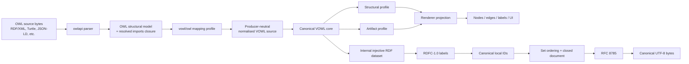
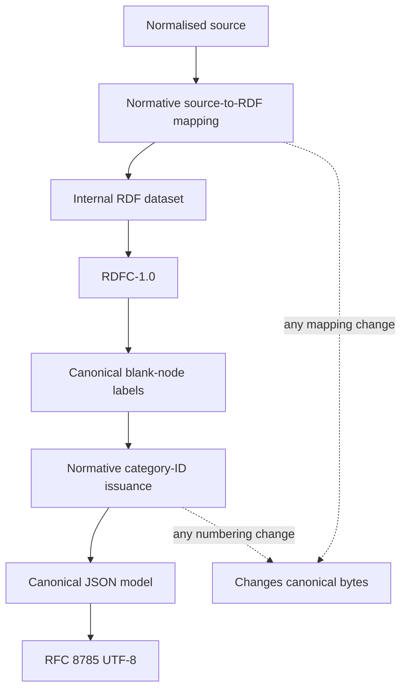
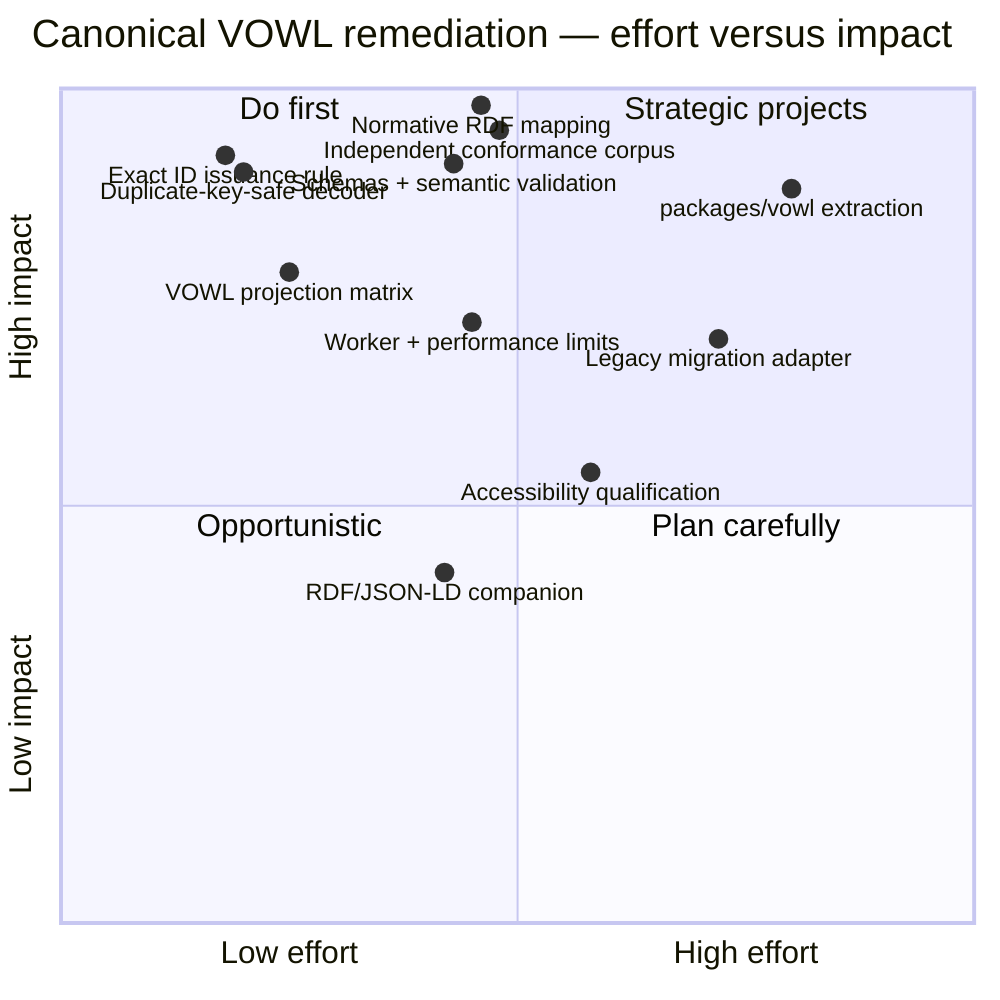

# Deep Research Assessment of the Proposed Canonical VOWL Representation

## Executive summary

**Overall judgement: the proposed Canonical VOWL design is architecturally strong and substantially follows modern best practice, but it is not yet sufficiently specified or implemented to be called a canonical interoperability format.**
I would rate the **design direction as “approve with blocking specification changes”**, rather than approve unchanged.

The assessment is against repository `main` at commit `354ed3af8c1e82019f6280b2594acaceac96cca0`, dated 24 September 2026.
That commit added the 871-line Canonical VOWL proposal; the implementation still resides in the legacy `src/owl2vowl` structure rather than the proposed `packages/vowl` package. fileciteturn21file0L1-L2 The root package is still a single private `webvowl` package with Jest/Vite tooling and no `packages/vowl` workspace or direct canonicalisation dependencies. fileciteturn11file0L1-L6

The strongest design decision is that Canonical VOWL **does not confuse three different notions of canonicality**:

1. OWL structural normalisation;
2. canonical identification of anonymous/symmetric graph structures;
3. deterministic JSON byte serialisation.

The proposal deliberately puts these into separate stages, using a producer-neutral normalised model, an injective internal RDF dataset plus RDFC-1.0 for graph labelling, and RFC 8785 for final JSON bytes.
That separation is conceptually correct: OWL 2 itself distinguishes its abstract structural representation from concrete exchange syntax, and defines structural equivalence using set versus ordered-sequence semantics. fileciteturn22file0L1-L2 citeturn2view2 RFC 8785 canonicalises JSON serialization but does not make unordered arrays, producer IDs, or graph isomorphism disappear; RDFC-1.0 addresses RDF dataset canonicalisation instead. citeturn2view4turn2view6

The proposed split between **subjects, semantic roles, expressions, constructs and visual occurrences** is also a major improvement over the current parallel `class`/`classAttribute` and `property`/`propertyAttribute` arrays.
It aligns especially well with an ontology visualiser because semantic identity and visual occurrence identity genuinely differ: VOWL deliberately duplicates generic elements under its splitting rules.
The repository has already adopted the architectural principle that the rendered graph is a projection rather than the ontology's system of record, and documents real cases where a single semantic element such as `owl:Thing` has multiple rendered occurrences. fileciteturn23file0L1-L2 fileciteturn18file0L1-L6

The proposed model is also materially better than the existing exporter in its handling of annotations, OWL punning, recursive expressions, ordered property chains, set-valued relations, source-independent local identities and avoidance of duplicated derived data.
The current implementation still returns a historical VOWL-JSON object containing `_comment`, `class`, `classAttribute`, `property` and `propertyAttribute`; the new proposal explicitly removes those hidden parallel joins. fileciteturn15file0 fileciteturn23file0L1-L2

There are, however, **three blockers before v1 should be frozen**.

**First, the normative source-model → internal-RDF mapping is not actually specified in the proposal itself.**
The document says such a mapping must be published and injective, but canonical byte identity depends on every detail of it.
Without the complete vocabulary, encoding rules for absence versus empty values, datatype choices, set membership, sequence positions, roles, nested annotations and profile-specific facts, independently written implementations cannot be expected to derive the same RDFC identifier map.
The proposal correctly recognises this requirement, but recognition is not yet a wire specification. fileciteturn24file0L1-L2

**Second, translation from the RDFC canonical identifier map to `s0`, `r0`, `x0`, `c0`, `o0` is underspecified.** “Translate the RDFC canonical identifier map to category IDs” is not enough for a canonical format: the exact category partitioning and ordinal assignment must itself be normative and test-vector-covered. fileciteturn23file0L1-L2 fileciteturn24file0L1-L2

**Third, the proposed `decode` algorithm cannot reliably reject duplicate JSON object names if it performs a normal `JSON.parse` before checking them.**
Ordinary object materialisation has already collapsed duplicate names by the time schema or semantic validation sees the object.
Yet the proposed conformance suite explicitly requires duplicate-name negative tests.
Duplicate-name detection therefore needs a lexical/tokenising JSON stage *before* normal JSON object construction.
This is the most important concrete algorithmic correction I would make to the current document. fileciteturn24file0L1-L2 RFC 8785's input domain depends on I-JSON restrictions and requires its input to be representable unambiguously before canonical serialization, so rejecting ambiguous JSON before canonicalisation is the appropriate boundary. citeturn2view6

My recommended disposition is therefore:

| Area | Assessment |
|---|---|
| Conceptual canonical model | **Strong / modern best practice** |
| Separation of semantics from rendering | **Strong** |
| VOWL 2 preservation | **Strong, with explicitly documented extensions needed** |
| RDF/OWL compatibility | **Strong architecture; normative mapping still missing** |
| Deterministic JSON | **Strong design; duplicate-name decoder defect must be fixed** |
| Versioning | **Strong** |
| Validation | **Strong intent; schemas and semantic validator not implemented** |
| Internationalisation | **Good** |
| Security/resource exhaustion | **Good design, implementation evidence outstanding** |
| Accessibility | **Representation supports it indirectly; renderer obligations remain** |
| Performance | **Reasonable but RDFC cost requires benchmarking and worker isolation** |
| Modularity/testability | **Very strong design; repository migration not yet done** |
| Cross-producer interoperability | **Not yet demonstrable** |
| Readiness to freeze v1 bytes | **No — resolve P0 items first** |

The proposed architecture should therefore be retained, but **v1 profile identifiers should not be treated as frozen wire contracts until the internal RDF mapping, ID issuance rule, schemas, duplicate-key-safe decoding and independent conformance vectors exist**.
The proposal itself states that byte-changing changes require new profile identifiers, making it particularly important to settle these details before implementations and stored artefacts begin depending on `/v1`. fileciteturn22file0L1-L2

## Repository and VOWL baseline

The current WebVOWL architecture is already much better positioned for this change than historical WebVOWL.
The README describes a browser-side ingestion architecture using the JavaScript `owlapi`, allowing the application to run on static hosting rather than requiring the historical Java conversion service.
It exposes OWL ingestion, graph exploration and VOWL JSON export, while keeping ontology parsing in the browser. fileciteturn10file0L1-L6

The production conversion path in `src/owl2vowl/js/index.js` constructs a real `OWLOntology` through `owlapi`, resolves an imports closure, and hands the structural model to `VOWLBuilder`.
Compatibility parsing is deliberately the production default and missing imports become diagnostics rather than necessarily aborting visualisation. fileciteturn19file0L1-L6 This is a sound starting boundary for the proposed `vowl/owl` adapter because OWL 2 itself defines an abstract structural representation separately from concrete RDF/XML, RDF and other serialisations. citeturn2view2

The present model is nevertheless still a historical VOWL-JSON dialect.
`VOWLBuilder` emits records split across `class`/`classAttribute` and `property`/`propertyAttribute`, together with generated IDs and derived/header information. fileciteturn15file0 That representation works as application input, but it is poorly suited to cross-producer canonicality because references depend on generated IDs and a semantic entity is divided between parallel records.

Annotations illustrate the same transitional state.
The current builder groups annotations by the annotation property's **local name**, while adding `predicateNs` so the complete property IRI can usually be reconstructed.
That was a useful compatibility repair, but local-name grouping still makes the structure itself depend on a lossy historical convention. fileciteturn15file0 The proposal's replacement—store each annotation with its complete annotation-property IRI, typed value and recursive annotation set—is substantially cleaner and matches OWL 2's model in which ontologies, axioms and annotations themselves can carry annotations. fileciteturn23file0L1-L2 citeturn2view2

The repository already has unusually good architectural safeguards for a legacy visualiser.
ADR 0010 declares that the renderer is a projection rather than a semantic store, separates semantic facts from rendered-occurrence facts, and explicitly recognises that one ontology entity can have several rendered occurrences. fileciteturn18file0L1-L6 The Canonical VOWL proposal is a logical extension of that architecture rather than a competing design.

The test and CI baseline is also credible.
The repository uses Jest, application linting/formatting, dependency architecture tooling and a pinned external ontology corpus; the README documents a full-suite corpus prerequisite. fileciteturn10file0L1-L6 CI runs application tests/builds, Python tooling on Linux and Windows, Markdown checks, and uses commit-pinned GitHub Actions plus locked installs with lifecycle scripts disabled for the application dependencies. fileciteturn20file0L1-L6 The missing piece is not test culture but a **language-neutral canonical conformance oracle**, which the proposal correctly calls for. fileciteturn24file0L1-L2

The VOWL 2 baseline is narrower than OWL 2.
The recovered specification identifies itself as *VOWL: Visual Notation for OWL Ontologies, Specification of Version 2.0 – 7 April 2014*, and explicitly says it concentrates primarily on the TBox while offering recommendations for ABox presentation.
It also warns that not all OWL constructs, particularly OWL 2 constructs, are covered. fileciteturn25file0L1-L6 This matters greatly: **Canonical VOWL cannot equate “preserved OWL structure” with “VOWL 2 glyph”**.

The correct target architecture is therefore:



This layering follows the repository's renderer-as-projection ADR and the proposal's stated ownership boundaries: `owlapi` owns parsing and OWL structure, the future `vowl` package owns normalisation and canonical representation, and WebVOWL owns application state/rendering. fileciteturn18file0L1-L6 fileciteturn22file0L1-L2

## VOWL conformance mapping

VOWL 2 is a **visual notation**, not a canonical serialisation standard.
Its essential requirements concern graphical primitives, splitting rules, class/property treatments, set operators, datatypes and selected header/ABox behaviour; it explicitly does not cover the entire OWL 2 language. fileciteturn25file0L1-L6 The Canonical VOWL proposal therefore appropriately distinguishes retained semantic constructs from visual occurrences and allows retained constructs to have no graph glyph. fileciteturn23file0L1-L2

The following is the practical conformance matrix.
“Current” refers to `main` at the reviewed commit; “Canonical proposal” means the intended future `packages/vowl` model.

| VOWL 2 requirement / construct | Current repository mapping | Canonical proposal | Status / assessment |
|---|---|---|---|
| Classes as graph nodes; special treatment of `owl:Thing`, `rdfs:Resource` | `vowlBuilder.js` creates typed class records and special built-ins. fileciteturn15file0 | `subject` + class `role`; occurrence projects it. fileciteturn23file0L1-L2 | **Conformant direction; improved model** |
| Multiple visual occurrences of generic nodes under VOWL splitting rules | Current builder explicitly implements splitting rules for `owl:Thing`, `rdfs:Datatype` and `rdfs:Literal`. fileciteturn15file0 | Explicit occurrence records with split context; proposal also covers `rdfs:Resource`. fileciteturn23file0L1-L2 | **Strong improvement**; makes multiplicity first-class without duplicating semantics |
| `owl:ObjectProperty`, `owl:DatatypeProperty`, generic RDF properties; domain/range | Builder has explicit object/data property domain/range handling. fileciteturn15file0 | Directed property constructs; full semantic role separate from occurrence. fileciteturn23file0L1-L2 | **Good** |
| Functional, inverse-functional, symmetric, transitive characteristics | Builder maps these characteristics. fileciteturn15file0 | Positive property characteristics are semantic facts, not generic strings. fileciteturn23file0L1-L2 | **Good; canonical representation better typed** |
| Reflexive/irreflexive/asymmetric OWL 2 characteristics | Builder currently retains `reflexive`, `irreflexive`, `asymmetric`. fileciteturn15file0 | General positive-characteristic model can preserve them. fileciteturn23file0L1-L2 | **OWL extension, not VOWL 2 notation**. Must be details-only unless an explicit extension profile defines glyphs |
| `rdfs:subClassOf` | `addSubclass` mapping in builder. fileciteturn15file0 | Directed construct plus occurrence. fileciteturn23file0L1-L2 | **Conformant** |
| `rdfs:subPropertyOf` | Builder retains subproperty relations. fileciteturn15file0 | One directed construct, avoiding reciprocal derived arrays. fileciteturn23file0L1-L2 | **Semantic preservation good**. Renderer must respect VOWL 2's interaction-oriented treatment rather than blindly inventing hierarchy glyphs |
| `owl:inverseOf` / equivalent properties | Builder has inverse/equivalent property handling. fileciteturn15file0 | Inverse pair and unordered equivalent-property group. fileciteturn23file0L1-L2 | **Improved**, especially for n-ary/group identity |
| Equivalent/disjoint classes | Builder dispatches equivalent and disjoint class axioms. fileciteturn15file0 | First-class unordered constructs/groups. fileciteturn23file0L1-L2 | **Good** |
| Cardinality notation | Builder supports min/max/exact object and data cardinalities and currently maps them onto VOWL property representations. fileciteturn15file0 | Restrictions become first-class typed expressions; cardinalities are decimal strings rather than JS numbers. fileciteturn23file0L1-L2 | **Major improvement**, avoids numeric precision limits and edge-decoration data loss |
| `unionOf`, `intersectionOf`, `complementOf` | Current builder represents the three anonymous class-expression forms. fileciteturn15file0 | Recursive expressions with set-valued union/intersection and single-operand complement. fileciteturn23file0L1-L2 | **Strong** |
| Datatypes and `rdfs:Literal` | Current builder has datatype/literal node handling and splitting. fileciteturn15file0 | Datatype role plus recursive data-range expressions and one literal value model. fileciteturn23file0L1-L2 | **More complete than VOWL 2 without corrupting visual semantics** |
| Ontology header, imports/version information | Current header records ontology metadata/import information. fileciteturn19file0L1-L6 | Root ontology record retains identity, version IRI, authored direct imports and annotations, not resolver history. fileciteturn23file0L1-L2 | **Good canonical boundary** |
| Individuals | Current builder supports selected individual information while equality/inequality is not visualised. fileciteturn15file0 | v1 retains direct class membership, enumerated/value-restriction references and annotations; excludes general property assertions/equality. fileciteturn23file0L1-L2 | **Well aligned with VOWL's limited ABox scope** |
| `someValuesFrom`, `allValuesFrom`, `hasValue`, etc. | Current builder deliberately treats some restriction edges as an extension; other restrictions are skipped because VOWL 2 has no corresponding edge form. fileciteturn15file0 | Retained as semantic expressions; constructs without a v1 glyph may be details-only. fileciteturn23file0L1-L2 | **Correct architectural fix**, but mapping table must explicitly mark each construct “visual”, “details-only” or “extension” |
| OWL 2 structures beyond VOWL 2: disjoint union, keys, data-range restrictions, chains | Current builder supports some richer OWL cases, including disjoint union/key dispatch. fileciteturn15file0 | Explicit constructs/expressions, with ordered property chains and key sets. fileciteturn23file0L1-L2 | **Reasonable Canonical-VOWL extension**; must not be presented as requirements from VOWL 2 itself |
| VOWL colours, line styles, interaction semantics | Primarily renderer-owned | Artifact intentionally avoids CSS/theme/font/DOM state. fileciteturn23file0L1-L2 | **Correct boundary**, provided projection kinds contain enough information to deterministically derive VOWL notation |

The key distinction is that **preserving more OWL information than VOWL 2 visualises is not itself a conformance problem**.
OWL 2's abstract structural specification contains class expressions, cardinality restrictions, property characteristics, axioms, annotations, data ranges and many constructs beyond VOWL's visual vocabulary. citeturn2view2 What would be a conformance problem is making one of those retained facts appear as a purportedly standard VOWL 2 glyph when VOWL 2 does not define one.

The proposed occurrence layer provides exactly the architectural mechanism needed to avoid that error.
I would strengthen it with a **normative VOWL projection matrix**, for example:

```json
{
  "object-some-values-from": {
    "retained": true,
    "vowl2Occurrence": "none",
    "presentation": "details-only"
  },
  "reflexive-object-property": {
    "retained": true,
    "vowl2Occurrence": "none",
    "presentation": "details-only"
  },
  "subclass": {
    "retained": true,
    "vowl2Occurrence": "edge",
    "projectionKind": "subclass"
  }
}
```

That table should become part of the profile specification/conformance corpus, not an implementation comment.
It would remove a significant source of ambiguity from the current builder, where code comments already have to distinguish standard VOWL rendering from deliberate extensions. fileciteturn15file0

## Modern canonical-representation assessment

The proposed model compares favourably with current standards practice in most dimensions.

**Canonicality and semantic scope — strong.**
OWL 2 explicitly defines structural equivalence syntactically rather than semantically: unordered associations behave as sets, ordered/non-unique associations as lists, and semantically equivalent expressions need not be structurally equivalent. citeturn2view2 The proposal follows the same principle by declaring that Canonical VOWL identifies a normalised **VOWL representation**, not an OWL entailment-equivalence class. fileciteturn22file0L1-L2 This is exactly the right boundary. Attempting semantic/entailment canonicalisation would make byte identity reasoner-dependent and dramatically harder to specify.

**Set versus sequence semantics — excellent.**
OWL 2 distinguishes unordered, duplicate-free associations from ordered repetition-permitting lists. citeturn2view2 The design does the same explicitly and never sorts property chains. fileciteturn24file0L1-L2 This is one of the most important improvements over generic “sort every JSON array” canonicalisers, which silently destroy sequence semantics.

**RFC 8785/JCS use — appropriate.**
RFC 8785 provides deterministic JSON serialization but deliberately operates on JSON values rather than deciding application semantics. citeturn2view6 The proposal correctly applies semantic set ordering *before* JCS and delegates final object-member, number and string serialization to JCS. fileciteturn24file0L1-L2 It is also correct not to Unicode-normalise lexical strings or IRIs merely to obtain matching bytes: canonicalisation should not silently change RDF/OWL terms.

**RDFC-1.0 — defensible, but the largest complexity centre.**
RDFC-1.0 is a standard mechanism for deterministic RDF dataset canonicalisation, including blank-node labelling. citeturn2view4 Using it for a private *normative internal RDF dataset* is reasonable because the problem genuinely includes anonymous and symmetric graph structures.
The design also correctly refuses to claim that its public JSON thereby becomes RDF. fileciteturn24file0L1-L2

The cost is that the internal mapping becomes part of the canonical wire protocol even though users never see it.
The following two documents are therefore just as normative as the JSON Schema:



Until the **R** and **I** boxes are specified exhaustively, `/v1` is incomplete as a cross-producer contract.

**JSON-LD — correctly not mandatory.**
JSON-LD 1.1 is designed to express linked-data semantics in JSON and uses JSON-LD processing rules and contexts to map JSON structures into RDF-compatible data. citeturn2view5 Requiring Canonical VOWL itself to be JSON-LD would add another semantic transformation layer and would not solve VOWL's visual-occurrence, profile, set-order or canonical-byte requirements.
The proposal is therefore right to use full IRIs but explicitly state that the canonical JSON is not JSON-LD. fileciteturn23file0L1-L2

For interoperability, I would publish a **companion RDF/JSON-LD view**, not put `@context` into canonical bytes.
The already-required normative internal RDF mapping provides a natural foundation.
A later `vowl/interop` API or command-line tool could expose RDF or JSON-LD without changing Canonical VOWL identity.

**JSON Schema — good choice, but keep semantic validation separate.**
JSON Schema 2020-12 is appropriate for a versioned closed JSON contract. citeturn2view7 The proposal correctly recognises that schema validation cannot establish every graph invariant and therefore requires normative prose and semantic validation as well. fileciteturn24file0L1-L2 Cross-reference integrity, set uniqueness by canonical member identity, exact sequence rules, RDFC-derived identifiers and byte-order constraints should remain semantic-validator responsibilities.

For composed schemas, I recommend consistently closing evaluated structures and making every discriminated type explicit:

```json
{
  "$schema": "https://json-schema.org/draft/2020-12/schema",
  "$id": "https://haddenindustries.com/ontology/profiles/vowl/canonical/structural-content/v1/schema",
  "type": "object",
  "required": ["profile", "structural"],
  "properties": {
    "profile": {
      "const": "https://haddenindustries.com/ontology/profiles/vowl/canonical/structural-content/v1"
    },
    "structural": {
      "$ref": "#/$defs/structural"
    }
  },
  "additionalProperties": false,
  "$defs": {
    "structural": {
      "type": "object",
      "required": [
        "ontology",
        "subjects",
        "roles",
        "expressions",
        "constructs",
        "occurrences"
      ],
      "properties": {
        "ontology": { "$ref": "#/$defs/ontology" },
        "subjects": { "type": "array" },
        "roles": { "type": "array" },
        "expressions": { "type": "array" },
        "constructs": { "type": "array" },
        "occurrences": { "type": "array" }
      },
      "additionalProperties": false
    }
  }
}
```

Where extensive `$ref`/composition is used, `unevaluatedProperties: false` is often safer than accidentally leaving a composed subtype open; the exact pattern should be proven against the chosen 2020-12 validator.
JSON Schema defines the structural validation vocabulary, but Canonical VOWL must not rely on implementation-specific `"format"` behaviour for normative absolute-IRI or BCP-47 validation. citeturn2view7

**Duplicate JSON names — blocking correction required.**
The current proposed decoder is:

```text
UTF-8 decode
→ JSON parse
→ schema/semantic validation
→ RFC 8785 re-encode
→ byte equality
```

It needs to become:

```text
resource limit
→ fatal UTF-8
→ lexical JSON validation
     ↳ reject duplicate object names here
→ construct JSON value
→ closed schema + semantic validation
→ RFC 8785 re-encode
→ exact byte equality
```

A normal `JSON.parse()` result cannot tell the validator that the input was originally something like:

```json
{"profile":"A","profile":"B"}
```

because one binding has already displaced the other.
That means the duplicate-name test promised by the conformance strategy cannot be satisfied by the algorithm as currently written. fileciteturn24file0L1-L2

**Local identifier issuance — needs one extra normative rule.**
Rather than leaving “translate the RDFC map” implementation-defined, specify something equivalent to:

```js
// Normative concept, not proposed library code.
function issueCategoryIds(records, rdfCanonicalOrdinal) {
  const groups = groupByCanonicalCategory(records);

  for (const [prefix, members] of groups) {
    members.sort(
      (a, b) => rdfCanonicalOrdinal(a) - rdfCanonicalOrdinal(b),
    );

    members.forEach((member, index) => {
      member.canonicalId = `${prefix}${index}`;
    });
  }
}
```

The specification must define exactly how `rdfCanonicalOrdinal(record)` is derived from RDFC-1.0 output and how every record maps to the internal blank node whose canonical ordinal is used.
It must not depend on JavaScript `Map` iteration, N-Quads encounter order or a particular library's object shape.

**Literal representation — strong.**
Preserving lexical forms and representing large cardinalities as decimal strings prevents JavaScript numeric limits from changing ontology structure.
The decision not to coerce RDF literals into dates/numbers also preserves RDF term identity. fileciteturn23file0L1-L2 RDF's abstract model treats IRIs and literals as RDF terms rather than application-native JavaScript values. citeturn2view3

**Versioning — strong.**
Byte-changing changes get new profile identifiers, while mapping-profile changes are versioned independently. fileciteturn22file0L1-L2 This is an excellent separation: a compatibility heuristic can evolve without pretending that canonical bytes and OWL recovery policy are the same contract.
I would add one operational requirement: every immutable profile IRI should resolve, directly or through a stable registry, to the precise schema, mapping specification and conformance-manifest version used by that profile.

**No derived duplication — excellent.**
Counts, reverse links, duplicated annotations, display flags and other computable values are omitted from canonical truth. fileciteturn23file0L1-L2 This is particularly valuable in graph formats, where forward and reverse edges or semantic and rendered fields frequently drift apart.

**Accessibility — canonical data is suitably neutral, but application conformance remains separate.**
WCAG 2.2 places requirements on perceivable and operable Web content rather than on a graph serialization itself. citeturn2view9 The canonical model should therefore retain enough semantic labels, relationships and language information for WebVOWL to offer keyboard-accessible exploration, non-visual summaries and alternatives to colour-only meaning; it should not duplicate ARIA strings or DOM state into canonical bytes.
The design's separation of semantic facts from theme/CSS/DOM state is therefore appropriate. fileciteturn23file0L1-L2

**Internationalisation — good, with one wording clarification.**
Full Unicode lexical forms, absolute IRIs, explicit language-tagged literal variants and locale-independent ordering are sound choices. fileciteturn23file0L1-L2 The specification should state explicitly that “lowercase language tag” is a Canonical-VOWL spelling rule, not a claim to perform all possible BCP-47 preferred-subtag canonicalisations.
That keeps byte identity predictable.

**Security — strong principle, but limits need executable definitions.**
The proposal explicitly bounds source size, record count, nesting, string size, internal RDF quads and RDFC work, supports cancellation, and forbids falling back to noncanonical output after resource exhaustion. fileciteturn24file0L1-L2 RDFC canonicalisation is precisely the sort of graph operation for which pathological structures need careful resource controls. citeturn2view4 For browser deployments, the CPU-heavy RDFC stage should also run away from the rendering/UI event loop, preferably in a Web Worker, because merely making the JS API `async` does not by itself make CPU-intensive graph canonicalisation cooperative.

**Modularity/testability — excellent.** `vowl`, `vowl/owl` and `vowl/migrate` establish a narrow core, OWL adapter and explicit historical ingress path; network resolution is kept outside the canonical core. fileciteturn22file0L1-L2 The proposal's metamorphic tests—permuting object order, source handles, blank-node labels, source syntax, import traversal and locale—are exactly the kinds of tests a canonical representation requires. fileciteturn24file0L1-L2

A useful overall scorecard is:

| Best-practice property | Rating | Main reason |
|---|---:|---|
| Producer neutrality | **Excellent** | Source handles discarded; canonical identities recomputed |
| Separation of semantic and visual identity | **Excellent** | Subjects/roles/constructs versus occurrences |
| RDF/OWL fidelity within declared scope | **Very good** | Recursive typed expressions, full IRIs, lexical literals |
| Determinism | **Very good** | Explicit sets/sequences + RDFC + JCS; ID rule still incomplete |
| Schema discipline | **Very good design** | Closed 2020-12 schemas proposed, not yet implemented |
| Extensibility/versioning | **Excellent** | Profile IDs and mapping-profile IDs separate |
| Legacy isolation | **Excellent** | One-way named migrations; no auto-detection |
| Cross-language implementability | **Good, not yet complete** | Plain data model helps; normative RDF mapping/ID rules missing |
| Security/resource controls | **Very good design** | Fail-closed limits and cancellation |
| Large-graph performance | **Moderate** | RDFC/internal-RDF transformation can be expensive |
| Accessibility | **Good representation boundary** | Semantic data retained, accessibility belongs primarily in renderer |
| Internationalisation | **Very good** | Unicode/full IRIs/language tags; deterministic non-locale ordering |
| Current implementation readiness | **Low** | `packages/vowl`, schemas and canonical implementation do not yet exist |

## Interoperability and edge cases

Several edge cases deserve explicit treatment before a wire-format freeze.

**Anonymous symmetric structures are the raison d'être for the RDFC stage.**
Sorting records by their existing IDs or traversal order is insufficient when two anonymous structures are symmetric.
The design is correct to reject historical blank-node labels and producer traversal IDs as canonical identity. fileciteturn23file0L1-L2 RDFC-1.0 is specifically intended to canonicalise RDF datasets containing blank-node structure. citeturn2view4

**Punning must remain role-based.**
OWL permits some uses of the same IRI in distinct semantic categories, while OWL 2 DL places constraints on others.
The proposed `(subject, role-kind)` identity avoids the common graph-format error of assuming one IRI implies one node type. fileciteturn23file0L1-L2 This is a clear improvement over flat `type`/`attributes` models.

**Annotations must be anchored before semantic aggregation.**
Combining two domains into an intersection can be reasonable for VOWL presentation, but an annotation on one of the original domain axioms cannot simply be transferred to the combined intersection without changing what the annotation says.
The proposal's “annotation anchors” solve exactly that problem. fileciteturn23file0L1-L2 This is one of the technically strongest parts of the design.

**Equivalent OWL syntax must not be confused with semantic equivalence.**
OWL 2's structural model explicitly demonstrates that semantically equivalent expressions need not be structurally equivalent. citeturn2view2 The proposal correctly avoids algebraic simplification, reasoner inference and satisfiability normalisation. fileciteturn23file0L1-L2

**IRI spelling should remain lexical.**
Do not add percent-decoding, host case transformations or Unicode normalisation merely to make more things compare equal.
The profile claims structural representation canonicality, not general Web-resource equivalence.
This is consistent with the proposal and RDF's term-oriented abstract model. fileciteturn24file0L1-L2 citeturn2view3

**Qualified cardinalities need care.**
VOWL 2's cardinality graphics do not supply a complete visual vocabulary for all OWL 2 qualified cardinality structure; the current builder already contains special logic that can collapse cardinality information into property-edge labels. fileciteturn15file0 The proposed first-class restriction expressions are therefore safer.
The occurrence projection should be treated as lossy presentation, not the semantic record.

**RDF/OWL import identity should not absorb retrieval history.**
The proposal retains authored direct import declarations but excludes redirects, cache locations, resolution order and resolver aliases from canonical bytes. fileciteturn23file0L1-L2 This is good: acquisition environment is provenance, not ontology structure.
Strict and compatibility profiles then make completeness policy explicit rather than hiding failed imports.

**Cross-syntax canonicality requires more than parser success.**
Turtle and RDF/XML documents can only be promised identical Canonical-VOWL bytes when they map to the same retained OWL/VOWL source model.
The proposal explicitly makes that qualification. fileciteturn22file0L1-L2 This avoids an overclaim that all differently serialised RDF graphs or semantically equivalent OWL ontologies are automatically canonical-equivalent.

**Artifact identity is intentionally stronger than structural identity.**
Because anonymous symmetric objects can carry different coordinates, artifact-only facts have to participate in labelling if otherwise there would be no deterministic way to associate a coordinate with one member of a symmetry class.
The proposal recognises this and permits structural local IDs to differ between structural and artifact profiles. fileciteturn23file0L1-L2 That is subtle but correct.
The cost should be prominently documented: consumers must never treat local IDs as cross-profile identities.

**Visual state is sensibly scoped.**
Positions, pins, camera, effective visibility and semantic display modes belong in an artifact; simulation velocities, random state, DOM state, CSS, viewport pixels and open sidebars do not. fileciteturn23file0L1-L2 This strikes a good balance between reproducible artefact and application session dump.

**JSON-LD interoperability should remain additive.**
JSON-LD is valuable for interchange with linked-data tooling, and SHACL is a standard language for validating RDF graphs. citeturn2view5turn2view8 Neither needs to replace the Canonical-VOWL JSON Schema/semantic validator. An informative JSON-LD/RDF projection and optional SHACL shapes over that projection would provide ecosystem interoperability without making RDF tooling a prerequisite for merely reading Canonical VOWL.

## Prioritised remediation and migration

The estimates below assume one engineer already comfortable with JavaScript, OWL/RDF and the repository, and exclude the later full WebVOWL UI cutover.
They are order-of-magnitude planning estimates, not delivery commitments.

| Priority | Issue / action | Impact if unresolved | Estimated effort | Risk |
|---|---|---|---:|---:|
| **P0** | Publish the complete normative normalised-source → internal-RDF mapping | Independent producers can derive different RDFC labels and bytes | **1–2 weeks** | High |
| **P0** | Fully specify RDFC-label → category-local ID issuance | Bytes can depend on implementation/library iteration behaviour | **2–4 days** | High |
| **P0** | Change decoder to detect duplicate JSON names lexically before `JSON.parse`-style materialisation | Required negative conformance test is otherwise impossible; ambiguous input may be accepted | **2–4 days** | High |
| **P0** | Create closed JSON Schema 2020-12 files plus semantic validator | “Canonical document” has no executable closed contract yet | **1–2 weeks** | High |
| **P0** | Produce independent exact-byte conformance vectors for RDFC mapping, IDs, set ordering and JCS | Cannot make credible cross-producer canonicality claim | **1–2 weeks** | High |
| **P1** | Add normative VOWL projection matrix: visual / details-only / extension for every retained construct | OWL 2 extensions can accidentally masquerade as VOWL 2 notation | **3–6 days** | Medium |
| **P1** | Extract normalised model/core into `packages/vowl`; add `vowl`, `vowl/owl`, `vowl/migrate` exports | Current implementation remains coupled to application/legacy VOWL JSON | **3–6 weeks** | High |
| **P1** | Run graph canonicalisation in a worker and benchmark symmetric/pathological ontologies | Browser stalls or denial-of-service on large/adversarial graphs | **1–2 weeks** | Medium |
| **P1** | Implement named one-way legacy migration with explicit ambiguity failures | Existing VOWL JSON cannot safely enter the new model | **2–4 weeks** | High |
| **P1** | Make profile IRIs resolve to immutable schema/mapping/conformance metadata | Wire versions are identifiable but harder to independently discover/implement | **2–5 days** | Low |
| **P2** | Publish noncanonical RDF/JSON-LD interoperability projection, optionally SHACL shapes | Semantic-Web integrations otherwise need custom adapters | **1–2 weeks** | Low |
| **P2** | Add accessibility qualification around graph/text equivalents and keyboard navigation | Canonical data is sound, but visual application may remain inaccessible | **2–4 weeks app-side** | Medium |
| **P2** | Explicitly specify language-tag lowercasing versus full BCP-47 canonicalisation | Minor cross-implementation ambiguity | **1 day** | Low |
| **P2** | Retire remaining protocol/deterministic `localeCompare()` call sites identified by the design audit | Locale-dependent pagination/tests/diagnostics remain possible outside the core | **1–3 days** | Low |

The effort/impact distribution is:



The migration should be staged so that the canonical model is not forced to reproduce historical defects.

**Canonical-core slice.**
Implement the plain producer-neutral source model, schemas, semantic validator, internal RDF mapping, RDFC labelling, exact category-ID rule, set ordering, JCS encoder and duplicate-safe exact decoder.
At this stage, use hand-written fixtures rather than the WebVOWL application as the oracle.
This is consistent with the proposal's own package-local first implementation slice. fileciteturn24file0L1-L2

**OWL adapter slice.**
Make the current `VOWLBuilder` conceptually change roles: instead of constructing historical parallel arrays, it should construct the new normalised source and call the root canonicaliser.
The current `owlapi` parsing/import boundary can remain substantially intact. fileciteturn19file0L1-L6

**Migration slice.**
Build named translators for exact historical dialects.
Resolve old IDs only at ingress, reconstruct split occurrences explicitly, retain full annotation IRIs only where the old dialect actually preserved them, and fail rather than guessing irrecoverable semantics.
That matches the proposal's one-way migration philosophy. fileciteturn22file0L1-L2

**Application cutover.**
Change inspection and rendering to consume semantic roles/constructs plus occurrences rather than parallel records.
ADR 0010 already supplies the governing principle: the renderer gets a sufficient projection but does not become the semantic store. fileciteturn18file0L1-L6

**Legacy export retirement.**
Only after all internal consumers have migrated should the application stop treating historical VOWL JSON as an internal interchange format.
Existing files remain ingress through a named migration adapter; there should not be a second canonical mode or a hidden fallback.

A recommended package shape is:

```text
packages/vowl/
├── package.json
├── src/
│   ├── canonicalize.js
│   ├── encode.js
│   ├── decode.js
│   ├── model/
│   │   ├── source.js
│   │   ├── document.js
│   │   └── invariants.js
│   ├── canonical/
│   │   ├── rdfMapping.js
│   │   ├── rdfcLabels.js
│   │   ├── issueIds.js
│   │   └── orderSets.js
│   ├── owl/
│   │   ├── fromOwl.js
│   │   └── mappingProfiles.js
│   └── migrate/
│       └── ...
├── schema/
│   ├── structural-content-v1.schema.json
│   └── artifact-v1.schema.json
└── conformance/
    ├── manifest.json
    ├── positive/
    ├── negative/
    ├── metamorphic/
    └── canonical-bytes/
```

The important architectural rule is that `rdfMapping.js`, `issueIds.js` and schema documents are **protocol implementation**, not ordinary internal utilities: changing their behaviour can change bytes and therefore must trigger the profile-version policy.
That follows directly from the proposal's stated versioning rule. fileciteturn22file0L1-L2

For validation, return stable errors from the core rather than library-specific messages:

```js
class CanonicalVowlError extends Error {
  constructor(code, message, { pointer, details, cause } = {}) {
    super(message, { cause });
    this.name = "CanonicalVowlError";
    this.code = code;
    this.pointer = pointer;
    this.details = details;
  }
}

// Examples of stable protocol-facing codes:
//
// JSON_DUPLICATE_MEMBER
// JSON_INVALID_UTF8
// DOCUMENT_UNKNOWN_FIELD
// SOURCE_DUPLICATE_SET_MEMBER
// REFERENCE_DANGLING
// IRI_INVALID
// LANGUAGE_TAG_INVALID
// RDFC_RESOURCE_LIMIT
// NON_CANONICAL_BYTES
```

That matches the proposed stable-code/JSON-Pointer error model and prevents an Ajv/RDFC/JCS dependency update from becoming an API-breaking error-message change. fileciteturn24file0L1-L2

The conformance manifest should also make dependencies explicit:

```json
{
  "profile": "https://haddenindustries.com/ontology/profiles/vowl/canonical/structural-content/v1",
  "jsonSchema": "structural-content-v1.schema.json",
  "rdfCanonicalizationAlgorithm": "RDFC-1.0",
  "jsonCanonicalizationAlgorithm": "RFC8785",
  "vectors": {
    "positive": "positive/manifest.json",
    "negative": "negative/manifest.json",
    "metamorphic": "metamorphic/manifest.json",
    "exactBytes": "canonical-bytes/manifest.json"
  }
}
```

The manifest itself need not appear in canonical instances.
Its purpose is to let another Java, Rust, Python or TypeScript implementation prove that “Canonical VOWL v1” means the same bytes rather than merely a similar-looking object.

## Open questions, limitations and conclusion

A few questions should be resolved during written review rather than left to implementation.

**The exact normative RDF vocabulary is still the primary open question.**
The proposal says the mapping must be injective and must distinguish scalar types, absence, sets, sequences, empty collections and sequence positions. fileciteturn24file0L1-L2 That is the right requirement; the actual mapping must now be written down and accompanied by counterexample tests showing that every pair of distinct retained source models maps to distinguishable internal datasets where required.

**The relation between Canonical-VOWL retention and VOWL-2 visual conformance needs a single machine-readable matrix.**
The design is already capable of doing the right thing because constructs can exist without occurrences. fileciteturn23file0L1-L2 What is missing is the table that authoritatively says which retained OWL structures have standard VOWL occurrences and which are details-only extensions.
This is particularly important for quantified restrictions and OWL 2 property characteristics absent from the 2014 VOWL notation.
The VOWL specification itself warns that it does not cover every OWL 2 construct. fileciteturn25file0L1-L6

**Profile v1 should not be treated as frozen merely because the IRI currently says `/v1`.**
The latest repository state describes the design as proposed for written review, not an adopted standard. fileciteturn21file0L1-L2 fileciteturn22file0L1-L2 That provides an opportunity to make the blocking corrections without a needless `/v2`.

**The current implementation and CI were reviewed statically rather than validated by executing the full repository suite in this assessment.**
The repository clearly contains broad builder tests and CI configuration, including pinned corpus inputs and application builds, but the stronger claim required for Canonical VOWL is not “the JavaScript tests pass”; it is that independently implemented producers generate exactly the same bytes.
The proposal itself correctly calls for a language-neutral conformance corpus for that reason. fileciteturn20file0L1-L6 fileciteturn24file0L1-L2

**Final assessment:** the design is **more rigorous than the historical VOWL-JSON representation and, in its fundamental architecture, aligns very well with modern canonical data-design practice**.
It uses the right abstractions: a closed producer-neutral model, structural rather than entailment identity, explicit sets versus sequences, semantic facts separated from rendered occurrences, versioned profiles, complete annotation predicates, lexical literal preservation, fail-closed validation, resource limits, canonical graph labelling and deterministic final bytes.
These choices are consistent with the separation of structural and concrete representations in OWL 2, the purpose of RDFC-1.0, and the limited role of RFC 8785 as a JSON serialization canonicaliser. citeturn2view2turn2view4turn2view6

The proposal also **improves VOWL fidelity rather than merely changing JSON shape**: VOWL's intentionally duplicated visual elements become explicit occurrences while their semantic identity remains singular; richer OWL constructs can be preserved without falsely claiming that VOWL 2 defines a glyph for them.
That is exactly the kind of separation an ontology visualisation canonical model needs. fileciteturn23file0L1-L2

I would therefore approve the architectural direction subject to the following release gate:

> **Do not freeze or publish Canonical VOWL structural-content/artifact v1 as an interoperability contract until the normative internal RDF mapping, exact category-ID issuance algorithm, duplicate-member-safe JSON decoder, closed schemas, semantic validator, VOWL projection matrix and independent exact-byte conformance corpus are complete.**

Once those items are resolved, the proposed Canonical VOWL model would be a defensible modern canonical representation for **VOWL visual ontology structure and portable visual artefacts**—while correctly remaining neither a replacement OWL serialization nor a claim of canonical OWL semantics.